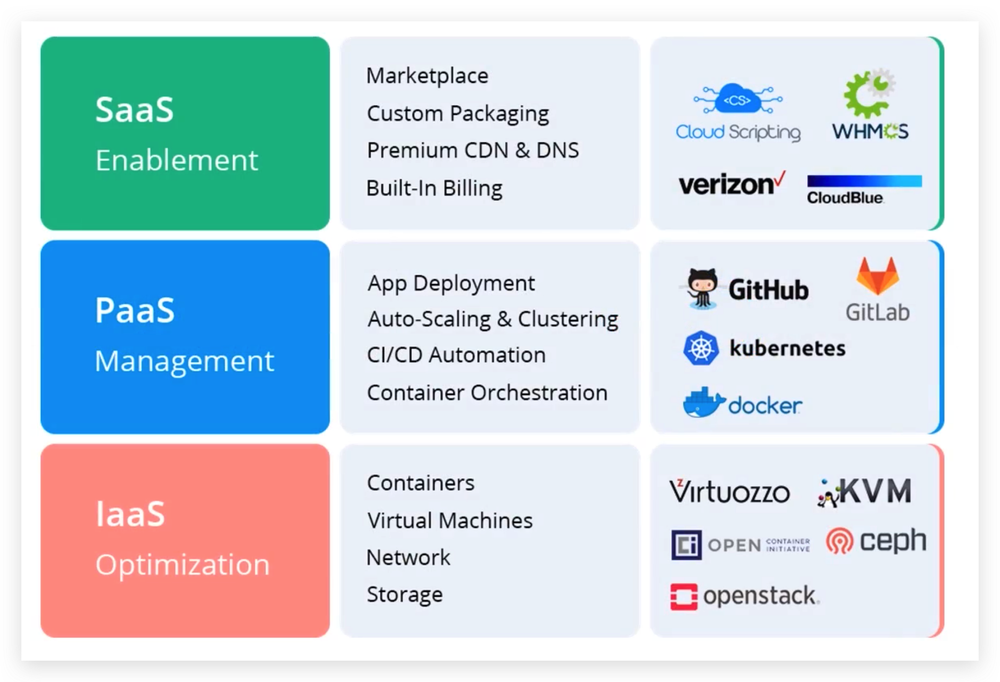
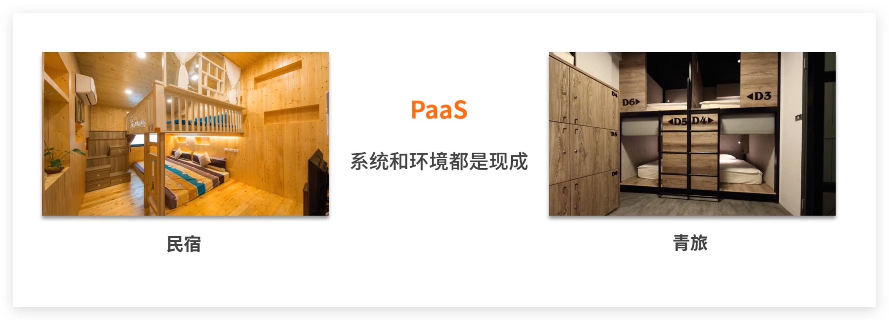
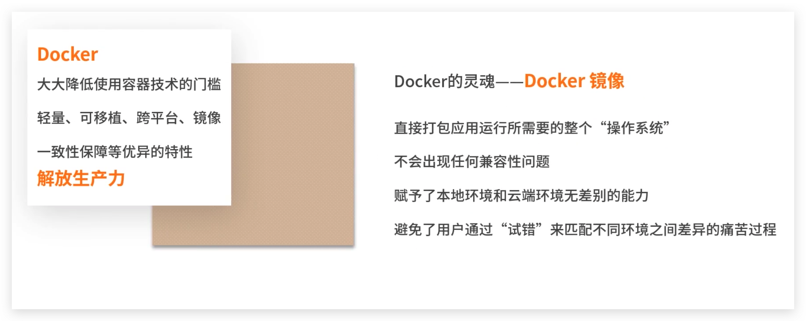
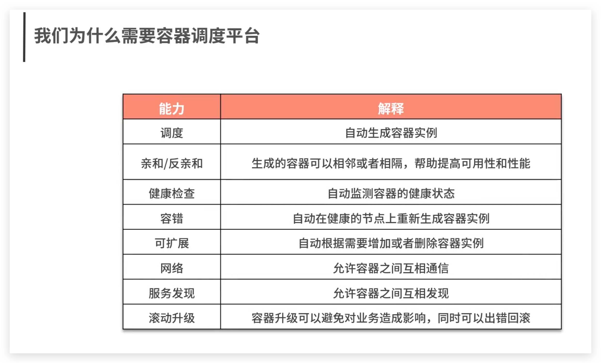
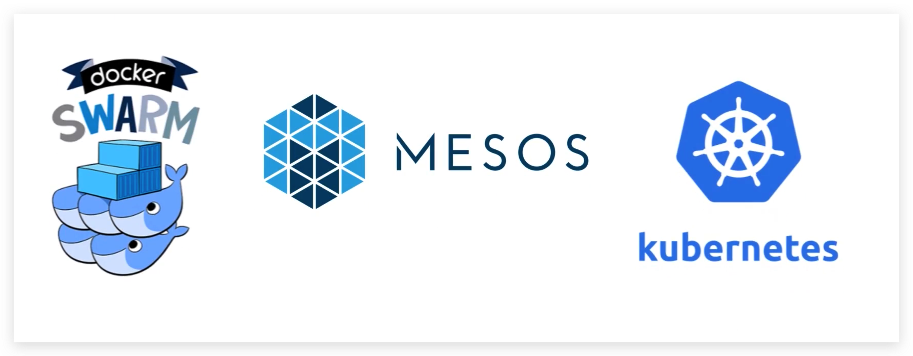
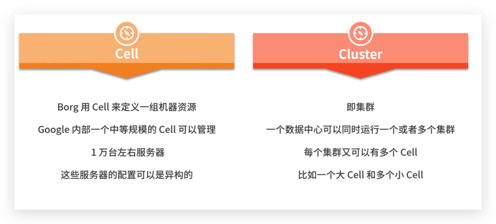
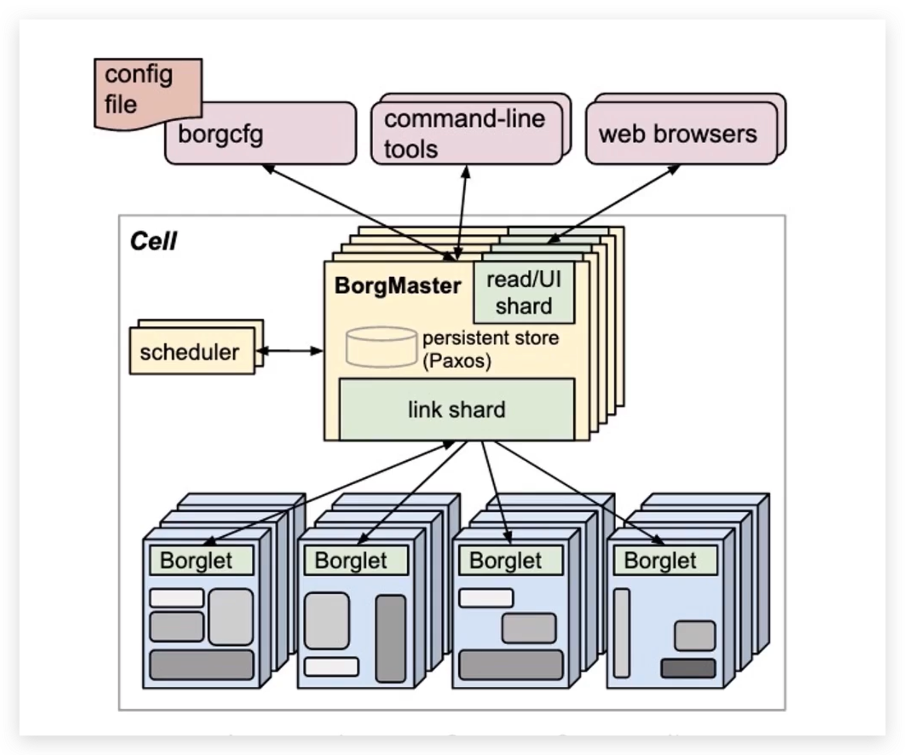
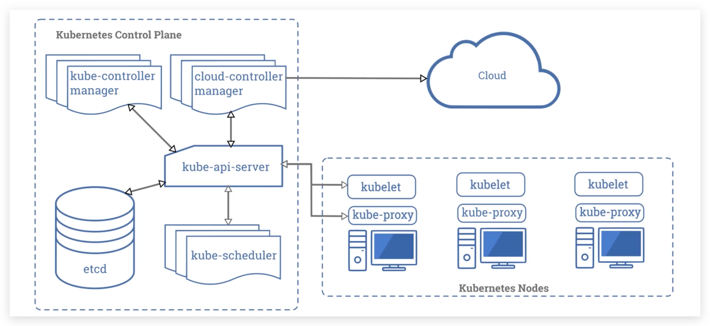

# 前世今生：Kubernetes

## 前言

Kubernetes是一款有Google开源的容器编排管理工具。

一个可移植的、可扩展的开源平台，用于管理容器化的工作负载和服务，可促进声明式配置和自动化。 Kubernetes 拥有一个庞大且快速增长的生态系统。Kubernetes 的服务、支持和工具广泛可用。

**Kubernetes** 这个名字源于希腊语，意为“舵手”或“飞行员”。k8s 这个缩写是因为 k 和 s 之间有八个字符的关系。 Google 在 2014 年开源了 Kubernetes 项目。

## 云计算平台

“云计算”概念由Google提出，自2006年被提出后，已经逐渐成为信息技术产业发展的战略重点。

## Docker

## 为什么需要容器调度平台

### 容器管理工具

## Borg和K8s

Google 的三个主要的容器管理系统是按照：Borg，Omega，Kubernetes 的顺序发展而来。他们是针对不同的需求目标发展而来，但是后者吸收了前者的好的特性并根据经验进行了改进。

### Borg架构

### Kubernetes架构

## Kubernetes组件

当你部署完 Kubernetes, 即拥有了一个完整的集群。

一个 Kubernetes 集群由一组被称作节点的机器组成。这些节点上运行 Kubernetes 所管理的容器化应用。集群具有至少一个工作节点。

工作节点托管作为应用负载的组件的 Pod 。控制平面管理集群中的工作节点和 Pod 。 为集群提供故障转移和高可用性，这些控制平面一般跨多主机运行，集群跨多个节点运行。

### 控制平面组件（Control Plane Components） 

控制平面的组件对集群做出全局决策(比如调度)，以及检测和响应集群事件（例如，当不满足部署的 `replicas` 字段时，启动新的 [pod](https://kubernetes.io/docs/concepts/workloads/pods/pod-overview/)）。

#### kube-apiserver

API 服务器是 Kubernetes [控制面](https://kubernetes.io/zh/docs/reference/glossary/?all=true#term-control-plane)的组件， 该组件公开了 Kubernetes API。 API 服务器是 Kubernetes 控制面的前端。

#### etcd

etcd 是兼具一致性和高可用性的键值数据库，可以作为保存 Kubernetes 所有集群数据的后台数据库。

#### kube-scheduler

控制平面组件，负责监视新创建的、未指定运行[节点（node）](https://kubernetes.io/zh/docs/concepts/architecture/nodes/)的 [Pods](https://kubernetes.io/docs/concepts/workloads/pods/pod-overview/)，选择节点让 Pod 在上面运行。

#### kube-controller-manager

运行[控制器](https://kubernetes.io/zh/docs/concepts/architecture/controller/)进程的控制平面组件。

从逻辑上讲，每个[控制器](https://kubernetes.io/zh/docs/concepts/architecture/controller/)都是一个单独的进程， 但是为了降低复杂性，它们都被编译到同一个可执行文件，并在一个进程中运行。

#### cloud-controller-manager

云控制器管理器是指嵌入特定云的控制逻辑的 [控制平面](https://kubernetes.io/zh/docs/reference/glossary/?all=true#term-control-plane)组件。 云控制器管理器使得你可以将你的集群连接到云提供商的 API 之上， 并将与该云平台交互的组件同与你的集群交互的组件分离开来。

### Node 组件 

节点组件在每个节点上运行，维护运行的 Pod 并提供 Kubernetes 运行环境。

#### kubelet

一个在集群中每个[节点（node）](https://kubernetes.io/zh/docs/concepts/architecture/nodes/)上运行的代理。 它保证[容器（containers）](https://kubernetes.io/zh/docs/concepts/overview/what-is-kubernetes/#why-containers)都 运行在 [Pod](https://kubernetes.io/docs/concepts/workloads/pods/pod-overview/) 中。

#### kube-proxy

[kube-proxy](https://kubernetes.io/zh/docs/reference/command-line-tools-reference/kube-proxy/) 是集群中每个节点上运行的网络代理， 实现 Kubernetes [服务（Service）](https://kubernetes.io/zh/docs/concepts/services-networking/service/) 概念的一部分。

### 容器运行时（Container Runtime） 

容器运行环境是负责运行容器的软件。