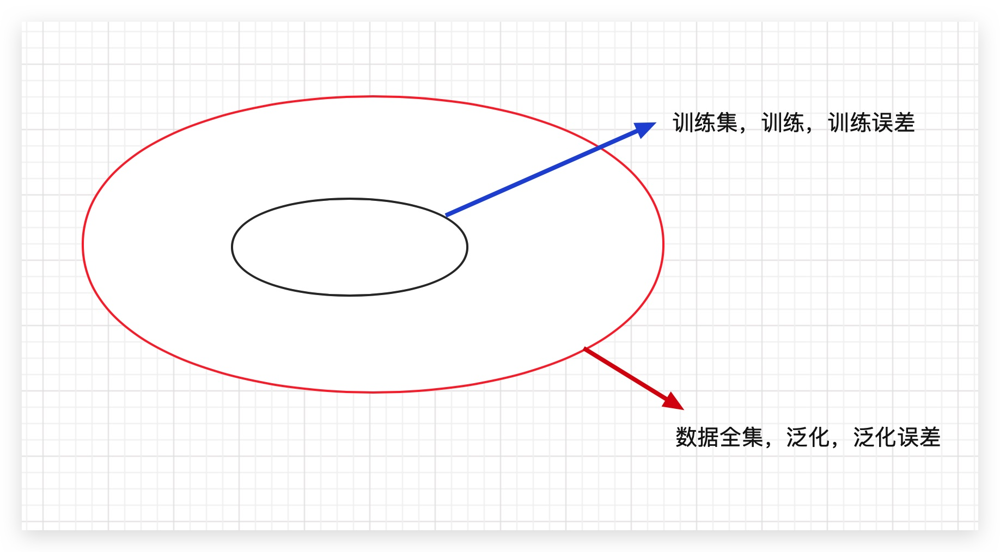
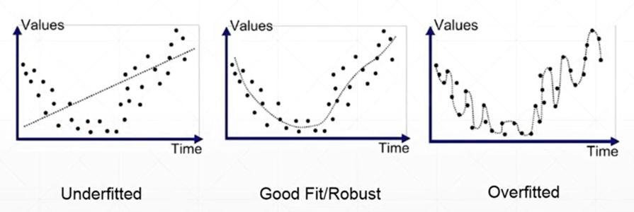
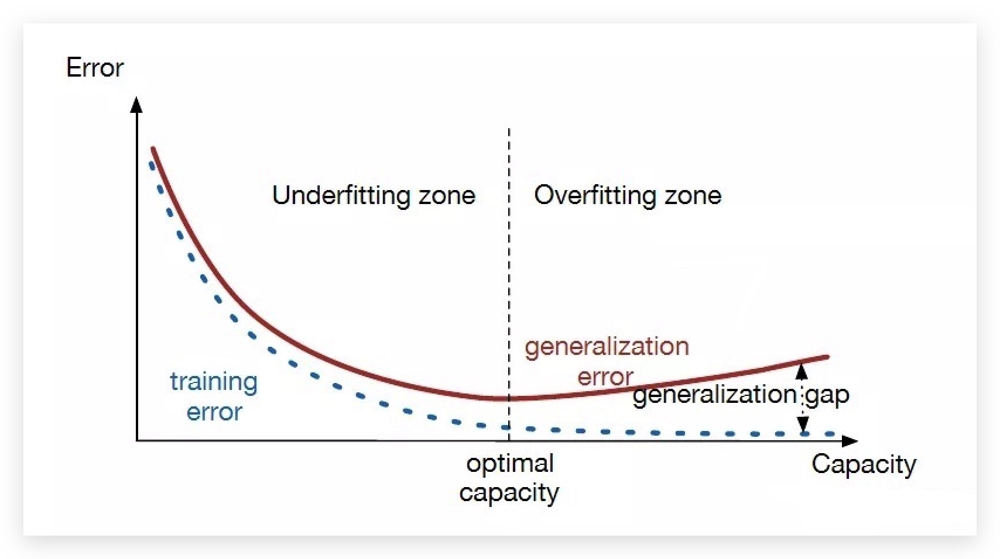
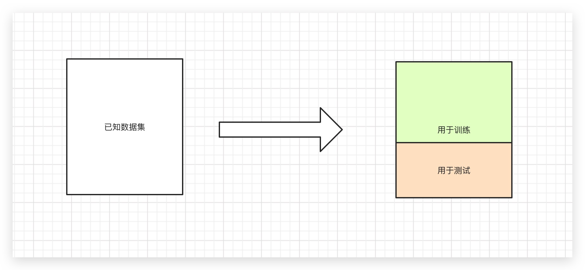
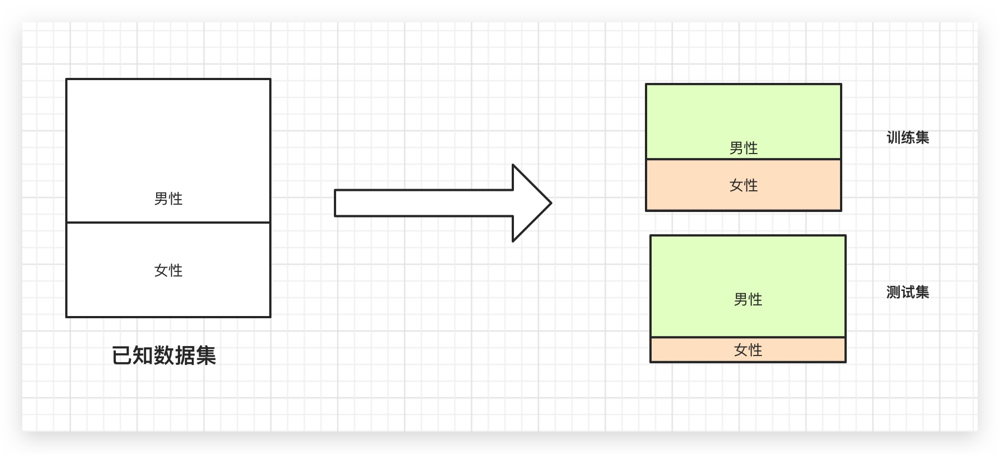

## 机器学习模型的选择和评估

**误差**（Error）：是模型的预测输出值与其真实值之间的差异。

**训练**（Training）：通过已知的样本数据进行学习，从而得到模型的过程。

**训练误差**（Training Error）：模型作用于训练集时的误差。

**泛化**（Generalize）：由具体的、个别的扩大为一般的，即从特殊到一般，称为泛化。对机器学习的模型来讲，泛化是指模型作用于新的样本数据（非训练集）。

**泛化误差**（Generalization Error）：模型作用于新的样本数据时的误差。

## 欠拟合和过拟合

**模型容量**（Model Capacity）：是指其拟合各种模型的能力。

**过拟合**（Overfitting）：是某个模型在训练集上表现很好，但是在新样本上表现很差。模型将训练集的特征学习的太好，导致一些非普遍规律被模型接纳和体现，从而在训练集上表现好，但是对于新模型表现差。反之则称为欠拟合（Underfitting），即模型对训练集的一般性质学习较差，模型作用于训练集时表现不好。

## 模型选择

**模型选择**（Model Selection）：针对某个具体的任务，通常会有多种模型可供选择，对同一个模型也会有多组参数，可以通过分析、评估模型的泛化误差，选择泛化误差最小的模型。

参照上图：

蓝色虚线代表训练误差，先下降，然后逐渐逼近于0，说明训练误差越来越小。

红色实线代表泛化误差，开始是下降，后面有开始上升

那么我们选择模型就选择黑色虚线的位置，这里泛化误差是最小的，训练误差也比较小，过拟合也是比较小，这里就是模型最优的选择。

## 模型评估思路

通过实验测试，对模型的泛化误差进行评估，选出泛化误差最小的模型。待测数据集全集未知，使用测试集进行泛化测试，测试误差（Testing Error）即为泛化误差的近似。

注意：

- 测试集和训练集尽可能互斥
- 测试集和训练集独立同分布

### 留出法

留出法（Hold-out）：将已知数据集分成两个互斥的部分，其中一部分用来训练模型，另一部分用来测试模型，评估其误差，作为泛化误差的估计。

- 两个数据集的划分要尽可能保持数据分布一致性，避免因数据划分过程引入人为的偏差
- 数据分割存在多种形式会导致不同的训练集、测试集划分，单次流出法结果往往存在偶然性，其稳定性较差，通常会进行若干次随机划分、重复实验评估取平均值作为评估结果
- 数据集拆分两部分，每部分的规模设置会影响评估结果，测试、训练的比例通常为7:3、8:2等

> 保持样本的类别比例相似，即采用分层采样。

### 交叉验证法

交叉验证法（Cross Validation）：将数据集划分k个大小相似的互斥的数据子集，子集数据尽可能保证数据分布的一致性（分层采样），每次从中选取一个数据集作为测试集，其余用作训练集，可以进行k次训练和测试，得到评估均值。也叫k折交叉验证。重复p次，就是p次k折交叉验证。

### 留一法

留一法（Leave-One-Out, LOO）：是k折交叉验证的特殊形式，将数据集分为两个，其中一个数据集记录条数为1，作为测试集使用，其余记录作为训练集训练模型。训练出的模型和使用全部数据集训练得到的模型接近，其评估结果比较准确。缺点是当数据集较大时，训练次数和计算规模较大。

### 自助法

自助法（Bootstrapping）：是一种产生样本的抽样方法，其实质是有放回的随机抽样。即从已知数据集中随机抽取一条记录，然后将该记录放入测试集同时放回原数据集，继续下一次抽样，知道测试集中的数据条数满足要求。

## 模型评估方法的使用场景

**留出法：**

- 实现简单、方便，在一定程度上能评估泛化误差
- 测试集和训练集分开，缓解了过拟合
- 一次划分，评估结果偶然性大
- 数据被拆分后，用于训练、测试的数据更少了

**交叉验证法（留一法）：**

- k可以根据实际情况设置，充分利用了所有样本
- 多次划分，评估结果相对稳定
- 计算比较繁琐，需要进行k次训练和评估

**自助法： **

- 样本量较小时可以通过自助法产生多个自助样本集，且有约36.8%的测试样本
- 对于总体的理论分布没有要求
- 无放回抽样引入了额外的偏差

**几种方法的选择：**

- 已知数据集数量充足时，通常采用**留出法或者k折交叉验证法**
- 对于已知数据量较小且难以有效划分训练集/测试集的时候，采用**自助法**
- 对于已知数据集较小且可以有效划分训练集/测试集的时候，采用**留一法**