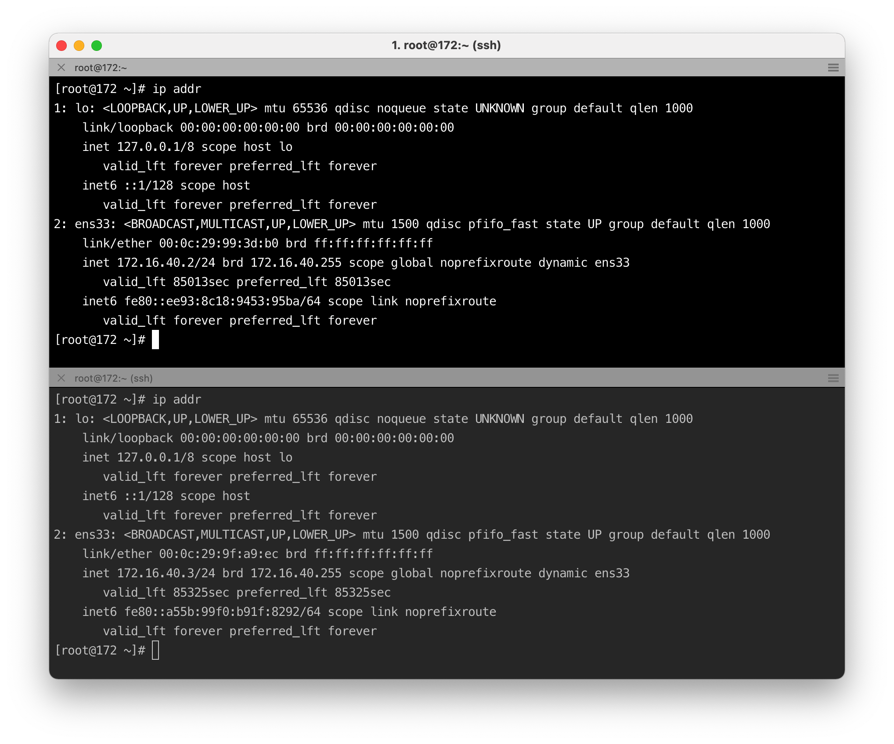

# Rocket主从服务搭建

# RocketMQ 4.x部署

- JDK 8
- MAVEN
- RocketMQ 4.4.0

## 连接服务器

server1(172.16.40.2)、server2(172.16.40.3)




### 下载安装包

```sh
wget https://dlcdn.apache.org/maven/maven-3/3.8.2/binaries/apache-maven-3.8.2-bin.tar.gz

wget --no-cookies --no-check-certificate --header "Cookie: gpw_e24=http%3A%2F%2Fwww.oracle.com%2F; oraclelicense=accept-securebackup-cookie" "http://download.oracle.com/otn-pub/java/jdk/8u141-b15/336fa29ff2bb4ef291e347e091f7f4a7/jdk-8u141-linux-x64.tar.gz"

wget https:\/\/archive.apache.org\/dist\/rocketmq\/4.4.0\/rocketmq-all-4.4.0-source-release.zip

wget https://github.com/apache/rocketmq-dashboard/archive/refs/heads/master.zip
```

### 配置Java环境

```sh
vim /etc/profile
添加如下：
export JAVA_HOME=/usr/local/software/jdk8
export PATH=$JAVA_HOME/bin:$PATH
export CLASSPATH=.:$JAVA_HOME/lib/dt.jar:$JAVA_HOME/lib/tools.jar
export JAVA_HOME PATH CLASSPATH
export PATH=/usr/local/software/maven/bin:$PATH
```

## RocketMQ

#### 构建RocketMQ

```sh
> unzip rocketmq-all-4.4.0-source-release.zip

> cd rocketmq/

> mvn -Prelease-all -DskipTests clean install -U

> cd distribution/target/rocketmq/rocketmq
```

##### 1.修改RocketMQ启动内存

```sh
> /usr/local/software/rocketmq/distribution/target/apache-rocketmq/bin
> vim runserver.sh
修改为：
JAVA_OPT="${JAVA_OPT} -server -Xms528m -Xmx528m -Xmn256m -XX:MetaspaceSize=128m -XX:MaxMetaspaceSize=320m"

> vim runbroker.sh
修改为：
JAVA_OPT="${JAVA_OPT} -server -Xms528m -Xmx528m -Xmn256m"

# 启动nameserver
nohup sh bin/mqnameserv &
```

设置自动创建topic

```
sh mqbroker -m
```


##### 2.编辑并启动rocketmq命令

```sh
# 主节点(172.16.40.2)
sh bin/mqbroker -c conf/2m-2s-async/broker-a.properties
修改为：
namesrvAddr=172.16.40.2:9876;172.16.40.3:9876
brokerClusterName=YidahuCluster
brokerName=broker-a
brokerId=0
deleteWhen=04
fileReservedTime=48
brokerRole=ASYNC_MASTER
flushDiskType=ASYNC_FLUSH
```


```sh
# 从节点(172.16.40.3)
sh bin/mqbroker -c conf/2m-2s-async/broker-a-s.properties
修改为：
namesrvAddr=172.16.40.2:9876;172.16.40.3:9876
brokerClusterName=YidahuCluster
brokerName=broker-a
brokerId=1
deleteWhen=04
fileReservedTime=48
brokerRole=SLAVE
flushDiskType=ASYNC_FLUSH
```

##### 3.使用控制台

```sh
vim pom.xml
修改为（保证和服务版本号一致）：
<rocketmq.version>4.4.0</rocketmq.version>

vim src/main/resources/application.properties
修改为：
rocketmq.config.namesrvAddr=172.16.40.2:9876;172.16.40.3:9876

# 构建
mvn clean package -Dmaven.test.skip=true

# docker
docker pull styletang/rocketmq-console-ng
docker run -e "JAVA_OPTS=-Drocketmq.namesrv.addr=172.16.40.2:9876 -Dcom.rocketmq.sendMessageWithVIPChannel=false" -p 8088:8080 -t styletang/rocketmq-console-ng

```

## Start Name Server

```sh
> nohup sh bin/mqnamesrv &
> tail -f ~/logs/rocketmqlogs/namesrv.log
  The Name Server boot success...
```

## Start Broker

```sh
> nohup sh bin/mqbroker -n localhost:9876 &
> tail -f ~/logs/rocketmqlogs/broker.log 

```

