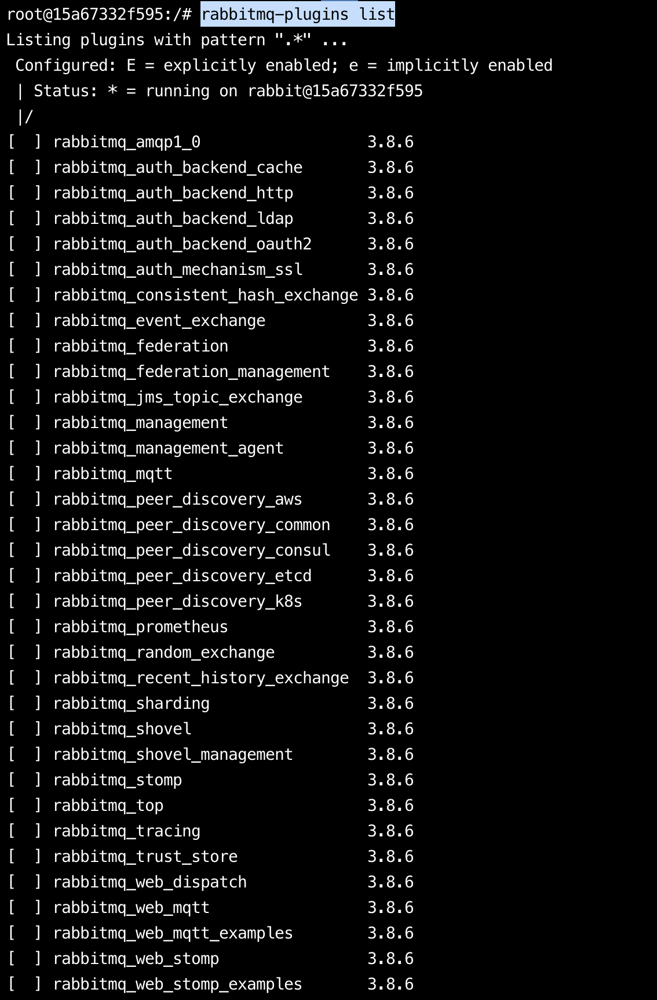
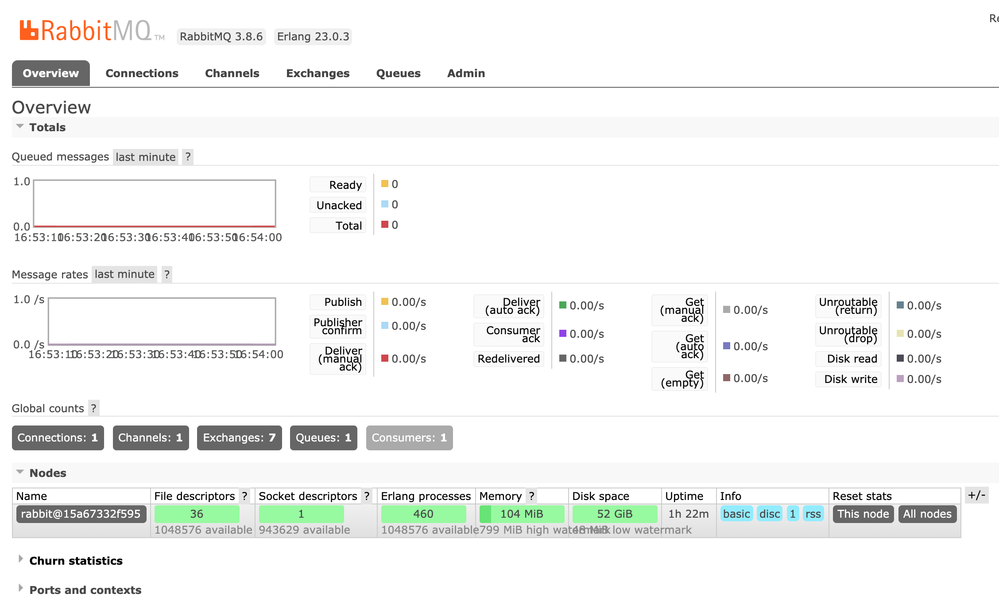

# SpringBoot应用中优雅的使用RabbitMQ

## RabbitMQ

### 什么是RabbitMQ？

**RabbitMQ**是实现了高级消息队列协议（AMQP）的开源消息代理软件（亦称面向消息的中间件）。RabbitMQ服务器是用Erlang语言编写的，而集群和故障转移是构建在开放电信平台框架上的。所有主要的编程语言均有与代理接口通讯的客户端库。

### Docker安装

```sh
# 拉取镜像
docker pull rabbitmq
# 启动RabbitMQ服务
docker run -d --name rabbitmq -p 5672:5672 -p 15672:15672 rabbitmq:latest
```

### 开启RabbitMQ管理

RabbitMQ默认安装启动以后，是没有开启web管理界面的

```sh
# 进入docker容器，获取上面启动RabbitMQ服务的容器ID，用一下命令
docker exec -it 15a67332f595 bash
```

通过**rabbitmq-plugins list**命令可列出插件的启用和禁用状态

```
rabbitmq-plugins list
```



开启RabbitMQ的web界面

```sh
rabbitmq-plugins enable rabbitmq_management
```

### 管理RabbitMQ服务

打开浏览器并访问：`http://localhost:15672/`，并使用默认用户`guest`登录，密码也为`guest`。我们可以看到如下图的管理页面：



## SpringBoot中使用RabbitMQ

### 构建项目

下面，我们通过在Spring Boot应用中整合RabbitMQ，并实现一个简单的发送、接收消息的例子来对RabbitMQ有一个直观的感受和理解。

在Spring Boot中整合RabbitMQ是一件非常容易的事，其中的AMQP模块就可以很好的支持RabbitMQ，下面我们就来详细说说整合过程：

- 新建一个Spring Boot工程，命名为：“rabbitmq-proj”。
- 在`pom.xml`中引入如下依赖内容，其中`spring-boot-starter-amqp`用于支持RabbitMQ。

```xml
<?xml version="1.0" encoding="UTF-8"?>
<project xmlns="http://maven.apache.org/POM/4.0.0" xmlns:xsi="http://www.w3.org/2001/XMLSchema-instance"
         xsi:schemaLocation="http://maven.apache.org/POM/4.0.0 https://maven.apache.org/xsd/maven-4.0.0.xsd">
    <modelVersion>4.0.0</modelVersion>
    <parent>
        <groupId>org.springframework.boot</groupId>
        <artifactId>spring-boot-starter-parent</artifactId>
        <version>2.3.2.RELEASE</version>
        <relativePath/> <!-- lookup parent from repository -->
    </parent>
    <groupId>com.huyida</groupId>
    <artifactId>rabbitmq-proj</artifactId>
    <version>0.0.1-SNAPSHOT</version>
    <name>rabbitmq-proj</name>
    <description>Demo project for Spring Boot</description>

    <properties>
        <java.version>1.8</java.version>
    </properties>

    <dependencies>
        <dependency>
            <groupId>org.springframework.boot</groupId>
            <artifactId>spring-boot-starter-amqp</artifactId>
        </dependency>
        <dependency>
            <groupId>org.springframework.boot</groupId>
            <artifactId>spring-boot-starter-web</artifactId>
        </dependency>

        <dependency>
            <groupId>org.springframework.boot</groupId>
            <artifactId>spring-boot-devtools</artifactId>
            <scope>runtime</scope>
            <optional>true</optional>
        </dependency>
        <dependency>
            <groupId>org.projectlombok</groupId>
            <artifactId>lombok</artifactId>
            <optional>true</optional>
        </dependency>
        <dependency>
            <groupId>org.springframework.boot</groupId>
            <artifactId>spring-boot-starter-test</artifactId>
            <scope>test</scope>
        </dependency>
        <dependency>
            <groupId>org.springframework.amqp</groupId>
            <artifactId>spring-rabbit-test</artifactId>
            <scope>test</scope>
        </dependency>
        <dependency>
            <groupId>junit</groupId>
            <artifactId>junit</artifactId>
            <version>4.12</version>
        </dependency>
        <dependency>
            <groupId>org.springframework</groupId>
            <artifactId>spring-test</artifactId>
            <version>5.2.7.RELEASE</version>
            <scope>compile</scope>
        </dependency>
        <dependency>
            <groupId>org.springframework.boot</groupId>
            <artifactId>spring-boot-test</artifactId>
            <version>2.3.1.RELEASE</version>
            <scope>compile</scope>
        </dependency>
    </dependencies>

    <build>
        <plugins>
            <plugin>
                <groupId>org.springframework.boot</groupId>
                <artifactId>spring-boot-maven-plugin</artifactId>
            </plugin>
        </plugins>
    </build>

</project>

```

在`application.properties`中配置关于RabbitMQ的连接和用户信息，用户可以回到上面的安装内容，在管理页面中创建用户。

```properties
spring.application.name=rabbitmq-proj
spring.rabbitmq.host=localhost
spring.rabbitmq.port=5672
spring.rabbitmq.username=guest
spring.rabbitmq.password=guest
```

### 生产者

创建消息生产者`Sender`。通过注入`AmqpTemplate`接口的实例来实现消息的发送，`AmqpTemplate`接口定义了一套针对AMQP协议的基础操作。在Spring Boot中会根据配置来注入其具体实现。在该生产者，我们会产生一个字符串，并发送到名为`chatbot`的队列中。

```java
@Component
public class Sender {

    public static final String QUEUENAME = "chatbot";

    @Autowired
    private AmqpTemplate rabbitTemplate;

    public void send() {
        String context = "hello " + new Date();
        System.out.println("Sender:" + context);
        this.rabbitTemplate.convertAndSend(QUEUENAME, context);
    }
}

```

### 消费者

创建消息消费者`Receiver`。通过`@RabbitListener`注解定义该类对`chatbot`队列的监听，并用`@RabbitHandler`注解来指定对消息的处理方法。所以，该消费者实现了对`chatbot`队列的消费，消费操作为输出消息的字符串内容。

```java
@Component
@RabbitListener(queues = "chatbot")
public class Receiver {

    @RabbitHandler
    public void process(String s) {
        System.out.println("Receiver:" + s);
    }
}
```

### 配置类

创建RabbitMQ的配置类`RabbitConfig`，用来配置队列、交换器、路由等高级信息。这里我们以入门为主，先以最小化的配置来定义，以完成一个基本的生产和消费过程。

```java
@Configuration
public class RabbitConfig {

    public static final String QUEUENAME = "chatbot";

    @Bean
    public Queue helloQueue() {
        return new Queue(QUEUENAME);
    }
}
```

创建应用主类：

```java
@SpringBootApplication
public class RabbitmqProjApplication {

    public static void main(String[] args) {
        SpringApplication.run(RabbitmqProjApplication.class, args);
    }

}
```

### 单元测试

创建单元测试类，用来调用消息生产：

```java
@RunWith(SpringRunner.class)
@SpringBootTest(classes = RabbitmqProjApplication.class)
public class SenderTest {

    @Autowired
    private Sender sender;

    @Before
    public void before() throws Exception {
        System.out.println("Start sending message...");
    }

    @After
    public void after() throws Exception {
        System.out.println("Finish sending message！");
    }

    /**
     * Method: send()
     */
    @Test
    public void testSend() throws Exception {
        sender.send();
    }


} 
```

### 启动服务

完成程序编写之后，下面开始尝试运行。首先确保RabbitMQ Server已经开始，然后进行下面的操作：

- 启动应用主类，从控制台中，我们看到如下内容，程序创建了一个访问`127.0.0.1:5672`的连接。

```xml
2020-08-09 17:03:31.126  INFO 32502 --- [           main] o.s.a.r.c.CachingConnectionFactory       : Created new connection: rabbitConnectionFactory#2f6bbeb0:0/SimpleConnection@18eec010 [delegate=amqp://guest@127.0.0.1:5672/, localPort= 60451]

```

同时，我们通过RabbitMQ的控制面板，可以看到Connection和Channels中包含当前连接的条目。

- 运行单元测试类，我们可以看到控制台中输出下面的内容，消息被发送到了RabbitMQ Server的`chatbot`队列中。

```
Start sending message...
Sender:hello Sun Aug 09 17:06:12 CST 2020
Finish sending message！
```

切换到应用主类的控制台，我们可以看到类似如下输出，消费者对`chatbot`队列的监听程序执行了，并输出了接受到的消息信息。

```
Receiver:hello Sun Aug 09 17:06:12 CST 2020
```

## 总结

通过上面的示例，我们在Spring Boot应用中引入`spring-boot-starter-amqp`模块，进行简单配置就完成了对RabbitMQ的消息生产和消费的开发内容。