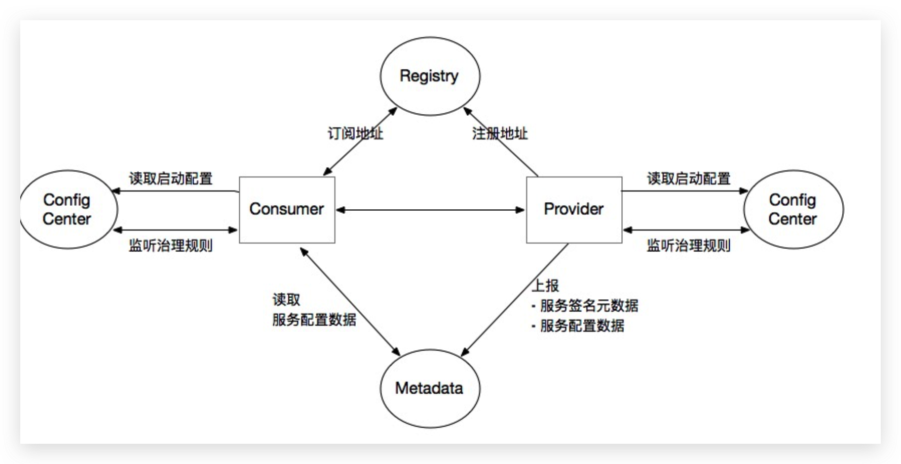
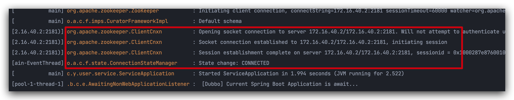
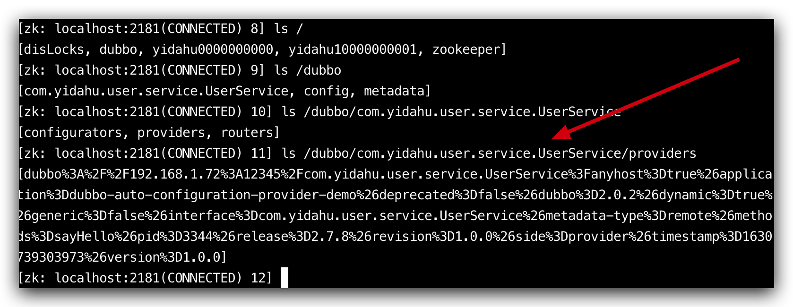
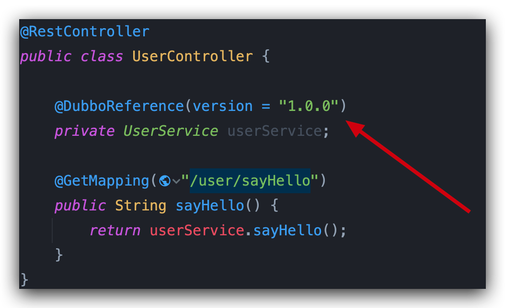
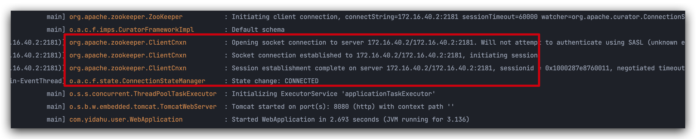
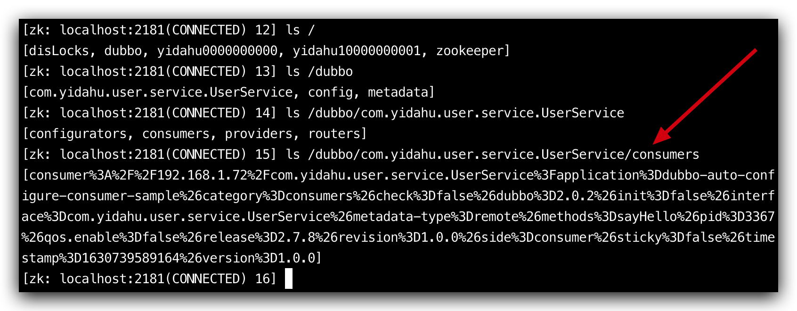
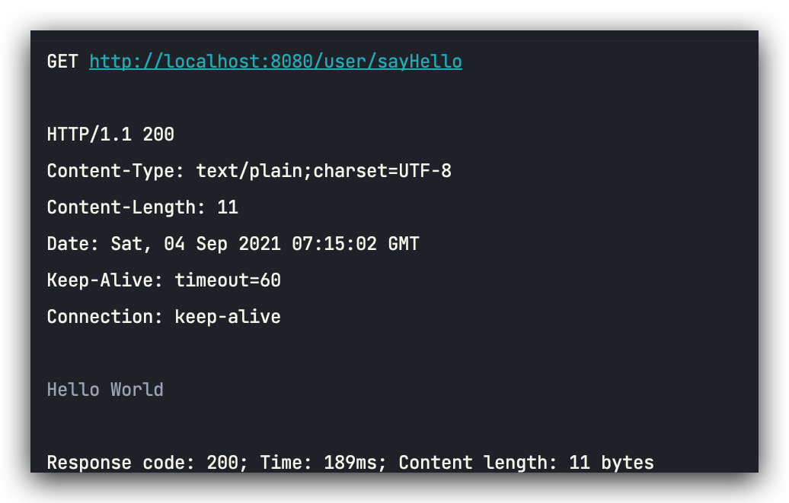

# Dubbo整合Zookeeper


## 前言

本片文章基于上篇文章[《Springboot+Dubbo开发环境配置》](Springboot+Dubbo开发环境配置)的基础上进行开发，整合使用Zookeeper作为数据中心。

## 架构

作为一个微服务框架，Dubbo sdk 跟随着微服务组件被部署在分布式集群各个位置，为了在分布式环境下实现各个微服务组件间的协作， Dubbo 定义了一些中心化组件，这包括：

- 注册中心。协调 Consumer 与 Provider 之间的地址注册与发现
- 配置中心。
  - 存储 Dubbo 启动阶段的全局配置，保证配置的跨环境共享与全局一致性
  - 负责服务治理规则（路由规则、动态配置等）的存储与推送。
- 元数据中心。
  - 接收 Provider 上报的服务接口元数据，为 Admin 等控制台提供运维能力（如服务测试、接口文档等）
  - 作为服务发现机制的补充，提供额外的接口/方法级别配置信息的同步能力，相当于注册中心的额外扩展




通常情况下，所有用户都会以独立的注册中心 开始 Dubbo 服务开发，而配置中心、元数据中心则会在微服务演进的过程中逐步的按需被引入进来。

这里注册中心使用**Zookeeper**。

## 项目整合

### Zookeeper服务

首先启动Zookeeper服务


### user-service服务提供者

application.properties中添加Dubbo注册中心地址

```properties
## Dubbo Registry
dubbo.registry.address= zookeeper://172.16.40.2:2181
```

pom.xml中添加Zookeeper相关依赖

```xml
        <!-- Zookeeper dependencies -->
        <dependency>
            <groupId>org.apache.dubbo</groupId>
            <artifactId>dubbo-dependencies-zookeeper</artifactId>
            <version>${dubbo.version}</version>
            <type>pom</type>
            <exclusions>
                <exclusion>
                    <groupId>org.slf4j</groupId>
                    <artifactId>slf4j-log4j12</artifactId>
                </exclusion>
            </exclusions>
        </dependency>
```

然后启动服务



在ZK中查看是否已注册



## user-web服务消费者

application.yml中添加dubbo注册中心地址

```yml
dubbo:
  registry:
    address: zookeeper://172.16.
```

pom.xml中添加Zookeeper相关依赖

```xml
        <!-- Zookeeper dependencies -->
        <dependency>
            <groupId>org.apache.dubbo</groupId>
            <artifactId>dubbo-dependencies-zookeeper</artifactId>
            <version>${dubbo.version}</version>
            <type>pom</type>
            <exclusions>
                <exclusion>
                    <groupId>org.slf4j</groupId>
                    <artifactId>slf4j-log4j12</artifactId>
                </exclusion>
            </exclusions>
        </dependency>
```


调用服务会使用注册中心



启动服务



查看ZK服务中是否存在



## 测试



