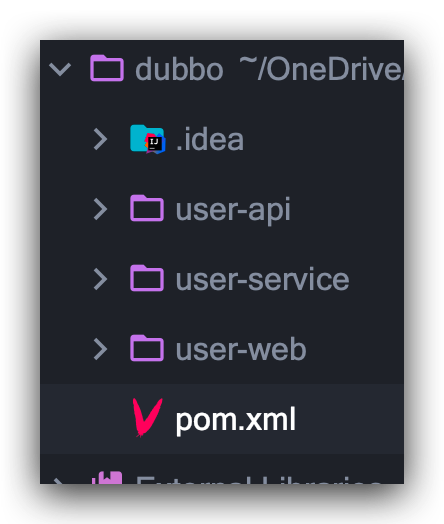
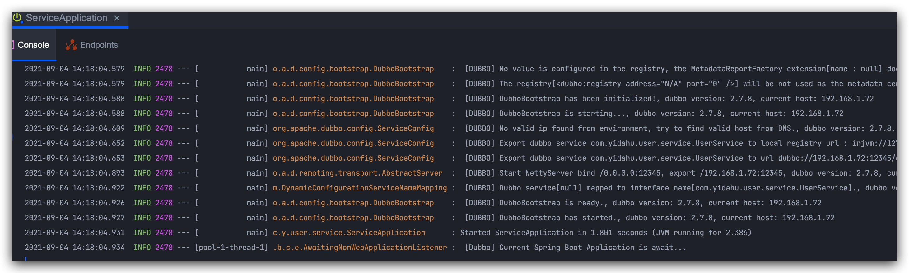
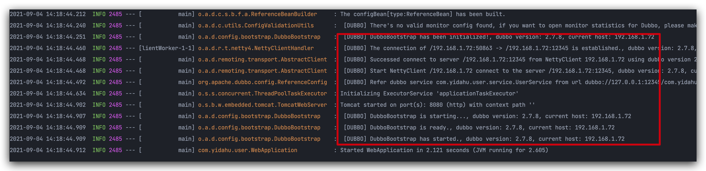
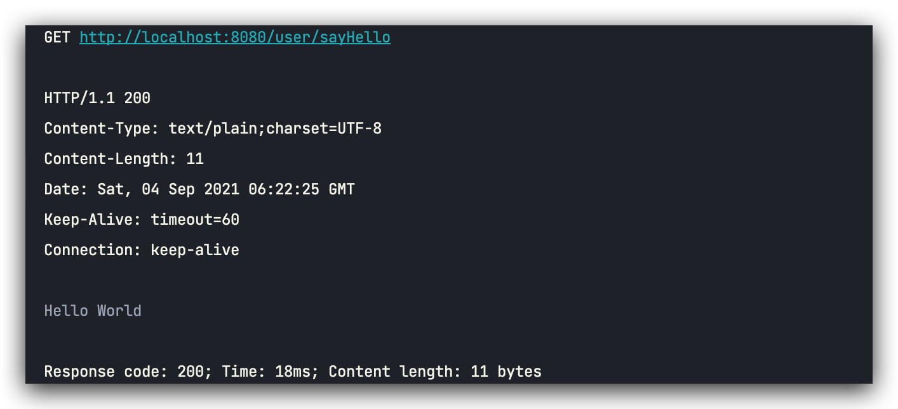

# Springboot+Dubbo开发环境配置


## 构建项目

### 项目结构

-- Dubbo

​	-- user-api (API层)

​	-- user-service（服务提供者）

​	-- user-web（服务消费者）



### IDEA创建项目

创建Maven项目，添加三个module

pom.xml

```xml
<?xml version="1.0" encoding="UTF-8"?>
<project xmlns="http://maven.apache.org/POM/4.0.0"
         xmlns:xsi="http://www.w3.org/2001/XMLSchema-instance"
         xsi:schemaLocation="http://maven.apache.org/POM/4.0.0 http://maven.apache.org/xsd/maven-4.0.0.xsd">
    <modelVersion>4.0.0</modelVersion>

    <groupId>com.yidahu</groupId>
    <artifactId>dubbo</artifactId>
    <packaging>pom</packaging>
    <version>1.0-SNAPSHOT</version>
    <modules>
        <module>user-api</module>
        <module>user-service</module>
        <module>user-web</module>
    </modules>

    <properties>
        <maven.compiler.source>8</maven.compiler.source>
        <maven.compiler.target>8</maven.compiler.target>
    </properties>

</project>
```


## user-api（API层）

UserService.java

```java
public interface UserService {

    /**
     * 你好模拟
     * @return
     */
    String sayHello();

}
```


## user-service（服务提供者）

pom.xml

```xml
<?xml version="1.0" encoding="UTF-8"?>
<project xmlns="http://maven.apache.org/POM/4.0.0"
         xmlns:xsi="http://www.w3.org/2001/XMLSchema-instance"
         xsi:schemaLocation="http://maven.apache.org/POM/4.0.0 http://maven.apache.org/xsd/maven-4.0.0.xsd">
    <parent>
        <artifactId>dubbo</artifactId>
        <groupId>com.yidahu</groupId>
        <version>1.0-SNAPSHOT</version>
    </parent>
    <modelVersion>4.0.0</modelVersion>

    <artifactId>user-service</artifactId>

    <properties>
        <maven.compiler.source>8</maven.compiler.source>
        <maven.compiler.target>8</maven.compiler.target>
        <spring-boot.version>2.3.0.RELEASE</spring-boot.version>
        <dubbo.version>2.7.8</dubbo.version>
    </properties>

    <dependencyManagement>
        <dependencies>
            <!-- Spring Boot -->
            <dependency>
                <groupId>org.springframework.boot</groupId>
                <artifactId>spring-boot-dependencies</artifactId>
                <version>${spring-boot.version}</version>
                <type>pom</type>
                <scope>import</scope>
            </dependency>

            <!-- Apache Dubbo  -->
            <dependency>
                <groupId>org.apache.dubbo</groupId>
                <artifactId>dubbo-dependencies-bom</artifactId>
                <version>${dubbo.version}</version>
                <type>pom</type>
                <scope>import</scope>
            </dependency>

            <dependency>
                <groupId>org.apache.dubbo</groupId>
                <artifactId>dubbo</artifactId>
                <version>${dubbo.version}</version>
                <exclusions>
                    <exclusion>
                        <groupId>org.springframework</groupId>
                        <artifactId>spring</artifactId>
                    </exclusion>
                    <exclusion>
                        <groupId>javax.servlet</groupId>
                        <artifactId>servlet-api</artifactId>
                    </exclusion>
                    <exclusion>
                        <groupId>log4j</groupId>
                        <artifactId>log4j</artifactId>
                    </exclusion>
                </exclusions>
            </dependency>
        </dependencies>
    </dependencyManagement>

    <dependencies>
        <!-- Spring Boot dependencies -->
        <dependency>
            <groupId>org.springframework.boot</groupId>
            <artifactId>spring-boot-starter</artifactId>
        </dependency>
        <dependency>
            <groupId>com.yidahu</groupId>
            <artifactId>user-api</artifactId>
            <version>1.0-SNAPSHOT</version>
        </dependency>
        <!-- Dubbo Spring Boot Starter -->
        <dependency>
            <groupId>org.apache.dubbo</groupId>
            <artifactId>dubbo-spring-boot-starter</artifactId>
            <version>2.7.8</version>
        </dependency>

        <dependency>
            <groupId>org.apache.dubbo</groupId>
            <artifactId>dubbo</artifactId>
        </dependency>
    </dependencies>

    <repositories>
        <repository>
            <id>apache.snapshots.https</id>
            <name>Apache Development Snapshot Repository</name>
            <url>https://repository.apache.org/content/repositories/snapshots</url>
            <releases>
                <enabled>false</enabled>
            </releases>
            <snapshots>
                <enabled>true</enabled>
            </snapshots>
        </repository>
    </repositories>


</project>
```

UserServiceImpl.java

```java
@DubboService(version = "1.0.0")
public class UserServiceImpl implements UserService {
    @Override
    public String sayHello() {
        return "Hello World";
    }
}

```

ServiceApplication.java

```java
@EnableAutoConfiguration
public class ServiceApplication {
    public static void main(String[] args) {
        SpringApplication.run(ServiceApplication.class, args);
    }
}
```

application.properties

```properties
# Spring boot application
spring.application.name=dubbo-auto-configuration-provider-demo
# Base packages to scan Dubbo Component: @org.apache.dubbo.config.annotation.Service
dubbo.scan.base-packages=com.yidahu.user.service.impl

# Dubbo Application
## The default value of dubbo.application.name is ${spring.application.name}
## dubbo.application.name=${spring.application.name}

# Dubbo Protocol
dubbo.protocol.name=dubbo
dubbo.protocol.port=12345

## Dubbo Registry
dubbo.registry.address=N/A
```


## user-web（服务消费者）

pom.xml

```xml
<?xml version="1.0" encoding="UTF-8"?>
<project xmlns="http://maven.apache.org/POM/4.0.0"
         xmlns:xsi="http://www.w3.org/2001/XMLSchema-instance"
         xsi:schemaLocation="http://maven.apache.org/POM/4.0.0 http://maven.apache.org/xsd/maven-4.0.0.xsd">
    <parent>
        <artifactId>dubbo</artifactId>
        <groupId>com.yidahu</groupId>
        <version>1.0-SNAPSHOT</version>
    </parent>
    <modelVersion>4.0.0</modelVersion>

    <artifactId>user-web</artifactId>

    <properties>
        <maven.compiler.source>8</maven.compiler.source>
        <maven.compiler.target>8</maven.compiler.target>
        <spring-boot.version>2.3.0.RELEASE</spring-boot.version>
        <dubbo.version>2.7.8</dubbo.version>
    </properties>

    <dependencyManagement>
        <dependencies>
            <!-- Spring Boot -->
            <dependency>
                <groupId>org.springframework.boot</groupId>
                <artifactId>spring-boot-dependencies</artifactId>
                <version>${spring-boot.version}</version>
                <type>pom</type>
                <scope>import</scope>
            </dependency>

            <!-- Apache Dubbo  -->
            <dependency>
                <groupId>org.apache.dubbo</groupId>
                <artifactId>dubbo-dependencies-bom</artifactId>
                <version>${dubbo.version}</version>
                <type>pom</type>
                <scope>import</scope>
            </dependency>

            <dependency>
                <groupId>org.apache.dubbo</groupId>
                <artifactId>dubbo</artifactId>
                <version>${dubbo.version}</version>
                <exclusions>
                    <exclusion>
                        <groupId>org.springframework</groupId>
                        <artifactId>spring</artifactId>
                    </exclusion>
                    <exclusion>
                        <groupId>javax.servlet</groupId>
                        <artifactId>servlet-api</artifactId>
                    </exclusion>
                    <exclusion>
                        <groupId>log4j</groupId>
                        <artifactId>log4j</artifactId>
                    </exclusion>
                </exclusions>
            </dependency>
        </dependencies>
    </dependencyManagement>

    <dependencies>
        <!-- Spring Boot dependencies -->
        <dependency>
            <groupId>org.springframework.boot</groupId>
            <artifactId>spring-boot-starter-web</artifactId>
        </dependency>
        <!-- Spring Boot dependencies -->
        <dependency>
            <groupId>org.springframework.boot</groupId>
            <artifactId>spring-boot-starter</artifactId>
        </dependency>
        <dependency>
            <groupId>com.yidahu</groupId>
            <artifactId>user-api</artifactId>
            <version>1.0-SNAPSHOT</version>
        </dependency>
        <!-- Dubbo Spring Boot Starter -->
        <dependency>
            <groupId>org.apache.dubbo</groupId>
            <artifactId>dubbo-spring-boot-starter</artifactId>
            <version>2.7.8</version>
        </dependency>

        <dependency>
            <groupId>org.apache.dubbo</groupId>
            <artifactId>dubbo</artifactId>
        </dependency>
    </dependencies>

    <repositories>
        <repository>
            <id>apache.snapshots.https</id>
            <name>Apache Development Snapshot Repository</name>
            <url>https://repository.apache.org/content/repositories/snapshots</url>
            <releases>
                <enabled>false</enabled>
            </releases>
            <snapshots>
                <enabled>true</enabled>
            </snapshots>
        </repository>
    </repositories>

</project>
```

UserController.java

```java
@RestController
public class UserController {

    @DubboReference(version = "1.0.0", url = "dubbo://127.0.0.1:12345")
    private UserService userService;

    @GetMapping("/user/sayHello")
    public String sayHello() {
        return userService.sayHello();
    }
}
```

WebApplication.java

```java
@SpringBootApplication
public class WebApplication {

    public static void main(String [] args) {
        SpringApplication.run(WebApplication.class, args);
    }

}
```

application.yml

```yml
spring:
  application:
    name: dubbo-auto-configure-consumer-sample
```


## 运行


Service服务




Web服务




测试



