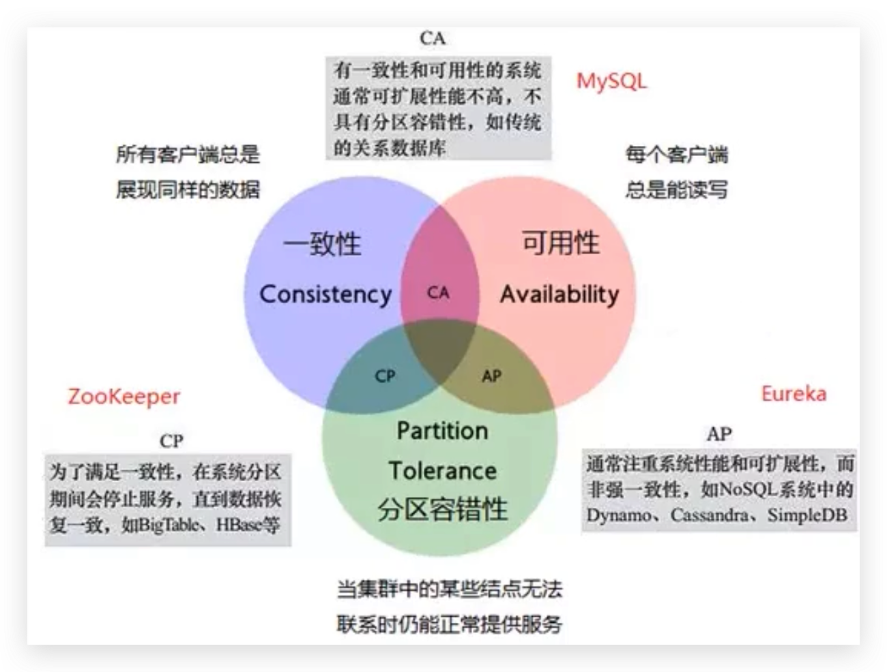
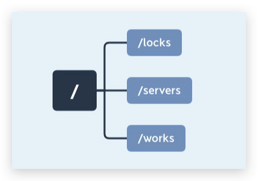
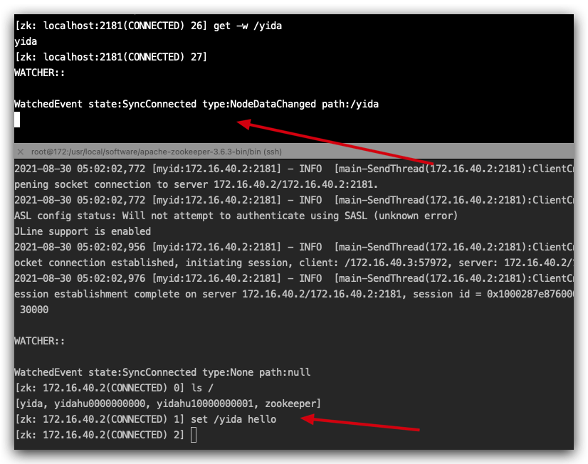
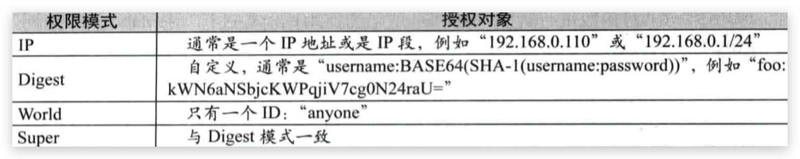

# 分布式应用注册中心- zookeeper


## 什么是微服务的注册中心？

### 什么是注册中心

服务注册中心是服务实现服务化管理的核心组件，类似于目录服务的作用，主要用来存储服务信息，譬如提供者 url 串、路由信息等。服务注册中心是微服务架构中最基础的设施之一。

注册中心可以说是微服务架构中的“通讯录”，它记录了服务和服务地址的映射关系。在分布式架构中，服务会注册到这里，当服务需要调用其它服务时，就到这里找到服务的地址，进行调用。


**总结：服务注册中心的作用就是「服务的注册」和「服务的发现」。**

### 为什么需要注册中心

了解了什么是注册中心，那么我们继续谈谈，为什么需要注册中心。在分布式系统中，我们不仅仅是需要在注册中心找到服务和服务地址的映射关系这么简单，我们还需要考虑更多更复杂的问题：

- 服务注册后，如何被及时发现
- 服务宕机后，如何及时下线
- 服务如何有效的水平扩展
- 服务发现时，如何进行路由
- 服务异常时，如何进行降级
- 注册中心如何实现自身的高可用
  

## CAP理论



## zookeeper环境部署


#### 安装

```shell
> wget https://dlcdn.apache.org/zookeeper/zookeeper-3.6.3/apache-zookeeper-3.6.3-bin.tar.gz
> tar zxvf apache-zookeeper-3.6.3-bin.tar.gz
> cd apache-zookeeper-3.6.3-bin
> mv conf/zoo_sample.cfg conf/zoo.cfg
> vim conf/zoo.cfg
修改内容如下：
dataDir=/usr/local/software/apache-zookeeper-3.6.3-bin/data
> chown -R zookeeper:zookeeper apache-zookeeper-3.6.3-bin/
> ./zkServer.sh start
```

#### 连接

```shell
./zkCli.sh
```

## zk数据模型

### 数据结构

数据模型是一种树形结构 。

```text
1. 不支持递归创建，必须先创建父节点 
2. 节点不能以 / 结尾，会直接报错 
3. ZooKeeper 树中的每一层级用斜杠（/）分隔开， 且只能用绝对路径（如“get /work/task1”）的方式查询 ZooKeeper 节点， 而不能使用相对路径
```



### znode 节点类型与特性

#### 持久节点

持久节点一旦创建、该数据节点会一直存储在zk服务器上、即使创建该节点的客户端与服务端的会话关闭了、该节点也不会被删除

#### 临时节点

如果将节点创建为临时节点、那么该节点数据不会一只存储在zk服务器上、当创建该临时节点的客户端绘画因超时或发生异常而关闭时、该节点也相应的在zk上被删除 。

#### 有序节点

序节点并不是一种单独种类的节点、而是在持久节点和临时节点的基础上、增加了一个节点有序的性质 


## zookeeper实现锁

针对超卖问题、使用zk实现锁

### **「悲观锁」**

认为对临界区的竞争总是会出现、为了保证在操作数据时、该数据不被其他进程修改、数据一直会处于锁定的状态 。

我们假设一个具有 n 个进程的应用，同时访问临界区资源，我们通过进程创建 ZooKeeper 节点 /locks 的方式获取锁。

线程 a 通过成功创建 ZooKeeper 节点“/locks”的方式获取锁后继续执行


隐含的问题，就是当进程 a 因为异常中断导致 /locks 节点始终存在，其他线程因为无法再次创建节点而无法获取锁，这就产生了一个死锁问题。针对这种情况我们可以通过将节点设置为临时节点的方式避免。并通过在服务器端添加监听事件来通知其他进程重新获取锁。


### **「乐观锁」**

进程对临界区资源的竞争不会总是出现、所以相对悲观锁而已、假锁方式没那么激烈、不会全程锁定资源、而是在数据进行提交更新的时候、对数据的冲突与否进行检查、如果发现冲突了、则拒绝操作

乐观锁基本都是CAS、CAS有三个操作数、内存值V、旧的预期值A、修改的新值B、当预期值与内存值V 相等时、才将内存值V改成B

在zk中的version 属性就是用来实现乐观锁机制中的检验的、zk中每个节点都有 dataVersion 这个字段、在调用更新操作的时候、加入有一个客户端试图进行更新操作、他会携带上次获取到的version值进行更新、如果在这段时间内、zk服务器上该节点的数值恰好已经被其他客户端更新了、那么 dataVersion一定发生变化、那么与当前客户端的version 无法匹配、便无法更新


## zkCli常用命令

```shell
connect zk03.matrix.mars.lianjia.com:2181
create root 
ls /
ls /root
ls -s /data0/www  带状态；
ls -R /data0  递归显示内容；
ls -w /borkers  watch一个目录的变化；
history
create /persistent_node 永久性节点
create -e /ephemeral_node mydata  临时节点
create -s /persistent_sequential_node mydata  永久有序节点
create -s -e /ephemeral_sequential_node mydata  临时有序节点
create /data0/www/applogs/one.txt mydata digest:hikerwu:secret:crwad   创建一个有账号密码的节点；
getAcl /data0/www/applogs/one.txt ‘digest,’hikerwu:secret:crwad 
create -c /container_node mydata    容器，最后一个孩子被删了，就会自动删除；
create -c /container_node/child_1 mydata
create -c /container_node/child_2 mydata 
delete /container_node/child_1 
delete /container_node/child_2
deleteall /container_node
get /container_node 过一段时间才没有了；并不是立刻没有了；
get /root
get /version -s  获取包含版本号；dataVersion=2；
set /root mydata  设置内容；
set -s /data0 mydata2 设置并显示状态；
set -v 0 /version mydata
set -v 1 /version mydata2 
set zookeeper.extendedTypesEnabled=true  打开ttl节点；
delete path [version] 删除节点，如果此时该节点有子节点，则不允许删除
create -t 3000 /ttl_node mydata  ttl节点；
addauth digest user:123456 
setAcl /acl_auth_test auth:user:123456:crwad  设置节点权限
setAcl -R /acl_auth_test auth:user:123456:crawd
setauth digest user:123456
getAcl /acl/child_2 'world,'anyone:cdrwa 获取节点权限
getAcl /acl/child_2
create /quota
setquota -n 2 /quota 包含自己；共计2个；但是实际还是建了很多呢；只是日志警告而已；
listquota /quota 
ls -R /quota 
create /quota/chlid1
create /quota/chlid2
setquota -b 512 /quota 只是日志记录而已，并不会严格记录；
set /quota "my_length_is 513" 
stat /quota
sync 同步信息；
version  版本；ZooKeeper CLI version: 3.6.2；
quit
```


## session机制

会话过期后，**集群中所有server**都删除由该会话创建的**临时节点**(EPHEMERAL)信息

## watch机制

只要数据一发生变化，就会通知相应地注册了监听的客户端

四个步骤：

1. 客户端注册Watcher到服务端;
2. 服务端发生数据变更;
3. 服务端通知客户端数据变更;
4. 客户端回调Watcher处理变更应对逻辑;

```shell
server1> get -w /yida
server2> set /yida hello
```



## 权限控制

ACL 权限控制，使用：scheme:id：perm 来标识，主要涵盖 3 个方面：
　　权限模式（Scheme）：授权的策略
　　授权对象（ID）:授权的对象
　　权限（Permission）:授予的权限

其特性如下：
　　ZooKeeper的权限控制是基于每个znode节点的，需要对每个节点设置权限
　　每个znode支持设置多种权限控制方案和多个权限
　　子节点不会继承父节点的权限，客户端无权访问某节点，但可能可以访问它的子节点

### 1. scheme 采用何种方式授权

　　**world：**默认方式，相当于全部都能访问
　　**auth**：代表已经认证通过的用户(cli中可以通过addauth digest user:pwd 来添加当前上下文中的授权用户)
　　**digest**：即用户名:密码这种方式认证，这也是业务系统中最常用的。用 *username:password* 字符串来产生一个MD5串，然后该串被用来作为ACL ID。认证是通过明文发送*username:password* 来进行的，当用在ACL时，表达式为*username:base64* ，base64是password的SHA1摘要的编码。
　　**ip**：使用客户端的主机IP作为ACL ID 。这个ACL表达式的格式为*addr/bits* ，此时addr中的有效位与客户端addr中的有效位进行比对。

### 2. ID  给谁授予权限

　　授权对象ID是指，权限赋予的用户或者一个实体，例如：IP 地址或者机器。授权模式 schema 与 授权对象 ID 之间



### 3. permission  授予什么权限

　　**CREATE、READ、WRITE、DELETE、ADMIN** 也就是 **增、删、改、查、管理**权限，这5种权限简写为crwda

注意:

　　**这5种权限中，delete是指对子节点的删除权限，其它4种权限指对自身节点的操作权限**

**更详细的如下:**

　　**CREATE**  c 可以创建子节点
　　**DELETE**  d 可以删除子节点（仅下一级节点）
　　**READ**    r 可以读取节点数据及显示子节点列表
　　**WRITE**   w 可以设置节点数据
　　**ADMIN**   a 可以设置节点访问控制列表权限

