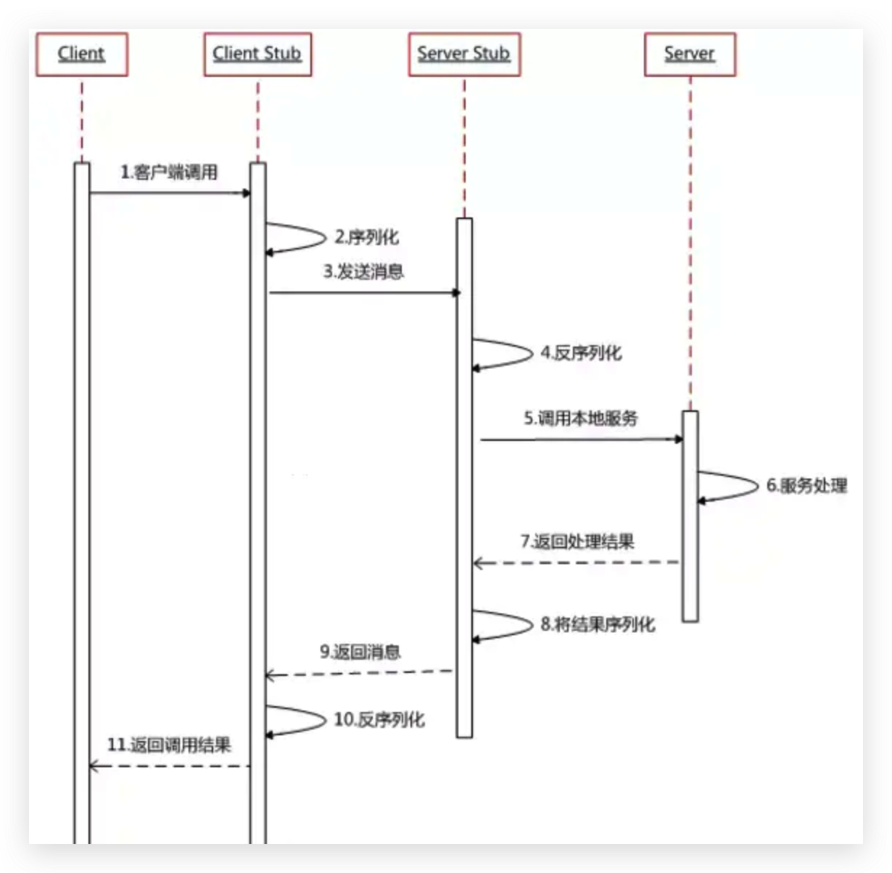

# 有了HTTP，为什么要用Dubbo？

## 一、什么是 Dubbo？

   Apache Dubbo 是一款高性能、轻量级的开源 Java RPC 框架，它提供了三大核心能力：**面向接口的远程方法调用**、**智能容错和负载均衡**，以及**服务自动注册和发现**。Dubbo 是一个分布式服务框架，致力于提供高性能和透明化 RPC 远程服务调用方案，以及 SOA 服务治理方案。

## 二、什么是 RPC？RPC 原理？

### 什么是 RPC？

   RPC(Remote Procedure Call) 远程过程调用。它是一种通过网络从远程计算机程序请求服务，而不需要了解底层网络技术的协议。
 ​
 ​   两个不同服务  A、B 分别部署在两台不同的机器上，那么服务 A 想要调用服务 B 中的某个方法，使用 HTTP 请求当然可以，但是会比较慢而且一些优化做得不好，也不安全。RPC 的出现就是为了解决这个问题。

### RPC原理？

## 三、有了 HTTP，为什么要用 Dubbo？

从以下两点回答：

- Dubbo 的定义

- RPC 相对于 HTTP 的优势

  SOA 面向服务的架构(Service Oriented Architecture)，也就是把工程按照业务逻辑拆分成**服务层**和**表现层**两个工程。服务层中包含业务逻辑，只需要对外提供服务即可。表现层只需要处理和页面的交互，业务逻辑都是调用服务层的服务来实现。SOA 架构中有两个主要角色：**服务提供者(Provider)**和**服务使用者(Consumer)**。

Dubbo 的四个特性：

1. **负载均衡**：同一个服务部署在不同的机器时该调用哪一台机器上的服务
2. **服务调用链路生成**：随着系统发展，服务越来越多，服务间依赖关系错综复杂，甚至分不清哪个应用要在哪个应用之前启动，架构师都不能完整描述应用的架构关系。Dubbo 可以为我们解决服务之间互相是如何调用的。
3. **服务访问压力以及时长统计、资源调度和治理**：基于访问压力实时管理集群容量，提高集群访问率。
4. **服务降级**：某个服务挂掉之后调用备用服务。

## 四、什么是分布式？

### 什么是分布式？

   SOA 分布式重要的就是面向服务，简单点说就是把整个系统拆分成不同的服务，将这些服务放在不同的服务器上减轻单体服务的压力提高并发量和性能。比如电商系统可以简单地拆分程订单系统、商品系统、登陆系统等等，部署在不同机器上，如果某个服务访问量比较大的话，还可以将这个服务同时部署在多台机器上。

### 为什么要分布式？

   从开发角度来讲单体应用的代码集中在一起，而分布式系统的代码根据业务被拆分。每个团队负责一个服务的开发，提升了开发效率。另外，代码根据业务拆分之后便于维护和扩展。

   将系统拆分成分布式之后不光便于系统的维护和扩展，更能提升整个系统的性能。把整个系统拆分成不同的服务，然后每个服务单独地部署在一台服务器上，是不是很大程度上提高了性能？

