# volatile 面试必问

## Java 中 volatile 用来干啥？

Volatile 是 Java 虚拟机提供的轻量级的同步机制（三大特性）

- 保证可见性
  - 不保证原子性
  - 禁止指令重排

要理解三大特性，就必须知道 Java 内存模型（JMM），那 JMM 又是什么呢？

## JMM 又是啥？

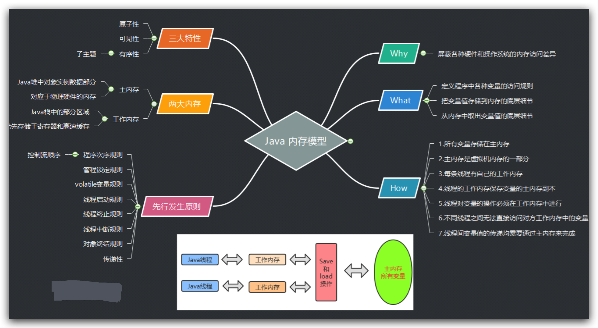

### 为什么需要 Java 内存模型？

> Why:屏蔽各种硬件和操作系统的内存访问差异

JMM 是 Java 内存模型，也就是 Java Memory Model，简称 JMM，本身是一种抽象的概念，实际上并不存在，它描述的是一组规则或规范，通过这组规范定义了程序中各个变量（包括实例字段，静态字段和构成数组对象的元素）的访问方式。

### 到底什么是 Java 内存模型？

- 1.定义程序中各种变量的访问规则

- 2.把变量值存储到内存的底层细节

- 3.从内存中取出变量值的底层细节

### Java 内存模型的两大内存是啥？

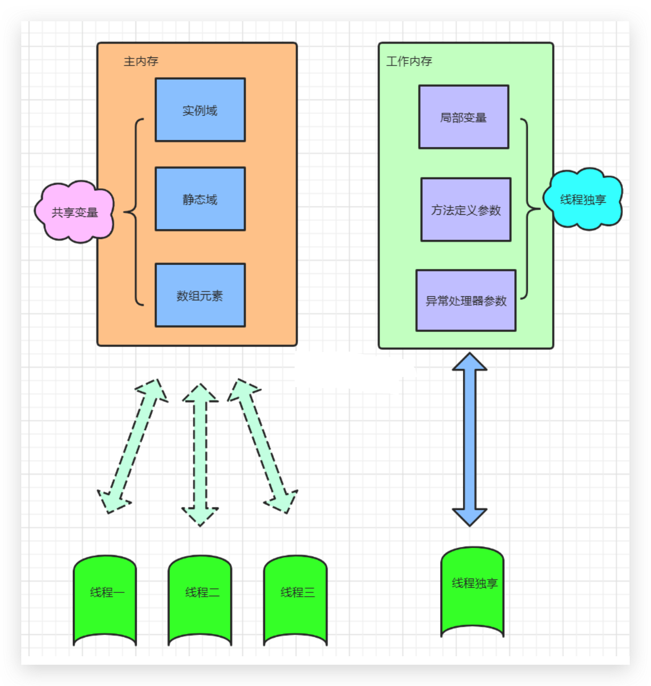

- 主内存
  - Java 堆中对象实例数据部分
  - 对应于物理硬件的内存
- 工作内存
  - Java 栈中的部分区域
  - 优先存储于寄存器和高速缓存

### Java 内存模型是怎么做的？

Java 内存模型的几个规范：

- 1.所有变量存储在主内存

- 2.主内存是虚拟机内存的一部分

- 3.每条线程有自己的工作内存

- 4.线程的工作内存保存变量的主内存副本

- 5.线程对变量的操作必须在工作内存中进行

- 6.不同线程之间无法直接访问对方工作内存中的变量

- 7.线程间变量值的传递均需要通过主内存来完成

由于 JVM 运行程序的实体是线程，而每个线程创建时 JVM 都会为其创建一个工作内存（有些地方称为栈空间），工作内存是每个线程的私有数据区域，而 Java 内存模型中规定所有变量都存储在主内存，主内存是共享内存区域，所有线程都可以访问，但线程对变量的操作（读取赋值等）必须在工作内存中进行，首先要将变量从主内存拷贝到自己的工作内存空间，然后对变量进行操作，操作完成后再将变量写会主内存，不能直接操作主内存中的变量，各个线程中的工作内存中存储着主内存中的变量副本拷贝，因此不同的线程间无法访问对方的工作内存，线程间的通信（传值）必须通过主内存来完成，其简要访问过程：

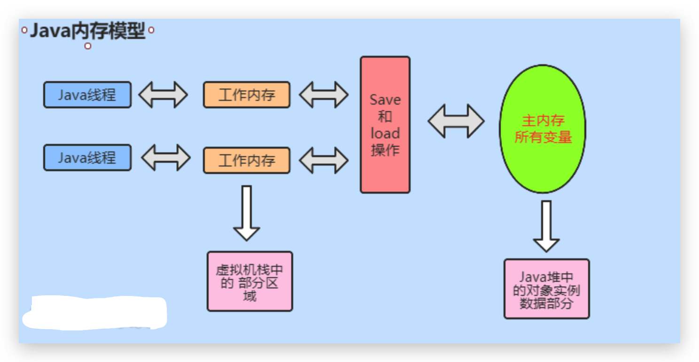

### Java 内存模型的三大特性

- 可见性（当一个线程修改了共享变量的值时，其他线程能够立即得知这个修改）

- 原子性（一个操作或一系列操作是不可分割的，要么同时成功，要么同时失败）

- 有序性（变量赋值操作的顺序与程序代码中的执行顺序一致）

关于有序性：如果在本线程内观察，所有的操作都是有序的；如果在一个线程中观察另一个线程，所有的操作都是无序的。前半句是指“线程内似表现为串行的语义”（Within-Thread As-If-Serial Semantics），后半句是指“指令重排序”现象和“工作内存与主内存同步延迟”现象。

## 能给个示例说下怎么用 volatile 的吗？

考虑一下这种场景：

> 有一个对象的字段 number 初始化值=0，另外这个对象有一个公共方法 setNumberTo100()可以设置 number = 100，当主线程通过子线程来调用 setNumberTo100()后，主线程是否知道 number 值变了呢？

答案：如果没有使用 volatile 来定义 number 变量，则主线程不知道子线程更新了 number 的值。

（1）定义如上述所说的对象：ShareData

```java
class ShareData {
int number = 0;

    public void setNumberTo100() {
        this.number = 100;
    }

}
```

（2）主线程中初始化一个子线程，名字叫做子线程

子线程先休眠 3s，然后设置 number=100。主线程不断检测的 number 值是否等于 0，如果不等于 0，则退出主线程。

```java
public class volatileVisibility {
public static void main(String[] args) {
// 资源类
ShareData shareData = new ShareData();

        // 子线程 实现了Runnable接口的，lambda表达式
        new Thread(() -> {

            System.out.println(Thread.currentThread().getName() + "\t come in");

            // 线程睡眠3秒，假设在进行运算
            try {
                TimeUnit.SECONDS.sleep(3);
            } catch (InterruptedException e) {
                e.printStackTrace();
            }
            // 修改number的值
            myData.setNumberTo100();

            // 输出修改后的值
            System.out.println(Thread.currentThread().getName() + "\t update number value:" + myData.number);

        }, "子线程").start();

        while(myData.number == 0) {
            // main线程就一直在这里等待循环，直到number的值不等于零
        }

        // 按道理这个值是不可能打印出来的，因为主线程运行的时候，number的值为0，所以一直在循环
        // 如果能输出这句话，说明子线程在睡眠3秒后，更新的number的值，重新写入到主内存，并被main线程感知到了
        System.out.println(Thread.currentThread().getName() + "\t 主线程感知到了 number 不等于 0");

        /**
         * 最后输出结果：
         * 子线程     come in
         * 子线程     update number value:100
         * 最后线程没有停止，并行没有输出"主线程知道了 number 不等于0"这句话，说明没有用volatile修饰的变量，变量的更新是不可见的
         */
    }

}
```

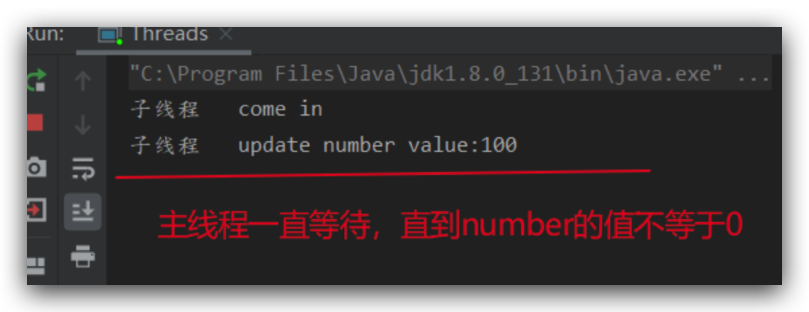

（3）我们用 volatile 修饰变量 number

```java
class ShareData {
//volatile 修饰的关键字，是为了增加多个线程之间的可见性，只要有一个线程修改了内存中的值，其它线程也能马上感知
volatile int number = 0;

    public void setNumberTo100() {
        this.number = 100;
    }
}
```

输出结果：

```
子线程 come in
子线程 update number value:100
main 主线程知道了 number 不等于 0

Process finished with exit code 0
```

小结：说明用 volatile 修饰的变量，当某线程更新变量后，其他线程也能感知到。

## 那为什么其他线程能感知到变量更新？

其实这里就是用到了“窥探（snooping）”协议。在说“窥探（snooping）”协议之前，首先谈谈缓存一致性的问题。

### 缓存一致性

当多个 CPU 持有的缓存都来自同一个主内存的拷贝，当有其他 CPU 偷偷改了这个主内存数据后，其他 CPU 并不知道，那拷贝的内存将会和主内存不一致，这就是缓存不一致。那我们如何来保证缓存一致呢？这里就需要操作系统来共同制定一个同步规则来保证，而这个规则就有 MESI 协议。

如下图所示，CPU2 偷偷将 num 修改为 2，内存中 num 也被修改为 2，但是 CPU1 和 CPU3 并不知道 num 值变了。

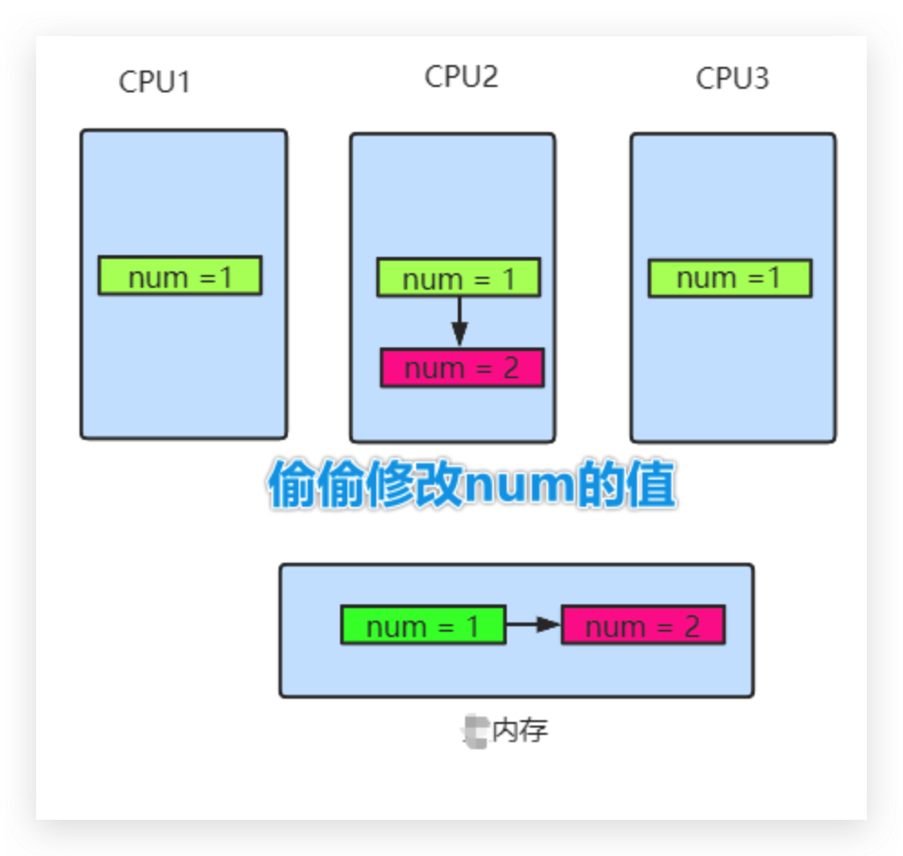

### MESI

当 CPU 写数据时，如果发现操作的变量是共享变量，即在其它 CPU 中也存在该变量的副本，系统会发出信号通知其它 CPU 将该内存变量的缓存行设置为无效。如下图所示，CPU1 和 CPU3 中 num=1 已经失效了。

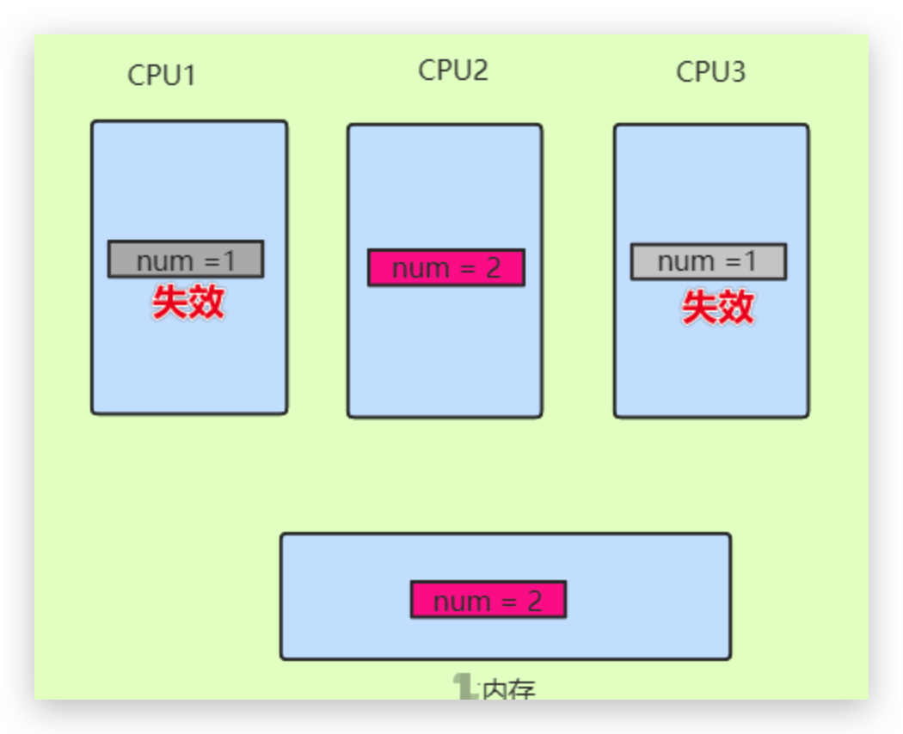

当其它 CPU 读取这个变量的时，发现自己缓存该变量的缓存行是无效的，那么它就会从内存中重新读取。

如下图所示，CPU1 和 CPU3 发现缓存的 num 值失效了，就重新从内存读取，num 值更新为 2。

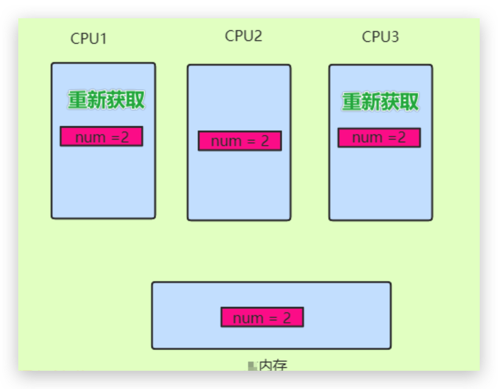

### 总线嗅探

那其他 CPU 是怎么知道要将缓存更新为失效的呢？这里是用到了总线嗅探技术。

每个 CPU 不断嗅探总线上传播的数据来检查自己缓存值是否过期了，如果处理器发现自己的缓存行对应的内存地址被修改，就会将当前处理器的缓存行设置为无效状态，当处理器对这个数据进行修改操作的时候，会重新从内存中把数据读取到处理器缓存中。

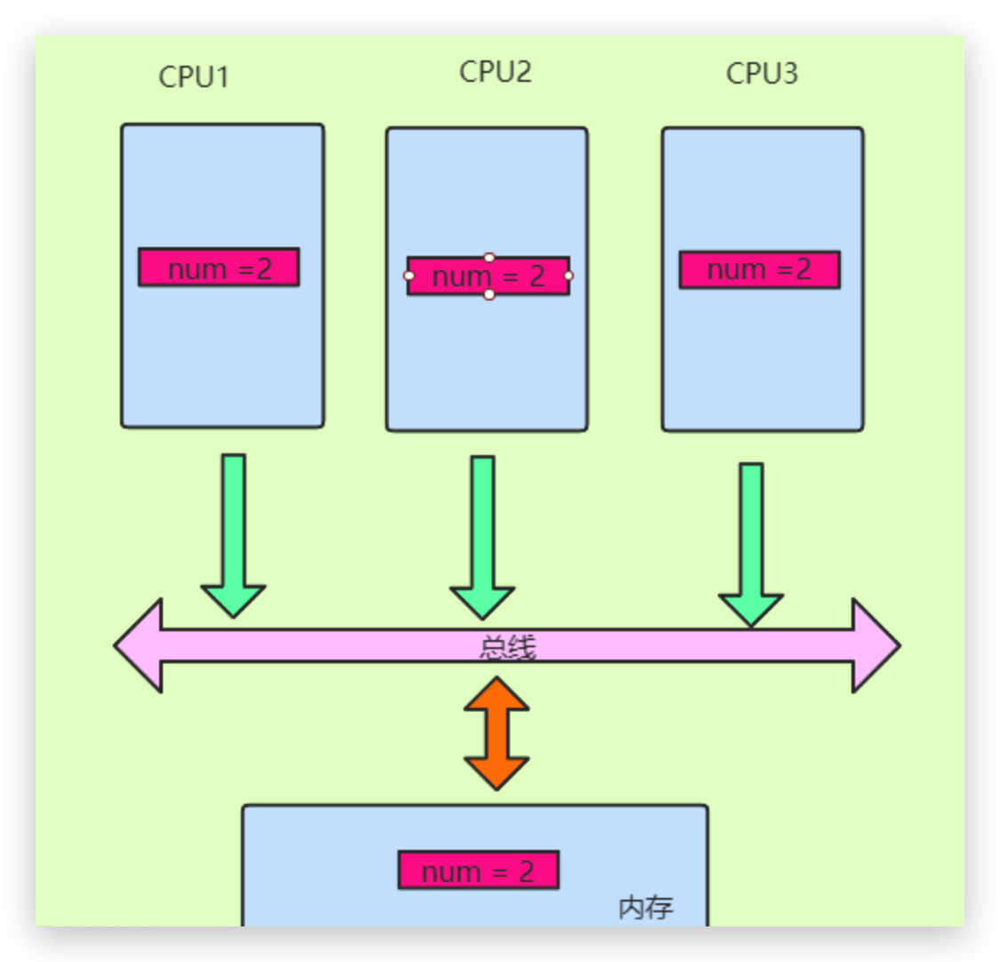

### 总线风暴

总线嗅探技术有哪些缺点？

由于 MESI 缓存一致性协议，需要不断对主线进行内存嗅探，大量的交互会导致总线带宽达到峰值。因此不要滥用 volatile，可以用锁来替代，看场景啦~

## 能演示下 volatile 为什么不保证原子性吗？

原子性：一个操作或一系列操作是不可分割的，要么同时成功，要么同时失败。

_这个定义和 volatile 啥关系呀，完全不能理解呀？Show me the code!_

考虑一下这种场景:

> 当 20 个线程同时给 number 自增 1，执行 1000 次以后，number 的值为多少呢？

在单线程的场景，答案是 20000，如果是多线程的场景下呢？答案是可能是 20000，但很多情况下都是小于 20000。

示例代码：

```java
package com.jackson0714.passjava.threads;

/\*\*
演示 volatile 不保证原子性

- @create: 2020-08-13 09:53
  \*/

public class VolatileAtomicity {
public static volatile int number = 0;

    public static void increase() {
        number++;
    }

    public static void main(String[] args) {

        for (int i = 0; i < 50; i++) {
            new Thread(() -> {
                for (int j = 0; j < 1000; j++) {
                    increase();
                }
            }, String.valueOf(i)).start();
        }

        // 当所有累加线程都结束
        while(Thread.activeCount() > 2) {
            Thread.yield();
        }

        System.out.println(number);
    }

}
```

执行结果：第一次 19144，第二次 20000，第三次 19378。

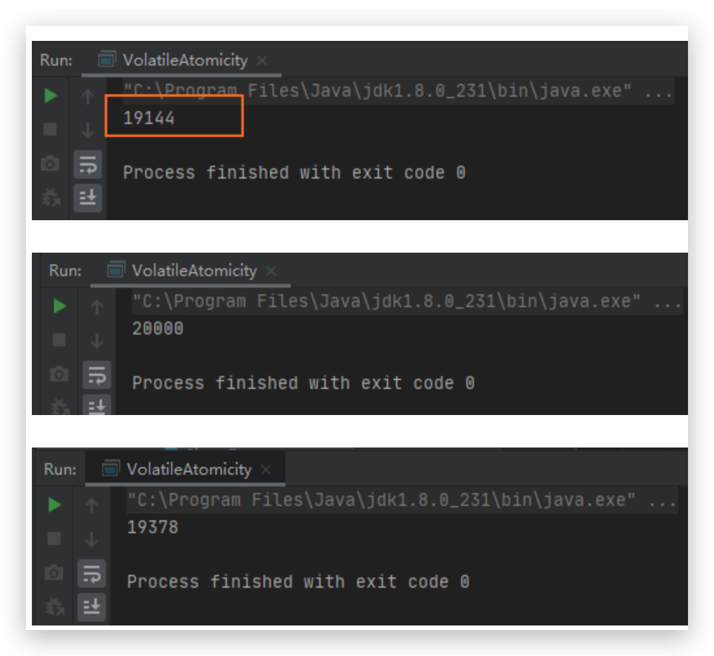

我们来分析一下 increase()方法，通过反编译工具 javap 得到如下汇编代码：

```java
public static void increase();
Code:
0: getstatic #2 // Field number:I
3: iconst_1
4: iadd
5: putstatic #2 // Field number:I
8: return
```

number++其实执行了 3 条指令：

> getstatic：拿 number 的原始值 iadd：进行加 1 操作 putfield：把加 1 后的值写回

执行了 getstatic 指令 number 的值取到操作栈顶时，volatile 关键字保证了 number 的值在此时是正确的，但是在执行 iconst_1、iadd 这些指令的时候，其他线程可能已经把 number 的值改变了，而操作栈顶的值就变成了过期的数据，所以 putstatic 指令执行后就可能把较小的 number 值同步回主内存之中。

总结如下：

> 在执行 number++这行代码时，即使使用 volatile 修饰 number 变量，在执行期间，还是有可能被其他线程修改，没有保证原子性。

## 怎么保证输出结果是 20000 呢？

### synchronized 同步代码块

我们可以通过使用 synchronized 同步代码块来保证原子性。从而使结果等于 20000

```java
public synchronized static void increase() {
    number++;
}
```

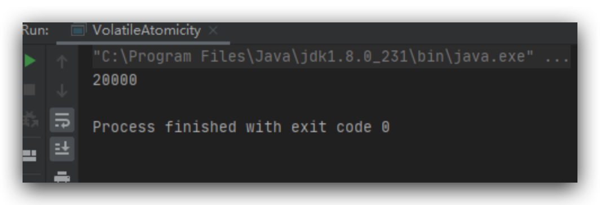

但是使用 synchronized 太重了，会造成阻塞，只有一个线程能进入到这个方法。我们可以使用 Java 并发包（JUC）中的 AtomicInterger 工具包。

## AtomicInteger 原子性操作

我们来看看 AtomicInteger 原子自增的方法 getAndIncrement()

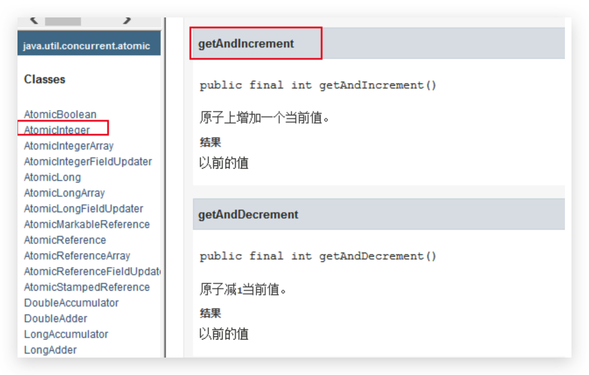

```java
public static AtomicInteger atomicInteger = new AtomicInteger();

public static void main(String[] args) {

    for (int i = 0; i < 20; i++) {
        new Thread(() -> {
            for (int j = 0; j < 1000; j++) {
                atomicInteger.getAndIncrement();
            }
        }, String.valueOf(i)).start();
    }

    // 当所有累加线程都结束
    while(Thread.activeCount() > 2) {
        Thread.yield();
    }

    System.out.println(atomicInteger);

}
```

多次运行的结果都是 20000。

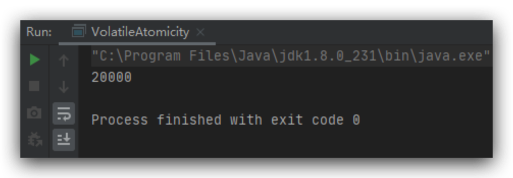

## 禁止指令重排又是啥？

说到指令重排就得知道为什么要重排，有哪几种重排。

如下图所示，指令执行顺序是按照 1>2>3>4 的顺序，经过重排后，执行顺序更新为指令 3->4->2->1。

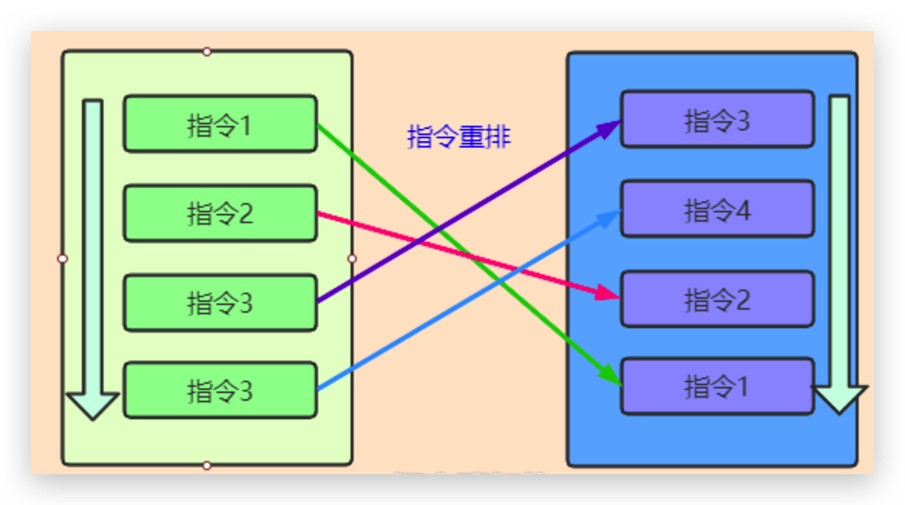

会不会感觉到重排把指令顺序都打乱了，这样好吗？

可以回想下小学时候的数学题：`2+3-5=?`，如果把运算顺序改为 `3-5+2=?`，结果也是一样的。所以指令重排是要保证单线程下程序结果不变的情况下做重排。

## 为什么要重排

计算机在执行程序时，为了提高性能，编译器和处理器常常会对指令做重排序。

## 有哪几种重排

- 1.编译器优化重排：编译器在不改变单线程程序语义的前提下，可以重新安排语句的执行顺序。

- 2.指令级的并行重排：现代处理器采用了指令级并行技术来将多条指令重叠执行。如果不存在数据依赖性，处理器可以改变语句对应机器指令的执行顺序。

- 3.内存系统的重排：由于处理器使用缓存和读/写缓冲区，这使得加载和存储操作看上去可能是在乱序执行。

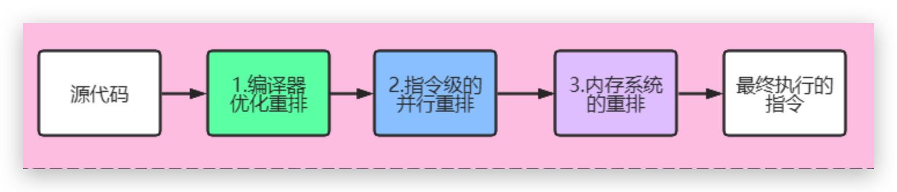

注意：

单线程环境里面确保最终执行结果和代码顺序的结果一致

处理器在进行重排序时，必须要考虑指令之间的数据依赖性

多线程环境中线程交替执行，由于编译器优化重排的存在，两个线程中使用的变量能否保证一致性是无法确定的，结果无法预测。

## 举个例子来说说多线程中的指令重排？

设想一下这种场景：定义了变量 num=0 和变量 flag=false，线程 1 调用初始化函数 init()执行后，线程调用 add()方法，当另外线程判断 flag=true 后，执行 num+100 操作，那么我们预期的结果是 num 会等于 101，但因为有指令重排的可能，num=1 和 flag=true 执行顺序可能会颠倒，以至于 num 可能等于 100

```java
public class VolatileResort {
    static int num = 0;
    static boolean flag = false;
    public static void init() {
        num= 1;
        flag = true;
    }
    public static void add() {
        if (flag) {
            num = num + 5;
            System.out.println("num:" + num);
        }
    }
    public static void main(String[] args) {
        init();
        new Thread(() -> {
            add();
        },"子线程").start();
    }
}
```

> 单例双重 check 问题也是需要 volatile

先看线程 1 中指令重排：

`num= 1;flag = true;` 的执行顺序变为 `flag=true;num = 1;`，如下图所示的时序图

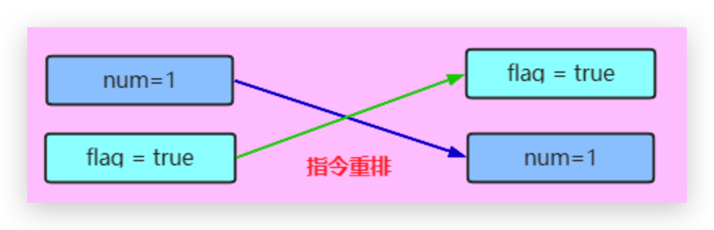

如果线程 2 num=num+5 在线程 1 设置 num=1 之前执行，那么线程 2 的 num 变量值为 5。如下图所示的时序图。

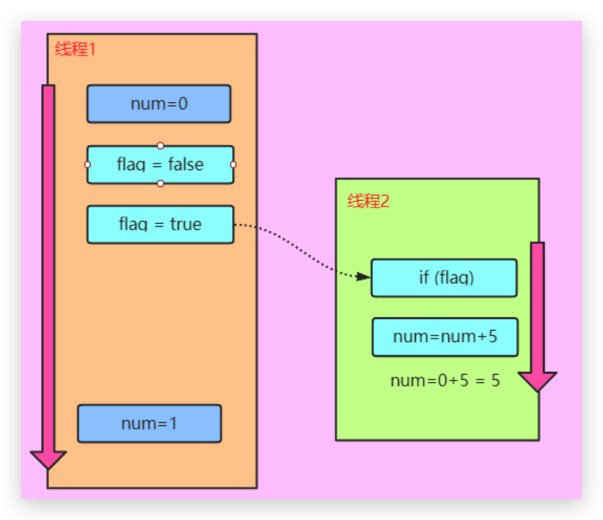

## volatile 怎么实现禁止指令重排？

我们使用 volatile 定义 flag 变量：

```java
static volatile boolean flag = false;
```

_如何实现禁止指令重排：_

原理：在 volatile 生成的指令序列前后插入内存屏障（Memory Barries）来禁止处理器重排序。

有如下四种内存屏障：

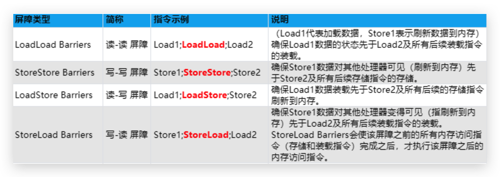

volatile 写的场景如何插入内存屏障：

- 在每个 volatile 写操作的前面插入一个 StoreStore 屏障（写-写 屏障）。

- 在每个 volatile 写操作的后面插入一个 StoreLoad 屏障（写-读 屏障）。

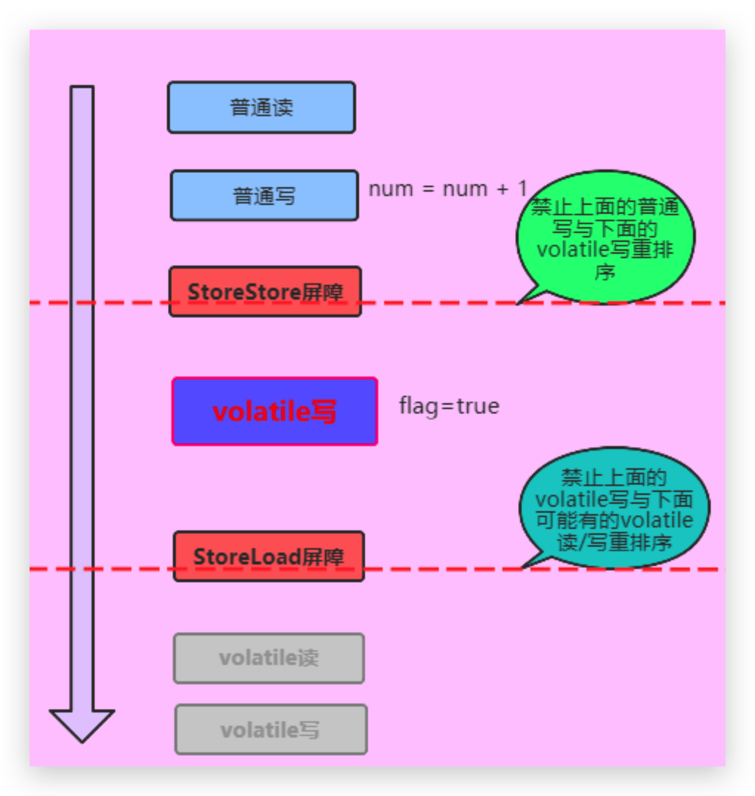

> StoreStore 屏障可以保证在 volatile 写（flag 赋值操作 flag=true）之前，其前面的所有普通写（num 的赋值操作 num=1) 操作已经对任意处理器可见了，保障所有普通写在 volatile 写之前刷新到主内存。

volatile 读场景如何插入内存屏障：

- 在每个 volatile 读操作的后面插入一个 LoadLoad 屏障（读-读 屏障）。

- 在每个 volatile 读操作的后面插入一个 LoadStore 屏障（读-写 屏障）。

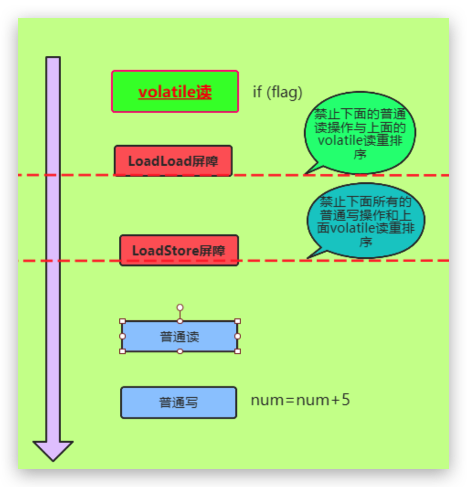

> LoadStore 屏障可以保证其后面的所有普通写（num 的赋值操作 num=num+5) 操作必须在 volatile 读（if(flag)）之后执行。

## volatile 常见应用

这里举一个应用，双重检测锁定的单例模式

```java
package com.jackson0714.passjava.threads;
/\*\*
演示 volatile 单例模式应用（双边检测）

- @create: 2020-08-17
  \*/

class VolatileSingleton {
    private static VolatileSingleton instance = null;
    private VolatileSingleton() {
        System.out.println(Thread.currentThread().getName() + "\t 我是构造方法 SingletonDemo");
    }
    public static VolatileSingleton getInstance() {
        // 第一重检测
        if(instance == null) {
            // 锁定代码块
            synchronized (VolatileSingleton.class) {
                // 第二重检测
                if(instance == null) {
                    // 实例化对象
                    instance = new VolatileSingleton();
                }
            }
        }
        return instance;
    }
}
```

代码看起来没有问题，但是 instance = new VolatileSingleton();其实可以看作三条伪代码：

```java
memory = allocate(); // 1、分配对象内存空间
instance(memory); // 2、初始化对象
instance = memory; // 3、设置 instance 指向刚刚分配的内存地址，此时 instance != null
```

步骤 2 和 步骤 3 之间不存在 数据依赖关系，而且无论重排前 还是重排后，程序的执行结果在单线程中并没有改变，因此这种重排优化是允许的。

```java
memory = allocate(); // 1、分配对象内存空间
instance = memory; // 3、设置 instance 指向刚刚分配的内存地址，此时 instance != null，但是对象还没有初始化完成
instance(memory); // 2、初始化对象
```

如果另外一个线程执行：if(instance == null) 时，则返回刚刚分配的内存地址，但是对象还没有初始化完成，拿到的 instance 是个假的。如下图所示：

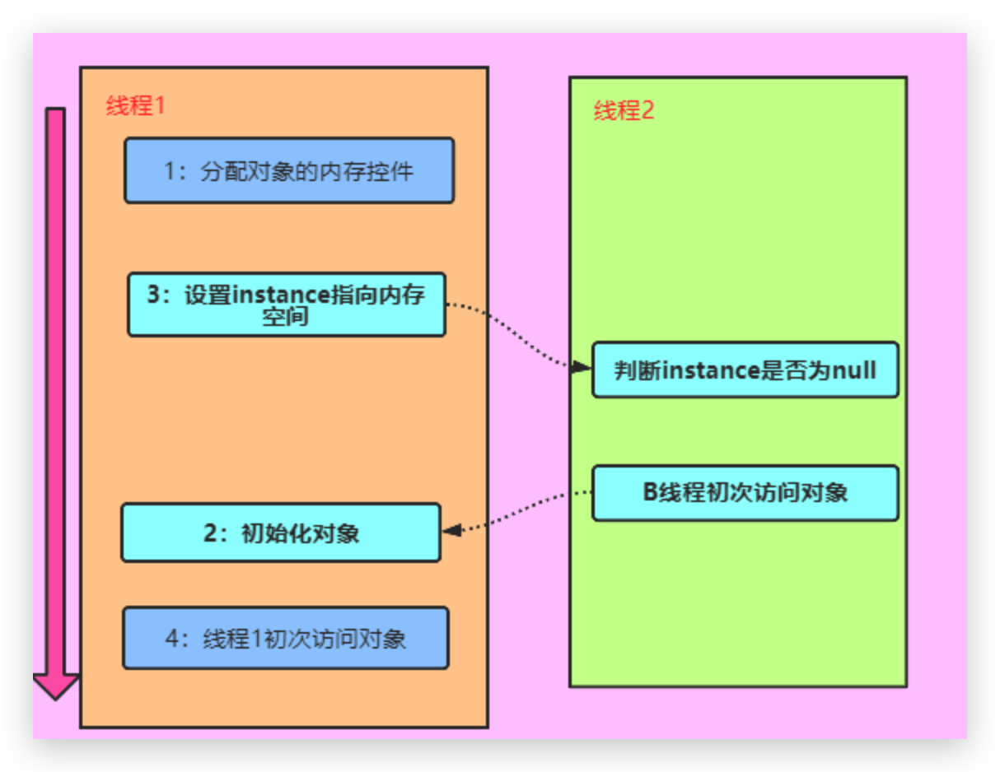

解决方案：定义 instance 为 volatile 变量

```java
private static volatile VolatileSingleton instance = null;
```

## volatile 都不保证原子性，为啥我们还要用它？

奇怪的是，volatile 都不保证原子性，为啥我们还要用它？

volatile 是轻量级的同步机制，对性能的影响比 synchronized 小。

> 典型的用法：检查某个状态标记以判断是否退出循环。

比如线程试图通过类似于数绵羊的传统方法进入休眠状态，为了使这个示例能正确执行，asleep 必须为 volatile 变量。否则，当 asleep 被另一个线程修改时，执行判断的线程却发现不了。

_那为什么我们不直接用 synchorized，lock 锁？它们既可以保证可见性，又可以保证原子性为何不用呢？_

因为 synchorized 和 lock 是排他锁（悲观锁），如果有多个线程需要访问这个变量，将会发生竞争，只有一个线程可以访问这个变量，其他线程被阻塞了，会影响程序的性能。

> 注意：当且仅当满足以下所有条件时，才应该用 volatile 变量
>
> 对变量的写入操作不依赖变量的当前值，或者你能确保只有单个线程更新变量的值。
> 该变量不会与其他的状态一起纳入不变性条件中。
> 在访问变量时不需要加锁。

## volatile 和 synchronzied 的区别

- volatile 只能修饰实例变量和类变量，synchronized 可以修饰方法和代码块。
- volatile 不保证原子性，而 synchronized 保证原子性
- volatile 不会造成阻塞，而 synchronized 可能会造成阻塞
- volatile 轻量级锁，synchronized 重量级锁
- volatile 和 synchronized 都保证了可见性和有序性

## 小结

- volatile 保证了可见性：当一个线程修改了共享变量的值时，其他线程能够立即得知这个修改。
- volatile 保证了单线程下指令不重排：通过插入内存屏障保证指令执行顺序。
- volatitle 不保证原子性，如 a++这种自增操作是有并发风险的，比如扣减库存、发放优惠券- 的场景。
- volatile 类型的 64 位的 long 型和 double 型变量，对该变量的读/写具有原子性。
- volatile 可以用在双重检锁的单例模式种，比 synchronized 性能更好。
- volatile 可以用在检查某个状态标记以判断是否退出循环。
