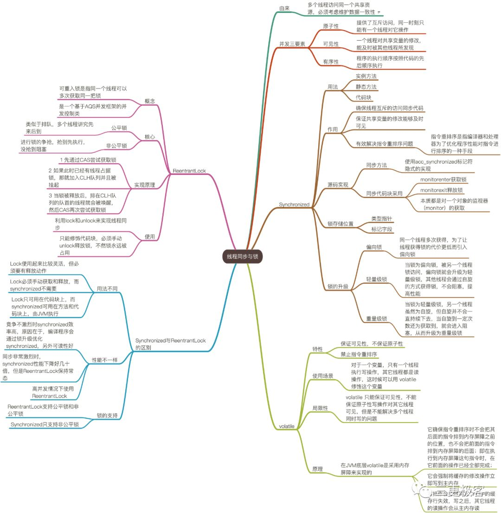

# [吐血总结]线程同步与锁

## 前言

线程同步与锁在Java编程中是非常核心的点，在这里总结画出思维导图。

## 概述

可以把单线程程序当作在问题域求解的单一实体，每次只能做一件事情。因为只有一个实体，所以永远不用担心诸如”两个实体试图同时使用同一个资源“这样的问题。比如，两个人同一个地方停车，两个人同时走出一扇门，甚至是两个人同时说话。

有了并发就可以同时做多件事情了，但是，两个或多个线程彼此互相干涉的问题也就出现了。如果不防范这种冲突，就可能发生两个线程同时试图访问同一个银行账户，或向同一个打印机打印，改变同一个值等诸如此类的问题。

- 线程在操作某个共享资源的过程中被其他线程所打断，时间片耗尽而被迫切换到其他线程
- 共享资源被其他线程修改后得不到告知，造成线程间数据不一致
- 由于编译器优化等原因，若干操作指令的执行顺序被打乱，造成结果的不可预期

