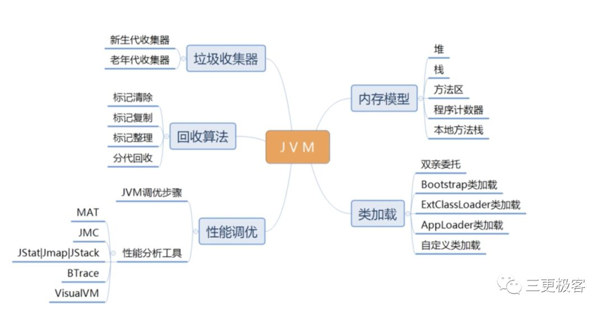
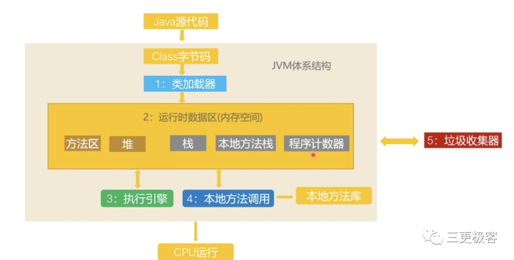

# 你不得不了解的JVM

## **前言**

根据自己的经验以及看书看文章的理解，从一个新手到现在明白JVM是个什么玩意，怎么去理解和明白，讲解这样一个经验而已。这篇文章并对JVM并没有挖掘得很深，只是以通熟易懂的方式，让大家理解JVM是个什么玩意。

## **Java的跨平台**

Java的跨平台特性，是对JVM最直观的认识。所谓的“一次编译，到处运行”，为什么C／C++ 却不能实现呢？这一类语言直接使用物理硬件(或者说操作系统的内存模型)，那么不同系统之间的内存模型是不同的。

Java虚拟机规范中试图定义一种Java内存模型(JMM)来屏蔽掉各种硬件和操作系统的内存访问差异，以实现让Java程序在各种平台上都能达到一致性的并发效果。

众所周知，Java的程序编译的最终样子是.class文件，不同虚拟机的对每一个.class文件的翻译结果都是一致的。而对于C／C++而言，编译生成的是纯二进制的机器指令，是直接面对计算机系统的内存，但是，java程序的编译结果是面向JVM，是要交付给JVM，让他再做进一步处理从而让计算机识别运行，这就是所谓的“屏蔽掉各种硬件和操作系统的内存访问差异”。

## **虚拟机**

“虚拟机（Virtual Machine）指通过软件模拟的具有完整硬件系统功能的、运行在一个完全隔离环境中的完整计算机系统”，但是虚拟机本质还是该计算机系统的一个进程，可以类比香港澳门具有高度自治，但本质上他们还是属于中国的。为了方便描述，我们把整个计算机当成一幢大楼，而虚拟机则是某一个楼层。大楼划分了一个区域给一个楼层，让这个楼层自己管理自己，也就对应着，计算机划分了一个内存给JVM，让JVM自己管理自己。下面这张图是笔者的阿里云服务器上的内存使用情况，可以看到JVM足足占用了接近500M的内存。那么问题来了，JVM要这么多的内存干什么，这里面又是怎么划分？

## **内存**

JVM是作为某一个楼层，单独占有了一大块区域（内存）。这个楼层中，有主厅，客厅，客房，这四个之间的区别之一就行，主厅和客厅是公有的，而主房和客房是私有的，这里对应到JVM层次上即是，有某几块内存，是无论是谁访问，有多少人（线程）访问，这些共有区域都可以为他们服务，而客房，私有区域，假定我们这个楼层比较牛逼，来了多少个客人，就会单独为他们建造每一件客房，每个客人都有自己私有区域，A客人是进不了B客人的房间。

　　对应的JVM的层次，即是JVM运行时数据区域划分为两大块，线程隔离的区域和线程共享的区域。我们可以简单的理解为，每个客人即是一条线程。具体对应的区域又是如何划分的，又有什么作用，这里只能从概念上理解和记忆了。

## **什么是垃圾**

在家里收拾垃圾的时候，为了确保扔掉的东西是垃圾，她会将这个东西，一个一个问家里的每个人，这个东西是不是你的，你还要不要，当没有一个人承认说这个东西是属于他的时候，老妈就将这个东西视为垃圾，当有人说这个不是垃圾，是他的宝贝的时候，我老妈就这个东西标记一下。JVM采用的是类似的做法，每个对象到GC ROOT都有一定的联系和路径可达，当某个对象，对于GC ROOT不可达（即没有人说这个东西是属于他的）的对象，JVM则判定为垃圾。JVM里称此行为是可达性分析。

### **垃圾回收算法**

知道什么是垃圾，找到了垃圾的位置，接下来的问题是我要怎么处理这个垃圾，即垃圾回收。我要怎样忘了你是谁，关键是要怎么做，这个动作是怎么发生的。

**标记清除**：在这个楼层中，垃圾四处都有，甚至散乱在非垃圾之间或者周围，即然我老妈已经给有用的东西做个标志，那么这就意味着我老妈只需要清除那些没有标识的东西。标记清除的做法形象成就是我老妈拿着垃圾桶，从头到尾，看到垃圾就把他扔到垃圾桶里面。这种做法无疑是最简单的，但是带来的后果也是很明显的，空间碎片太多。这里的空间碎片又要做如何理解，每个物品（每个对象）都是需要占据着一定的的面积（即内存），他要站住脚跟嘛，但是如果空间碎片的太多，就会导致大的物品来临的时候，区域（内存）不够用，就会再次引发垃圾回收（意味着你打游戏的时候可能要停顿个几秒）。再举个现实中的例子，打包行李箱的时候，随随便便，散乱的放置东西，行李厢很容易被撑满，这个时候你还想放一双鞋进去，你会发现空间不够用，只能把所以东西都倒出来，整整齐齐的，从上到下从左到右的放置物品。对于空间的利用率，整齐的做法比散乱无章的行为更来得高，这就引出了另外一个做法，标记整理算法。

**标记整理**：你见过有谁扫地的时候，看到垃圾就直接把扫到扫帚了里面，看到就扫。不存在的！人是有惰性的，所有总会找到更高效的做法，更习惯的做法是将垃圾扫到一起，再统一将其扔到垃圾桶中。

**复制**：这个算法就有点奢侈了，不管这个内存里有多少垃圾，我老妈都统一将他们扔掉，然后重新再买一次那些我们还需要用的物品，俗称复制。因此，如果存活对象太多，这个算法是不适合的（想想就知道了-.-）,其二，JVM里面需要将可用内存分为两半，一半供目前使用，一半供复制后的对象使用。

**分代算法**：根据对象存活周期的不同将内存划分为几块，一般是新生代和老年代，新生代基本采用复制算法，老年代采用标记整理算法。