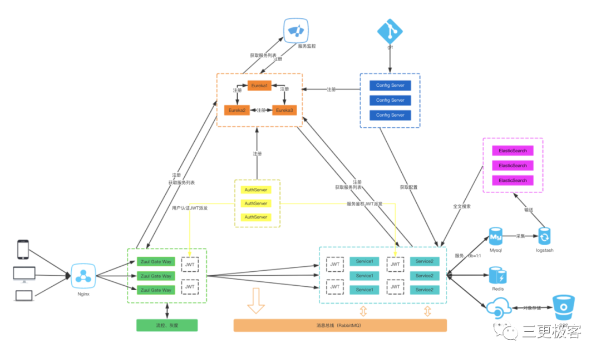
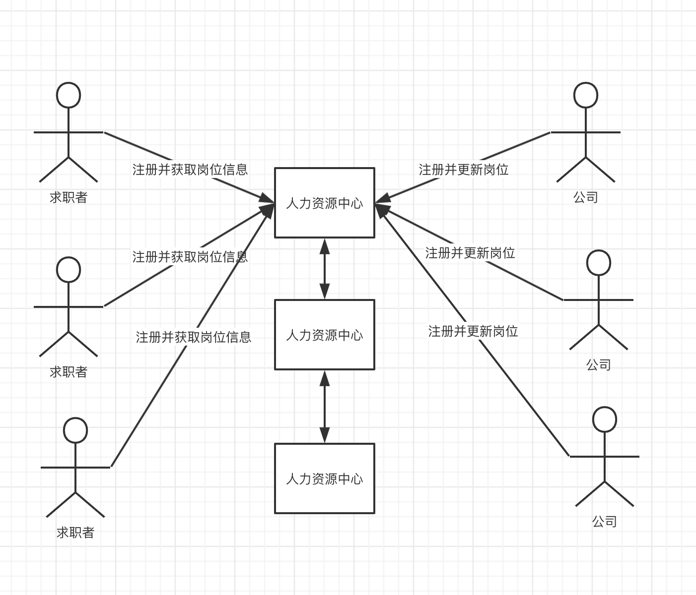
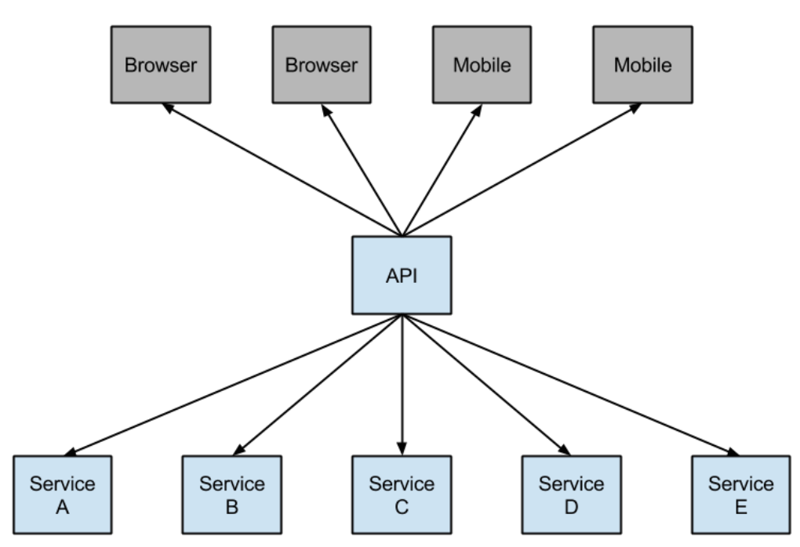
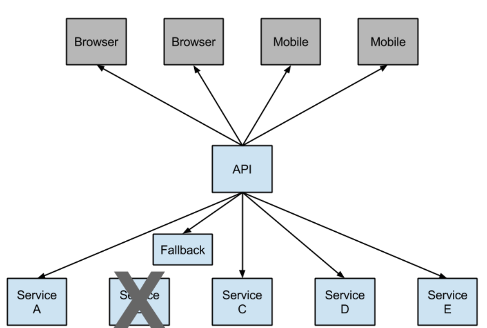
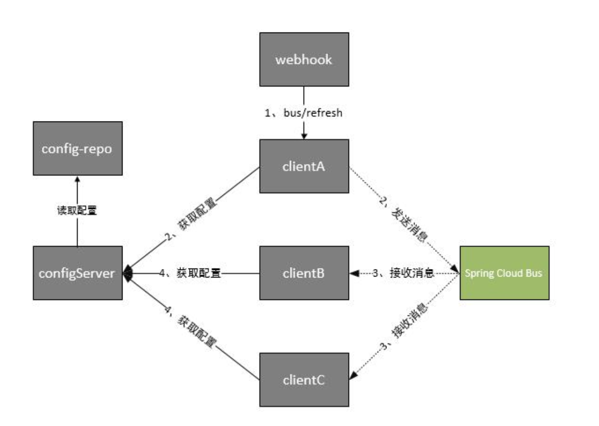

# 搞懂SpringCloud微服务架构

## 前言

微服务架构已经流行很长时间了，如果要问为什么要用微服务架构，那先来说一下一体化架构。

单体应用就是将应用程序的所有功能都打包成一个独立的单元。部署简单，开发效率“高”，上手容易，但是容易出现系统风险，一个非主要功能，导致整个系统不可用，性能、稳定性难以优化等等问题。

微服务就是把一个大系统按业务功能**分解**成多个小系统，并利用简单的方法使多小系统相互协作，**组合**成一个大系统。优势是规避系统性风险，轻管理 ，迭代快、降成本、有利于长期发展。

## 什么是Spring Cloud？

Spring Cloud为开发人员提供了快速构建分布式系统中一些常见模式的工具（例如配置管理，服务发现，断路器，智能路由，微代理，控制总线）。而 Spring Cloud 为我们提供了一套简易的编程模型，使我们能在 Spring Boot 的基础上轻松地实现微服务项目的构建。

## Spring Cloud的特性

Spring Cloud专注于提供良好的开箱即用经验的典型用例和可扩展性机制覆盖。

- 服务注册和发现

- 分布式/版本化配置
- 路由
- service - to - service调用
- 负载均衡
- 断路器
- 分布式消息传递

以下是Spring Cloud体系所包含的架构图，如果大家对这张图有不太明白的地方，我相信看完这篇文章你会恍然大悟的。



## Spring Cloud版本

Spring Cloud是一个拥有诸多子项目的大型综合项目，原则上其子项目也都维护着自己的发布版本号。那么每一个Spring Cloud的版本都会包含不同的子项目版本，为了要管理每个版本的子项目清单，避免版本名与子项目的发布号混淆，所以没有采用版本号的方式，而是通过命名的方式。

通过下表，我们可以快速查阅当前各版本所包含的子项目，以及各子项目的版本号，通过此来决定需要选择怎么样的版本。

| Spring Boot | Spring Cloud | Spring Cloud Alibaba |
| :---------- | :----------- | :------------------- |
| 2.1.x       | Greenwich    | 0.9.x                |
| 2.0.x       | Finchley     | 0.2.x                |
| 1.5.x       | Edgware      | 0.1.x                |
| 1.5.x       | Dalston      | 0.1.x                |

## Spring Cloud服务发现框架 - Eureka

> 服务发现是基于微服务架构的关键原则之一。尝试配置每个客户端或某种形式的约定可能非常困难，可以非常脆弱。Netflix服务发现服务器和客户端是Eureka。可以将服务器配置和部署为高可用性，每个服务器将注册服务的状态复制到其他服务器。

到底是服务发现？什么又是服务注册呢？

举一个生活中的例子，就像我们平时找工作去找人力资源公司一样，比如上各种求职APP。

在没有人力资源公司的时候，我们需要一家家公司的去找是否有合适的工作岗位，这显然非常的费时费力，一方面你是找不到那么工作岗位的资源，另一方面你也不可能那么费时的找下去，可能找着找着没有合适的就将就将就了。这里的求职者就是消费者，而那些招聘的公司就是生产者。消费者需要生产者提供的服务，就像我们需要去他们公司提供的岗位工作一样。

如果光是求职者与招聘公司之间相互找，效率肯定是非常低的，招聘公司招不到合适的人才影响发展，求职者找不到合适的工作没钱无法生活。需求来了就需要解决方案，于是招聘公司开始四处发传单贴广告，这里招聘公司完成了自己的任务，把招聘岗位发出去了，但是问题来了，不是求职的人也看到了这些消息，在现实世界中可能没什么，但是计算机世界中这就是资源消耗，另一方面，求职者也不能时刻的去找路边的广告，这个就非常的麻烦。

那更好的解决方案是什么？大家都去找人力资源公司阿，比如需要招聘的公司，把自己需要招聘的岗位全部托付给人力资源公司，而求职者需要找工作第一时间去人力资源公司查看。

对于上面的问题，画出下面的图：



**服务发现**：其实就是一个“资源中心”，整个过程中有三个角色：**服务提供者(提供岗位)、服务消费者(找工作)、服务中介(人力资源中心)**。

**服务提供者**：就是提供一些自己能够执行的一些服务给外界。

**服务消费者**：就是需要使用一些服务的“用户”。

**服务中介**：其实就是服务提供者和服务消费者之间的“桥梁”，服务提供者可以把自己注册到服务中介那里，而服务消费者如需要消费一些服务(使用一些功能)就可以在服务中介中寻找注册在服务中介的服务提供者。

**服务注册 Register**：

官方解释：当 Eureka 客户端向`[Eureka] Server`注册时，它提供自身的**元数据**，比如IP地址、端口，运行状况指示符URL，主页等。

结合人力资源中心理解：公司 (提供者`[Eureka] Client Provider`)在人力资源中心 (服务器`[Eureka] Server`) 那里登记岗位的信息，比如工程师、架构师、CTO等等(元数据`metaData`)。

当然除了Eureka，还有其他充当服务发现的组件，比如Nacos，Zookeeper，Consul 等。

## Spring Cloud的断路器 - Hystrix

> 在分布式环境中，不可避免地会有许多服务依赖项中的某些失败。Hystrix是一个库，可通过添加等待时间容限和容错逻辑来帮助您控制这些分布式服务之间的交互。Hystrix通过隔离服务之间的访问点，停止服务之间的级联故障并提供后备选项来实现此目的，所有这些都可以提高系统的整体弹性。

总体来说`[Hystrix]`就是一个能进行**熔断**和**降级**的库，通过使用它能提高整个系统的弹性。

那么什么是 熔断和降级 呢？再举个例子，此时我们整个微服务系统是这样的。服务A调用了服务B，服务B再调用了服务C，但是因为某些原因，服务C顶不住了，这个时候大量请求会在服务C阻塞。

服务C阻塞了还好，毕竟只是一个系统崩溃了。但是请注意这个时候因为服务C不能返回响应，那么服务B调用服务C的的请求就会阻塞，同理服务B阻塞了，那么服务A也会阻塞崩溃。

> 请注意，为什么阻塞会崩溃。因为这些请求会消耗占用系统的线程、IO 等资源，消耗完你这个系统服务器不就崩了么。

Netflix的创造了一个调用的库Hystrix实现了服务熔断。在微服务架构中，通常有多层服务调用。



较低级别的服务中的服务故障可能导致整个链路故障。可以对特定服务的设置呼叫达到一定阈值时（Hystrix中的默认值为5秒内的20次故障），进行服务熔断。在错误和开路的情况下，开发人员可以提供后备。



服务降级是为了更好的用户体验，当一个方法调用异常时，通过执行另一种代码逻辑来给用户友好的回复。

举个例子，突然来了一条新闻非常火🔥，比如某某明星又官宣结婚，导致一瞬间涌入大量的请求同时访问可能导致系统崩溃，那么现在我们就需要做服务降级，一些服务需要做降级处理比如返回查看人数太多请稍后查看等等。

## 负载均衡 - Ribbon

> Ribbon是一个客户端负载均衡器，它可以很好地控制HTTP和TCP客户端的行为。Feign已经使用Ribbon，所以如果您使用`@FeignClient`，则本节也适用。

那我们为什么需要Ribbon呢？

举个例子，比如现在双十一大促要到了，我们需要上一个秒杀的系统，为了这个系统能够高可用，我们将这个秒杀系统做成一个集群，这时消费者就会有多个调用途径。

这个时候，如果我们没有做负载均衡措施，可能多个请求打过来的时候会请求到某一个服务器中，这一台承受着很大的压力，很可能最后因为流量太大而崩溃，而其他的服务器很空闲，这样就达不到高可用的目的。

这时，Ribbon就可以闪亮登场，⚠️注意开头解释，这是一个客户端负载均衡器，运行在消费者端的。在消费者拿到服务列表后，在其内部使用负载均衡算法，再对多个系统进行调用。

### Ribbon 的几种负载均衡算法

负载均衡，不管`Nginx`还是`Ribbon`都需要其算法的支持，如果我没记错的话`Nginx`使用的是 轮询和加权轮询算法。而在`Ribbon`中有更多的负载均衡调度算法，其默认是使用的`RoundRobinRule`轮询策略。

- **RoundRobinRule**：轮询策略。`Ribbon`默认采用的策略。若经过一轮轮询没有找到可用的`provider`，其最多轮询 10 轮。若最终还没有找到，则返回 null。
- **RandomRule**: 随机策略，从所有可用的 provider 中随机选择一个。
- **RetryRule**: 重试策略。先按照 RoundRobinRule 策略获取 provider，若获取失败，则在指定的时限内重试。默认的时限为 500 毫秒。

## 声明性REST客户端：Feign

> [Feign](https://github.com/Netflix/feign)是一个声明式的Web服务客户端。这使得Web服务客户端的写入更加方便 要使用Feign创建一个界面并对其进行注释。

通过上面的Eureka、Ribbon等，我们就可以愉快的进行服务间的调用。但是这里存在一个问题，进行服务间的调用我们使用的Spring提供的访问Http服务的客户端类RestTemplate，这样调用方式需要提供URL，我们理想中的状态是就像单体应用直接调用原来代码进行服务间调用。

这个时候Feign来了，可以实现我们理想中的开发方式。

> OpenFeign 也是运行在消费者端的，使用 Ribbon 进行负载均衡，所以 OpenFeign 直接内置了 Ribbon。

示例spring boot应用

```java
@Configuration
@ComponentScan
@EnableAutoConfiguration
@EnableEurekaClient
@EnableFeignClients
public class Application {

    public static void main(String[] args) {
        SpringApplication.run(Application.class, args);
    }

}
```

StoreClient.java

```java
@FeignClient("stores")
public interface StoreClient {
    @RequestMapping(method = RequestMethod.GET, value = "/stores")
    List<Store> getStores();

    @RequestMapping(method = RequestMethod.POST, value = "/stores/{storeId}", consumes = "application/json")
    Store update(@PathVariable("storeId") Long storeId, Store store);
}
```

在`@FeignClient`注释中，String值（以上“存储”）是一个任意的客户端名称，用于创建Ribbon负载均衡器。您还可以使用`url`属性（绝对值或只是主机名）指定URL。应用程序上下文中的bean的名称是该接口的完全限定名称。要指定您自己的别名值，您可以使用`@FeignClient`注释的`qualifier`值。

以上的Ribbon客户端将会发现“stores”服务的物理地址。如果您的应用程序是Eureka客户端，那么它将解析Eureka服务注册表中的服务。

## 微服务网关 - Zuul

> 路由在微服务体系结构的一个组成部分。例如，`/`可以映射到您的Web应用程序，`/api/users`映射到用户服务，并将`/api/shop`映射到商店服务。Zuul是Netflix的基于JVM的路由器和服务器端负载均衡器。

这里的网关，其实网络结构中网关是一个道理，就可以理解为系统的统一入口。

回顾之前的内容，服务提供者是消费者通过Eureka Server来进行访问的，Eureka Server是服务提供者的唯一入口。整个系统存在那么多消费者需要用户去调用，这样用户应该怎么去访问呢？的确可以想之前那样进行直接访问需要使用的工程，但是这样不便于访问与管理，所以也需要有一个统一的入口，那么Zuul就是对消费者统一的入口。

Netflix使用Zuul进行以下操作：

- 认证
- 监控
- 压力测试
- 动态路由
- 服务迁移
- 鉴权
- 限流

### 如何加入Zuul

要在您的项目中包含Zuul，请使用组`org.springframework.cloud`和artifact id `spring-cloud-starter-zuul`的启动器。有关 使用当前的Spring Cloud发布列表设置构建系统的详细信息，请参阅[Spring Cloud项目页面](http://projects.spring.io/spring-cloud/)。

### 嵌入式Zuul反向代理

Spring Cloud已经创建了一个嵌入式Zuul代理，以简化UI应用程序想要代理对一个或多个后端服务的呼叫的非常常见的用例的开发。此功能对于用户界面对其所需的后端服务进行代理是有用的，避免了对所有后端独立管理CORS和验证问题的需求。

要启用它，使用`@EnableZuulProxy`注释Spring Boot主类，并将本地调用转发到相应的服务。按照惯例，具有ID“用户”的服务将接收来自位于`/users`（具有前缀stripped）的代理的请求。代理使用Ribbon来定位一个通过发现转发的实例，并且所有请求都以 [hystrix命令执行](https://www.springcloud.cc/spring-cloud-dalston.html#hystrix-fallbacks-for-routes)，所以故障将显示在Hystrix指标中，一旦电路打开，代理将不会尝试联系服务。

> 注意：Zuul启动器不包括发现客户端，因此对于基于服务ID的路由，您还需要在类路径中提供其中一个路由（例如Eureka）。

要跳过自动添加的服务，请将`zuul.ignored-services`设置为服务标识模式列表。如果一个服务匹配一个被忽略的模式，而且包含在明确配置的路由映射中，那么它将被无符号。例：

application.yml

```yaml
 zuul:
  ignoredServices: '*'
  routes:
    users: /myusers/**
```

在此示例中，**除** “用户” **之外**，所有服务都被忽略。

要扩充或更改代理路由，可以添加如下所示的外部配置：

application.yml

```yaml
 zuul:
  routes:
    users: /myusers/**
```

这意味着对“/ myusers”的http呼叫转发到“用户”服务（例如“/ myusers / 101”转发到“/ 101”）。

要获得对路由的更细粒度的控制，您可以独立地指定路径和serviceId：

application.yml

```yaml
 zuul:
  routes:
    users:
      path: /myusers/**
      serviceId: users_service
```

这意味着对“/ myusers”的http呼叫转发到“users_service”服务。路由必须有一个“路径”，可以指定为蚂蚁样式模式，所以“/ myusers / *”只匹配一个级别，但“/ myusers / **”分层匹配。

后端的位置可以被指定为“serviceId”（用于发现的服务）或“url”（对于物理位置），例如

application.yml

```yaml
 zuul:
  routes:
    users:
      path: /myusers/**
      url: http://example.com/users_service
```

这些简单的URL路由不会被执行为`HystrixCommand`，也不能使用Ribbon对多个URL进行负载平衡。为此，请指定service-route并为serviceId配置Ribbon客户端（目前需要在Ribbon中禁用Eureka支持：详见[上文](https://www.springcloud.cc/spring-cloud-dalston.html#spring-cloud-ribbon-without-eureka)），例如

application.yml

```yaml
zuul:
  routes:
    users:
      path: /myusers/**
      serviceId: users

ribbon:
  eureka:
    enabled: false

users:
  ribbon:
    listOfServers: example.com,google.com
```

具体详细的Zuul配置教程可以参照官方教程。

## Spring Cloud配置管理——Config

> Spring Cloud Config为分布式系统中的外部配置提供服务器和客户端支持。使用Config Server，您可以在所有环境中管理应用程序的外部属性。

随着服务的不断增多，同时每个服务也会有多个环境（开发环境、测试环境、生产环境等），每个环境的配置文件又会有所不同，但是其中又有许多配置是可以共用的，如果每个服务自己去管理这些配置，会给维护带来很大的麻烦，这时候，我们就需要引入配置中心去统一管理这些配置。`Spring Cloud` 提供了 `Spring Cloud Config` 来完成这项任务，但是也有社区提供的比较好的实现，如携程提供的 Apollo以及阿里巴巴的Nacos也提供配置中心。但是，配置更新后怎样通知到具体服务，这又是个问题，所以 `Spring Cloud` 还提供了 `Spring Cloud Bus` 组件，来进行服务间的通讯。

简单来说，`Spring Cloud Config`就是能将各个 应用/系统/模块 的配置文件存放到**统一的地方然后进行管理**(Git 或者 SVN)。

你想一下，我们的应用是不是只有启动的时候才会进行配置文件的加载，那么我们的`Spring Cloud Config`就暴露出一个接口给启动应用来获取它所想要的配置文件，应用获取到配置文件然后再进行它的初始化工作。

而对配置文件更改后，一般我们会使用`Bus`消息总线 +`Spring Cloud Config`进行配置的动态刷新。

> Spring Cloud bus通过轻量消息代理连接各个分布的节点。这会用在广播状态的变化（例如配置变化）或者其他的消息指令。Spring bus的一个核心思想是通过分布式的启动器对spring boot应用进行扩展，也可以用来建立一个多个应用之间的通信频道。目前唯一实现的方式是用AMQP消息代理作为通道，同样特性的设置（有些取决于通道的设置）在更多通道的文档中。

可以参照下图理解：



# 总结

本篇文章只是初步说明了`Spring Cloud`的各个组件，主要内容如下：

- Eureka 服务发现框架
- Hystrix 服务降级熔断器
- Ribbon 进程内负载均衡器
- Open Feign 服务调用映射
- Zuul 微服务网关
- Config 微服务统一配置中心
- Bus 消息总线

看到这里，大家应该对Spring Cloud架构也有了一定的了解，具体应用还需要自己再实践中探讨。