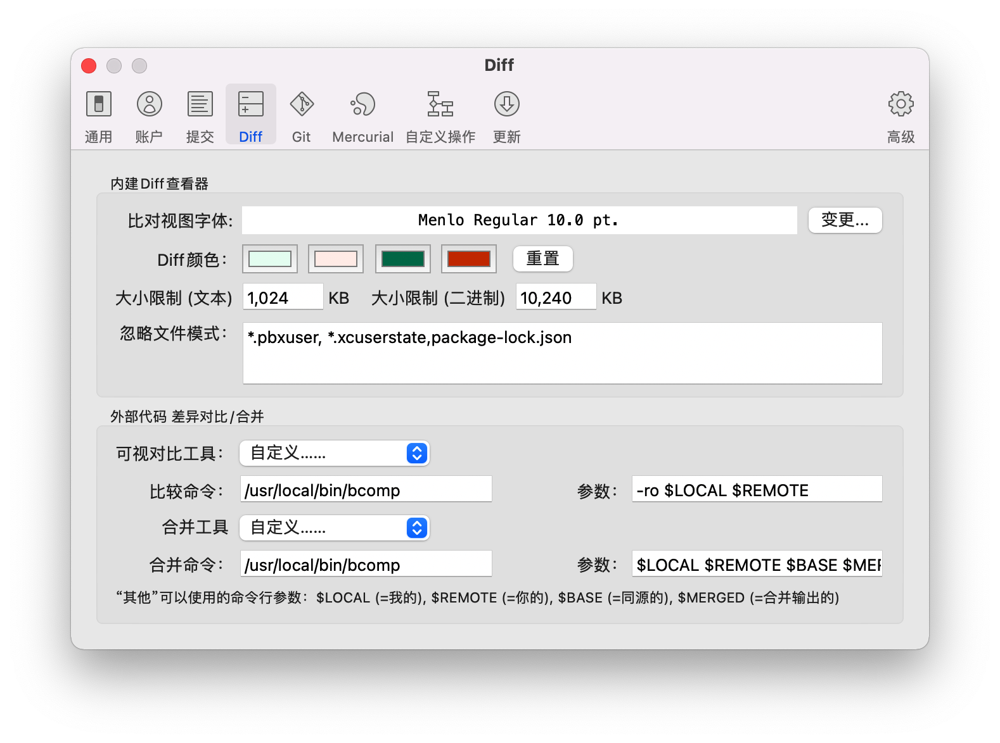

# Sourcetree外部差异⽐对⼯具为BeyondCompare


1、⾸先，安装好beyond compare后，创建⼀个快捷⽅式

```sh
ln -s /Applications/Beyond\ Compare.app/Contents/MacOS/bcomp /usr/local/bin/
```

2、打开source tree，在系统偏好设置⾥⾯，找到diff，按照下⾯的进⾏配置：

```sh
Visual Diff Tool: Other
Diff Command:/usr/local/bin/bcomp
Parameters:-ro $LOCAL $REMOTE
Merge Tool: Other
Merge Command:/usr/local/bin/bcomp
Parameters:$LOCAL $REMOTE $BASE $MERGED
```

