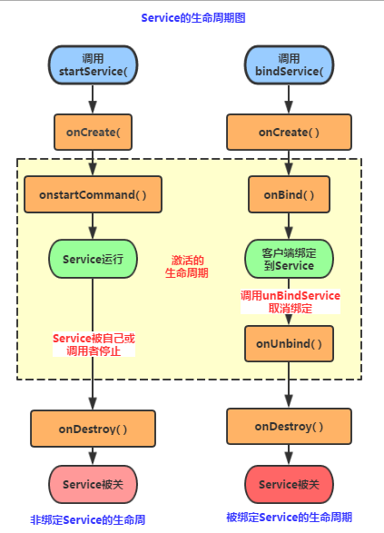
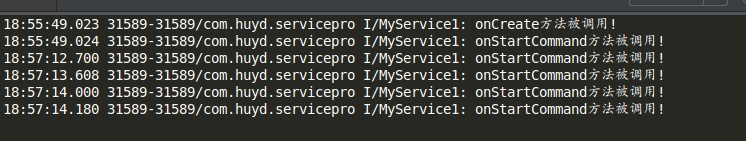
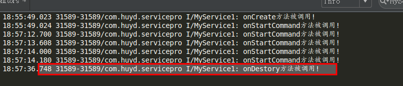
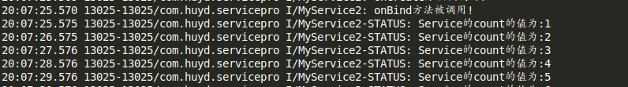
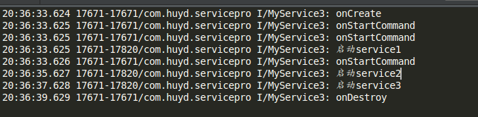

# 如何优雅的“叫”服务——Service总结

# 前言

Service是Android系统中的四大组件之一，主要有两个应用场景：后台运行和跨进程访问。Service是Android中实现程序后台运行的解决方案,它非常适合用于去执行那些不需要和用户交互而且还要求长期运行的任务.服务的运行不依赖与任何界面,即使当程序切换到后台,或者用户打开另一个应用程序,服务仍然可以保持后台运行.Service可以在后台执行长时间运行操作而不提供用户界面，除非系统必须回收内存资源，否则系统不会停止或销毁服务。

另外服务并不会自动开启线程,所有代码都是默认运行在主线程中.如果需要在服务内部进行耗时操作,那么需要手动创建子线程,要不然可能就会出现主线程被阻塞住的情况.

# Service的种类

## **按运行地点分类：**

| 类别           | 区别          | 优点                                       | 缺点                                     | 应用                              |
| ------------ | ----------- | ---------------------------------------- | -------------------------------------- | ------------------------------- |
| 本地服务（Local）  | 该服务依附在主进程上， | 服务依附在主进程上而不是独立的进程，这样在一定程度上节约了资源，另外Local服务因为是在同一进程因此不需要IPC，也不需要AIDL。相应bindService会方便很多。 | 主进程被Kill后，服务便会终止。                      | 非常常见的应用如：HTC的音乐播放服务，天天动听音乐播放服务。 |
| 远程服务（Remote） | 该服务是独立的进程，  | 服务为独立的进程，对应进程名格式为所在包名加上你指定的android:process字符串。由于是独立的进程，因此在Activity所在进程被Kill的时候，该服务依然在运行，不受其他进程影响，有利于为多个进程提供服务具有较高的灵活性。 | 该服务是独立的进程，会占用一定资源，并且使用AIDL进行IPC稍微麻烦一点。 | 一些提供系统服务的Service，这种Service是常驻的。 |

其实remote服务还是很少见的，并且一般都是系统服务。

  

## **按运行类型分类：**

| 类别   | 区别                                       | 应用                                       |
| ---- | ---------------------------------------- | ---------------------------------------- |
| 前台服务 | 会在通知一栏显示 ONGOING 的 Notification，         | 当服务被终止的时候，通知一栏的 Notification 也会消失，这样对于用户有一定的通知作用。常见的如音乐播放服务。 |
| 后台服务 | 默认的服务即为后台服务，即不会在通知一栏显示 ONGOING 的 Notification。 | 当服务被终止的时候，用户是看不到效果的。某些不需要运行或终止提示的服务，如天气更新，日期同步，邮件同步等。 |

有同学可能会问，后台服务我们可以自己创建 ONGOING 的 Notification 这样就成为前台服务吗？答案是否定的，前台服务是在做了上述工作之后需要调用 startForeground （ android 2.0 及其以后版本 ）或 setForeground （android 2.0 以前的版本）使服务成为 前台服务。这样做的好处在于，当服务被外部强制终止掉的时候，ONGOING 的 Notification 任然会移除掉。

 

## **按使用方式分类：**

| 类别                                 | 区别                                       |
| ---------------------------------- | ---------------------------------------- |
| startService 启动的服务                 | 主要用于启动一个服务执行后台任务，不进行通信。停止服务使用stopService |
| bindService 启动的服务                  | 该方法启动的服务要进行通信。停止服务使用unbindService        |
| startService 同时也 bindService 启动的服务 | 停止服务应同时使用stepService与unbindService       |

以上面三种方式启动的服务其生命周期也有区别，将在随后给出。

# Service生命周期




Android中使用Service的方式有两种：

- StartService()启动Service
- BindService()启动Service**

PS:还有一种，就是启动Service后，绑定Service！

## 相关方法详解：

1. onCreate()**：当Service第一次被创建后立即回调该方法，该方法在整个生命周期中只会调用一次！
2. onDestory()**：当Service被关闭时会回调该方法，该方法只会回调一次！
3. onStartCommand(intent,flag,startId)**：早期版本是onStart(intent,startId),当客户端调用startService(Intent)方法时会回调，可多次调用StartService方法，但不会再创建新的Service对象，而是继续复用前面产生的Service对象，但会继续回调onStartCommand()方法！
4. IBinder onOnbind(intent)**：该方法是Service都必须实现的方法，该方法会返回一个IBinder对象，app通过该对象与Service组件进行通信！
5. onUnbind(intent)**：当该Service上绑定的所有客户端都断开时会回调该方法！

# Service实现方式

## StartService启动Service

首先我们自定义一个Service,重写相关的方法,用户在logcat上打印验证:

**MyService1.java**

```
public class MyService1 extends Service {
	private final String LOG = "MyService1";

	//必须实现
	@Nullable
	@Override
	public IBinder onBind(Intent intent) {
		Log.i(LOG, "onBind方法被调用");
		return null;
	}

	//Service被创建时调用
	@Override
	public void onCreate() {
		Log.i(LOG, "onCreate方法被调用!");
		super.onCreate();
	}
结果分析：

从上面的运行结果我们可以验证我们生命周期图中解释的内容: 我们发现onBind()方法并没有被调用,另外多次点击启动Service,只会重复地调用onStartCommand 方法!无论我们启动多少次Service,一个stopService就会停止Service!
	//Service被启动时调用
	@Override
	public int onStartCommand(Intent intent, int flags, int startId) {
		Log.i(LOG, "onStartCommand方法被调用!");
		return super.onStartCommand(intent, flags, startId);
	}

	//Service被关闭之前回调
	@Override
	public void onDestroy() {
		Log.i(LOG, "onDestory方法被调用!");
		super.onDestroy();
	}
}
```

**AndroidManifest.xml完成Service注册**

```
<!-- 配置Service组件,同时配置一个action -->
        <service android:name="com.huyd.service.MyService1"></service>
```

再接着是简单的布局文件,两个按钮,再最后是MainActivity的编写,在按钮的点击事件中分别
调用startService( )和stopService( )

```
public class MainActivity extends AppCompatActivity {

	@Bind(R.id.btnStart)
	Button btnStart;
	@Bind(R.id.btnStop)
	Button btnStop;
	Intent intent;

	@Override
	protected void onCreate(Bundle savedInstanceState) {
		super.onCreate(savedInstanceState);
		setContentView(R.layout.activity_main);
		intent = new Intent(this, MyService1.class);
		ButterKnife.bind(this);

		//创建启动Service的Intent,以及Intent属性

	}

	@OnClick({R.id.btnStart, R.id.btnStop})
	public void onViewClicked(View view) {
		switch (view.getId()) {
			case R.id.btnStart:
				startService(intent);
				break;
			case R.id.btnStop:
				stopService(intent);
				break;
		}
	}
}
```

点击开始服务:


多次点击服务:



最后停止服务:



**结果分析：**

从上面的运行结果我们可以验证我们生命周期图中解释的内容:我们发现onBind()方法并没有被调用,另外多次点击启动Service,只会重复地调用onStartCommand方法!无论我们启动多少次Service,一个stopService就会停止Service.

## BindService启动Service

**bindService方法：**

1. ServiceConnection对象:监听访问者与Service间的连接情况,如果成功连接,回调onServiceConnected(),如果异常终止或者其他原因终止导致Service与访问者断开连接则回调onServiceDisconnected方法,调用unBindService()不会调用该方法!
2. onServiceConnected方法中有一个IBinder对象,该对象即可实现与被绑定Service之间的通信!我们再开发Service类时,默认需要实现IBinder onBind()方法,该方法返回的IBinder对象会传到ServiceConnection对象中的onServiceConnected的参数,我们就可以在这里通过这个IBinder与Service进行通信!

**流程:**

**Step 1:**在自定义的Service中继承Binder,实现自己的IBinder对象

**Step 2:**通过onBind( )方法返回自己的IBinder对象

**Step 3:**在绑定该Service的类中定义一个ServiceConnection对象,重写两个方法,
onServiceConnected和onDisconnected！然后直接读取IBinder传递过来的参数即可!

**实现:**

这里采用了自定义回调的方式,由service实时向activity传输数据,具体看代码.

**MyService2.java**

```
public class MyService2 extends Service {
	private final String LOG = "MyService2";
	private int count;
	private boolean quit;

	private Callback callback;//采用回调的方式

	//定义onBinder方法所返回的对象
//	private MyBinder binder = new MyBinder();
//
//	public class MyBinder extends Binder {
//		public int getCount() {
//			return count;
//		}
//	}

	public class IBinder extends Binder {
		public MyService2 getService() {
			return MyService2.this;
		}
	}

	public void setCallback(Callback callback) {
		this.callback = callback;
	}

	//必须实现的方法,绑定改Service时回调该方法
	@Nullable
	@Override
	public IBinder onBind(Intent intent) {
		Log.i(LOG, "onBind方法被调用!");
//		return binder;
		return new IBinder();
	}

	//Service被创建时回调
	@Override
	public void onCreate() {
		super.onCreate();
		Log.i(LOG, "onCreate方法被调用!");
		//创建一个线程动态地修改count的值
		new Thread() {
			@Override
			public void run() {
				while (!quit) {
					count++;
					if (callback != null) {
						callback.onDataChange(count + "");
					}
					try {
						Thread.sleep(1000);
					} catch (InterruptedException e) {
						e.printStackTrace();
					}

				}
			}
		}.start();
	}

	//Service断开连接时回调
	@Override
	public boolean onUnbind(Intent intent) {
		Log.i(LOG, "onUnbind方法被调用!");
		return true;
	}

	//Service被关闭前回调
	@Override
	public void onDestroy() {
		super.onDestroy();
		this.quit = true;
		Log.i(LOG, "onDestroyed方法被调用!");
	}

	@Override
	public void onRebind(Intent intent) {
		Log.i(LOG, "onRebind方法被调用!");
		super.onRebind(intent);
	}

	public interface Callback {
		void onDataChange(String data);
	}
}
```

**AndroidManifest.xml完成Service注册**

```
<service android:name="com.huyd.service.MyService2"/>
```

**MainActivity.java**

```
public class MainActivity extends AppCompatActivity {

	@Bind(R.id.btnStart)
	Button btnStart;
	@Bind(R.id.btnStop)
	Button btnStop;
	Intent intent;
	@Bind(R.id.btnBind)
	Button btnBind;
	@Bind(R.id.btnCancel)
	Button btnCancel;
	@Bind(R.id.btnStatus)
	Button btnStatus;
	String string = "";

	//保持所启动的Service的IBinder对象,同时定义一个ServiceConnection对象
	MyService2.IBinder binder;

	private ServiceConnection conn = new ServiceConnection() {
		//Activity与Service连接成功时回调该方法
		@Override
		public void onServiceConnected(ComponentName componentName, IBinder iBinder) {
			System.out.println("------Service Connected-------");
			binder = (MyService2.IBinder) iBinder;
			MyService2 myService2 = binder.getService();
			//这里采用了自定义回调的方式
			myService2.setCallback(new MyService2.Callback() {
				@Override
				public void onDataChange(String data) {
					Message message = new Message();
					message.obj = data;
					handler.sendMessage(message);
				}
			});
		}

		//Activity与Service断开连接时回调该方法
		@Override
		public void onServiceDisconnected(ComponentName componentName) {
			System.out.println("------Service DisConnected-------");
		}
	};

	@Override
	protected void onCreate(Bundle savedInstanceState) {
		super.onCreate(savedInstanceState);
		setContentView(R.layout.activity_main);

		//创建启动Service的Intent,以及Intent属性
		intent = new Intent(this, MyService2.class);

		ButterKnife.bind(this);


	}

	@OnClick({R.id.btnStart, R.id.btnStop, R.id.btnBind, R.id.btnCancel, R.id.btnStatus})
	public void onViewClicked(View view) {
		switch (view.getId()) {
			case R.id.btnStart://开启服务MyService1
				startService(intent);
				break;
			case R.id.btnStop://关闭服务MyService1
				stopService(intent);
				break;
			case R.id.btnBind://绑定serviceMyService2
				bindService(intent, conn, Service.BIND_AUTO_CREATE);
				break;
			case R.id.btnCancel://关闭服务MyService2
				unbindService(conn);
				break;
			case R.id.btnStatus://服务状态MyService2
//				Log.i("MyService2-STATUS", "Service的count的值为:" + binder.getCount);
				break;
		}
	}

	Handler handler = new Handler() {
		@Override
		public void handleMessage(Message msg) {
			string = msg.obj.toString();
			Log.i("MyService2-STATUS", "Service的count的值为:" + string);
			super.handleMessage(msg);
		}
	};

}
```

**结果:**

点击绑定服务:


Service实时传到Activity的数据:



点击取消绑定服务:


**从上面的运行结果验证了生命周期图中的:**

使用BindService绑定Service,依次调用onCreate(),onBind()方法,我们可以在onBind()方法中返回自定义的IBinder对象;再接着调用的是ServiceConnection的onServiceConnected()方法该方法中可以获得IBinder对象,从而进行相关操作;当Service解除绑定后会自动调用onUnbind和onDestroyed方法,当然绑定多客户端情况需要解除所有的绑定才会调用onDestoryed方法进行销毁哦！

## ServiceIntent实现

如果我们直接把耗时线程放到Service中的onStart()方法中，虽然可以这样做，但是很容易会引起ANR异常(Application Not Responding)，而Android的官方在介绍Service有下面这样一段话：


**直接翻译：**

> 1.Service不是一个单独的进程,它和它的应用程序在同一个进程中
> 2.Service不是一个线程,这样就意味着我们应该避免在Service中进行耗时操作

于是乎，Android给我们提供了解决上述问题的替代品，就是下面要讲的**IntentService**；IntentService是继承与Service并处理异步请求的一个类,在IntentService中有一个工作线程来处理耗时操作,请求的Intent记录会加入队列

**工作流程：**

> 客户端通过startService(Intent)来启动IntentService;我们并不需要手动地区控制IntentService,当任务执行完后,IntentService会自动停止;可以启动IntentService多次,每个耗时操作会以工作队列的方式在IntentService的onHandleIntent回调方法中执行,并且每次只会执行一个工作线程,执行完一，再到二这样!

再接着是代码演示,网上大部分的代码都是比较Service与IntentService的,定义足够长的休眠时间,演示Service的ANR异常,然后引出IntentService有多好!这里就不演示Service了,网上的都是自定义Service,然后在onStart()方法中Thread.sleep(20000)然后引发ANR异常,有兴趣的可以自己写代码试试,这里的话只演示下IntentService的用法！

**MyService3.java**

```
public class MyService3 extends IntentService {
	private final String LOG = "MyService3";

	//必须实现父类的构造方法
	public MyService3() {
		super("MyService3");
	}

	//必须重写的核心方法
	@Override
	protected void onHandleIntent(Intent intent) {
		//Intent是从Activity发过来的，携带识别参数，根据参数不同执行不同的任务
		String action = intent.getExtras().getString("param");
		if (action.equals("s1")) Log.i(LOG, "启动service1");
		else if (action.equals("s2")) Log.i(LOG, "启动service2");
		else if (action.equals("s3")) Log.i(LOG, "启动service3");

		//让服务休眠2秒
		try {
			Thread.sleep(2000);
		} catch (InterruptedException e) {
			e.printStackTrace();
		}
	}

	//重写其他方法,用于查看方法的调用顺序

	@Nullable
	@Override
	public IBinder onBind(Intent intent) {
		Log.i(LOG, "onBind");
		return super.onBind(intent);
	}

	@Override
	public void onCreate() {
		Log.i(LOG, "onCreate");
		super.onCreate();
	}

	@Override
	public int onStartCommand(Intent intent, int flags, int startId) {
		Log.i(LOG, "onStartCommand");
		return super.onStartCommand(intent, flags, startId);
	}

	@Override
	public void setIntentRedelivery(boolean enabled) {
		super.setIntentRedelivery(enabled);
		Log.i(LOG, "setIntentRedelivery");
	}

	@Override
	public void onDestroy() {
		Log.i(LOG, "onDestroy");
		super.onDestroy();
	}
}
```

**AndroidManifest.xml注册下Service**

```
<service android:name="com.huyd.service.MyService3"/>
```

**在MainActivity启动三次服务：**

```
public class Main3Activity extends AppCompatActivity {

	@Override
	protected void onCreate(Bundle savedInstanceState) {
		super.onCreate(savedInstanceState);
		setContentView(R.layout.activity_main3);

		Intent intent1 = new Intent(Main3Activity.this, MyService3.class);
		Bundle bundle1 = new Bundle();
		bundle1.putString("param", "s1");
		intent1.putExtras(bundle1);

		Intent intent2 = new Intent(Main3Activity.this, MyService3.class);
		Bundle bundle2 = new Bundle();
		bundle2.putString("param", "s2");
		intent2.putExtras(bundle2);

		Intent intent3 = new Intent(Main3Activity.this, MyService3.class);
		Bundle bundle3 = new Bundle();
		bundle3.putString("param", "s3");
		intent3.putExtras(bundle3);


		//接着启动多次IntentService,每次启动,都会新建一个工作线程
		//但始终只有一个IntentService实例
		startService(intent1);
		startService(intent2);
		startService(intent3);
	}
}
```

**运行截图：**



## AIDL跨进程通信

### 1）AIDL是什么？

> 嘿嘿，前面我们讲到**IPC**这个名词，他的全名叫做：**跨进程通信(interprocess communication)**，因为在Android系统中,个个应用程序都运行在自己的进程中,进程之间一般是无法直接进行数据交换的,而为了实现跨进程，Android给我们提供了上面说的Binder机制，而这个机制使用的接口语言就是:**AIDL**(Android Interface Definition Language)，他的语法很简单，而这种接口语言并非真正的编程语言，只是定义两个进程间的通信接口而已！而生成符合通信协议的Java代码则是由Android SDK的platform-tools目录下的**aidl.exe**工具生成，生成对应的接口文件在:gen目录下，一般是:Xxx.java的接口！而在该接口中包含一个**Stub**的内部类，该类中实现了在该类中实现了**IBinder**接口与自定义的通信接口,这个类将会作为远程Service的回调类——实现了IBinder接口,所以可作为Service的onBind( )方法的返回值！

------

### 2）AIDL实现两个进程间的简单通信

在开始编写AIDL接口文件前，我们需要了解下编写AIDL的一些注意事项：

**AIDL注意事项：**

> - 接口名词需要与aidl文件名相同
> - 接口和方法前面**不要加访问权限修饰符**：public ,private,protected等，也不能用static final!
> - AIDL默认支持的类型包括**Java基本类型**，**String**，**List**，**Map**，**CharSequence**，除此之外的其他类型都需要import声明，对于使用自定义类型作为参数或者返回值，自定义类型需要实现Parcelable接口，详情请看后面的传递复杂数据类型
> - 自定义类型和AIDL生成的其它接口类型在aidl描述文件中，应该显式import，即便在该类和定义的包在同一个包中。

另外，如果编写aidl你用的编译器是:Eclipse的话要注意：
不要直接new file然后建立哦!这样的话是打不开文件,从而不能编写代码哦！
①直接新建一个txt文件,编写好后保存为.aidl格式,然后复制到对应路径下
②因为aidl和接口类似,所以直接new interface,编写好内容后,来到对应java文件所在目录下修改文件后缀名;

假如你使用的是Android Studio的话，不同于Eclipse，如果你按照Eclipse那样创建一个AIDL文件，会发现并没有编译生成对应的XXX.java文件，AS下创建AIDL需要在main目录下新建一个aidl文件夹，然后定义一个和aidl包名相同的包，最后创建一个aidl文件，接着按ctrl + f9重新编译，就可以了！

如上参考菜鸟教程[Service精通](http://www.runoob.com/w3cnote/android-tutorial-service-3.html)

具体讲解参考博客[Android aidl Binder框架浅析](http://blog.csdn.net/lmj623565791/article/details/38461079)和[快速入门android AIDL（开启多进程并进行通信)](http://blog.csdn.net/double2hao/article/details/51626347)


具体实现见下面小尾巴,有源(jing)码(xi).

其中源码中ServicePro项目包含StartService/BindService/ServiceIntent三种使用,ServiceAIDL项目为AIDL的多线程通信方式,ServiceAIDL1项目包含AIDL的实时回调(观察者模式),提供了添加和获取功能,具体看源码.


**源码请点击[这里](https://github.com/huyida/ServicePro.git)**