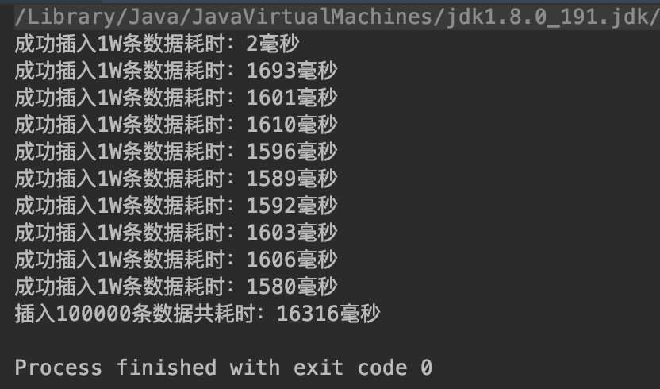
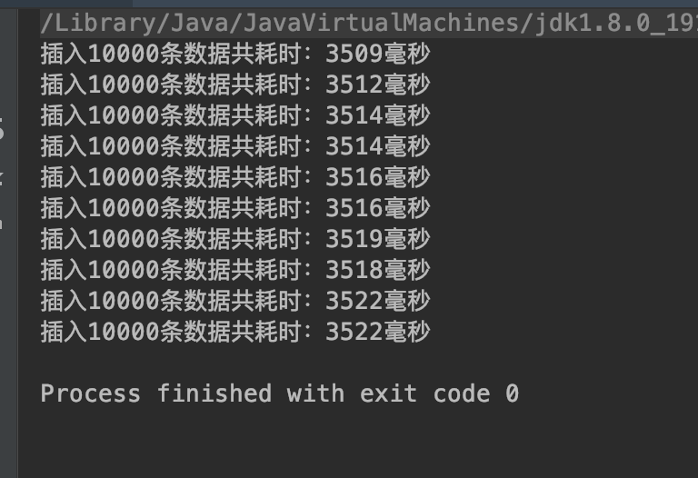

# 记百万级数据实现秒级导入的优化过程

## 前言

项目中遇到，百万级Excel数据的导入。优化分两步：一，编写算法整理Excel中读取的数据，减少对数据库的操作；二，优化插入效率，项目中用到Mybatis持久层框架时耗时较久，然后想到用最原生的方法来存一下，利用批处理来加快jdbc的插入效率。

下文实例在初步优化之下，插入**10W级数据耗时3秒**。


<!--MORE-->

## 思路

### 数据整理

问题：由于数据导入要整理成Treeview要的格式，需要计算出parentId、parentIds，所以项目原本代码为先插入然后查询，根据获得的id来设置parentId、parentIds，这样带来的问题是多了select，增加了对数据库的操作。

优化：编写计算parentId、parentIds的算法，整理数据为树状结构，可直接导入数据库，减少对数据库的操作，**减少耗时**。


### 优化插入效率

问题：当须要向数据库插入百万条数据时，利用Mybatis持久层框架时耗时较久。

优化：**利用批处理**来加快jdbc的插入效率，一次存10000条，批量处理。在此，我使用的单线程，而如果块处理和使用线程，应该更快。


**以下代码使用10W级数据为基础做对比。**


使用单线程批处理 **10W条数据**：

```java
        long bTime1 = System.currentTimeMillis();
        List<Zip> result = new ArrayList<>();
        // 生成10W条假数据
        for (int i = 0; i < 100000; i++) {
            String str = String.valueOf(new Random().nextInt(100) + 1);
            result.add(new Zip(str, "京都府", "京都市", "中京區二條城町"));
        }

        Connection conn = null;
        PreparedStatement pstm = null;
        //加载jdbc驱动
        Class.forName("com.mysql.jdbc.Driver");
        //连接mysql
        try {
            conn = DriverManager.getConnection(url, user, password);
            String sql = "insert into zip(code,addr1,addr2,addr3) values(?,?,?,?)";  //insert语句

            //预编译sql
            pstm = conn.prepareStatement(sql);
            long bTime = System.currentTimeMillis();
            for (int i = 0; i < result.size(); i++) {

                pstm.setString(1, result.get(i).getCode());
                pstm.setString(2, result.get(i).getAddr1());
                pstm.setString(3, result.get(i).getAddr1());
                pstm.setString(4, result.get(i).getAddr2());
                pstm.addBatch();
                if (i % 10000 == 0) {
                    pstm.executeBatch();
                    //关闭分段计时
                    long eTime = System.currentTimeMillis();

                    //输出
                    System.out.println("成功插入1W条数据耗时：" + (eTime - bTime) + "毫秒");
                    bTime = System.currentTimeMillis();
                }
            }
            pstm.executeBatch();
            //关闭总计时
            long eTime1 = System.currentTimeMillis();
            //输出
            System.out.println("插入" + result.size() + "条数据共耗时：" + (eTime1 - bTime1) + "毫秒");
        } catch (SQLException e) {
            try {
                conn.rollback();
            } catch (SQLException e1) {
                e1.printStackTrace();
            }
            e.printStackTrace();
        }
```


耗时 **16.316秒**：




多线程批处理 **10W条数据**：


MyThread.java

```java
import entity.Zip;

import java.sql.Connection;
import java.sql.DriverManager;
import java.sql.PreparedStatement;
import java.sql.SQLException;
import java.util.ArrayList;
import java.util.List;
import java.util.Random;

/**
 * @description:
 * @author: huyida
 * @create: 2019-03-03 21:26
 **/

public class MyThread extends Thread {
    static String url = "jdbc:mysql://localhost:3306/thrall";
    static String user = "root";
    static String password = "1qazxsw2";

    public void run() {

        long bTime1 = System.currentTimeMillis();
        List<Zip> result = new ArrayList<>();
        // 生成10W条假数据
        for (int i = 0; i < 10000; i++) {
            String str = String.valueOf(new Random().nextInt(100) + 1);
            result.add(new Zip(str, "京都府", "京都市", "中京區二條城町"));
        }

        Connection conn = null;
        PreparedStatement pstm = null;
        //加载jdbc驱动
        try {
            Class.forName("com.mysql.jdbc.Driver");
        } catch (ClassNotFoundException e) {
            e.printStackTrace();
        }
        //连接mysql
        try {
            conn = DriverManager.getConnection(url, user, password);
            String sql = "insert into zip(code,addr1,addr2,addr3) values(?,?,?,?)";  //insert语句

            //预编译sql
            pstm = conn.prepareStatement(sql);
            long bTime = System.currentTimeMillis();
            for (int i = 0; i < result.size(); i++) {

                pstm.setString(1, result.get(i).getCode());
                pstm.setString(2, result.get(i).getAddr1());
                pstm.setString(3, result.get(i).getAddr1());
                pstm.setString(4, result.get(i).getAddr2());
                pstm.addBatch();
            }
            pstm.executeBatch();
            //关闭总计时
            long eTime1 = System.currentTimeMillis();
            //输出
            System.out.println("插入" + result.size() + "条数据共耗时：" + (eTime1 - bTime1) + "毫秒");
        } catch (SQLException e) {
            try {
                conn.rollback();
            } catch (SQLException e1) {
                e1.printStackTrace();
            }
            e.printStackTrace();
        }
    }
}

```


Test.java

```java
/**
 * @description:
 * @author: huyida
 * @create: 2019-03-03 21:30
 **/

public class Test {
    public static void main(String[] args) {
        for (int i = 1; i <= 10; i++) {
            new MyThread().start();
        }
    }
}
```


耗时 **3.522秒**：




## 总结

大量数据的时候，使用Hibernate、MyBatis等持久层框架时耗时较久，可以利用批处理来加快jdbc的插入效率，另外使用多线程速度更快，但有时候线程越多不是好事，过多反而更慢。