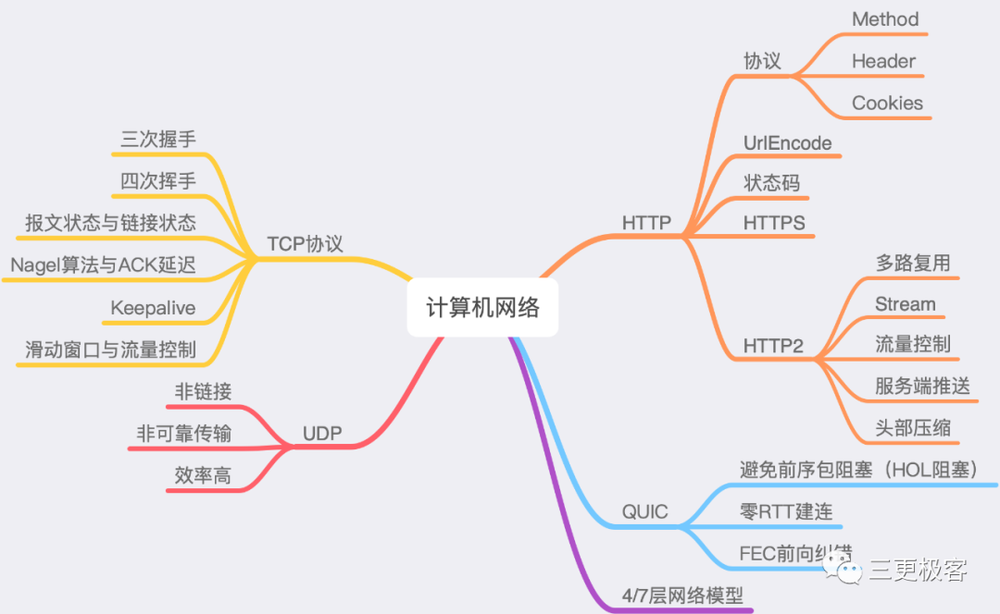
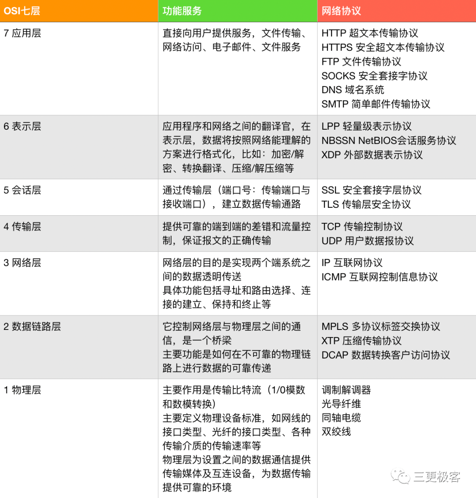
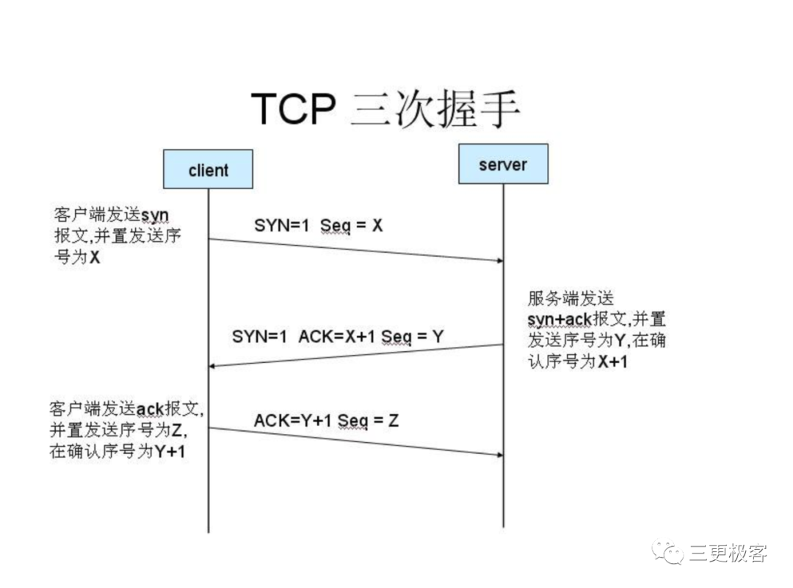
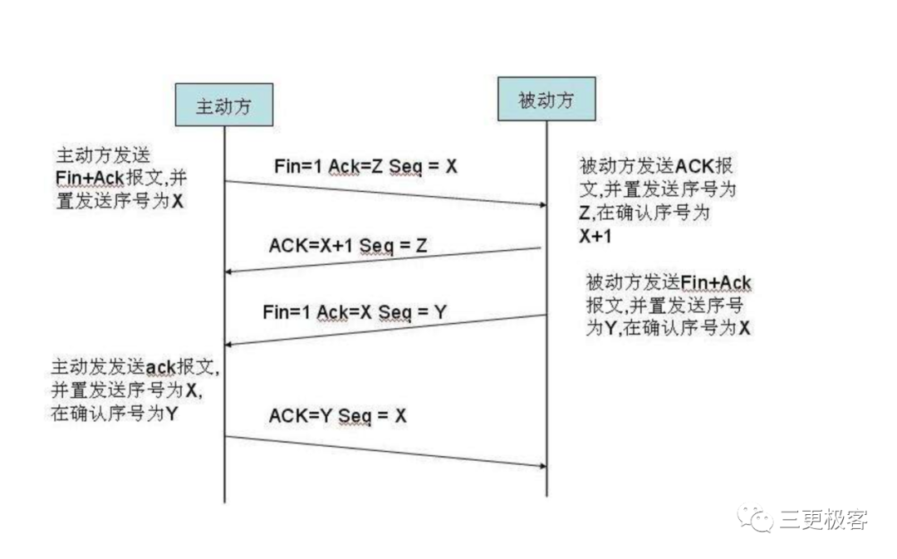
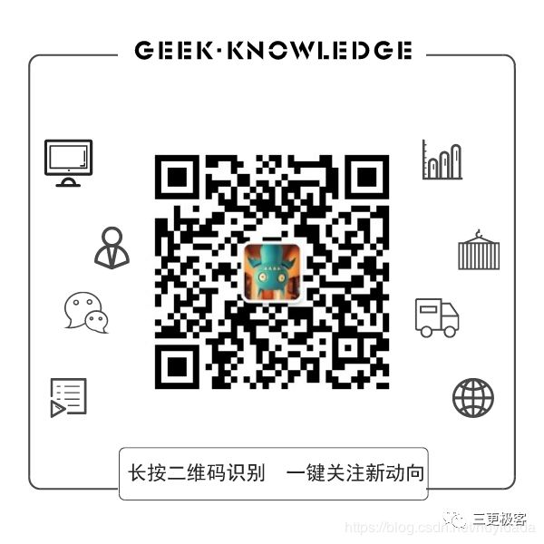

# 【九层之台，起于累土】搞定计算机网络面试

## 前言

在互联网公司中，不管是工作还是面试，计算机网络的知识都是必不可少的，计算机网络的知识不亚于语言基础，平常开发中还是经常要与网络打交道的。

## 知识点

需要掌握的知识点如下图⬇️，我会着重写一下几个必备知识点。

## OSI七层网络模型 

OSI模型，即开放式通信系统互联参考模型，是国际标准化组织提出的一个试图是各种计算机或者通信系统在世界范围内互联为网络的标准框架。整个模型分为七层，物理层，数据链路层，网络层，传输层，会话层，表示层，应用层。

### 为什么要建立OSI呢？

建立七层模型主要的目的就是为了**解决各种网络互连时所遇到的兼容性**问题。

#### 优点：

- 将服务、接口和协议这三个概念明确分开来
- 功能服务上，说明某一层为上一层提供一些什么功能
- 接口上，说明上一层如何使用下层的服务
- 协议上，涉及如何实现本层的服务

## TCP和UDP的区别

### TCP

1. 面向连接（如打电话要先拨号建立连接）
2. 提供可靠的服务，通过TCP连接传送的数据，无差错，不丢失，不重复，且有序可达
3. 面向字节流，实际上是TCP把数据看成一连串无结构的字节流
4. 每一条TCP连接只能是点到点的

#### TCP优点

可靠，传递数据前，会有三次握手连接

#### TCP缺点

慢，效率低，占用系统资源高，易被攻击

### UDP

1. 无连接的，即发送数据之前不需要建立连接
2. 尽最大努力交付，即不保证可靠交付
3. 面向报文的
4. 支持一对一，一对多，多对一和多对多的交互通信
5. 不可靠信道

#### UDP优点

传递数据时非常快，没有TCP的握手

#### UDP的缺点

不可靠，不稳定，网络质量不好，就会很容易丢包

## TCP三次握手

TCP提供可靠的连接服务，采用三次握手确认建立一个连接。

- Sequence Number （seq）序列号码
- Acknowledgment Number （ack）确认号码

1. 第一次握手：客户端打开，发送连接请求报文段，将SYN标识位置为1，Seq置为x（TCP规定SYN=1时不能携带数据，x为随机产生的一个值），然后进入SYN_SEND状态。
2. 第二次握手：服务器收到SYN报文段进行确认，将SYN标识位置为1，ACK置为1，Seq置为y，ACK再置为x+1，然后进入SYN_SEND状态，这个状态被称为半连接状态。
3. 第三次握手：客户端再进行一次确认，将ACK置为1（此时不用SYN），Seq置为z，ACK置为y+1发向服务器，最后客户端与服务器都进入ESTABLISHED状态，完成三次握手，主机A与主机B开始传送数据。

> 为什么TCP最后还要发送一次确认？

为了防止已经失效的连接请求报文段突然又传回到服务端而产生的错误的场景。

假设没有最后一次确认，客户端发出一个连接请求报文段并没有丢失，然后网络传输中滞留延迟到连接释放以后的时间才到达服务器，于是服务器又向客户端请求报文段，同意建立连接，但此时客户端并没有发出建立连接的请求，因此不理会服务器的确认，也不向服务器发送数据，而服务器以为连接已经建立，苦苦等待客户端的数据，这样服务器的许多资源就白白浪费了。

## TCP四次挥手

TCP三次握手时建立连接的过程，TCP四次挥手则是连接释放的过程，当客户端没有数据再需要发送给服务端时，就需要释放客户端的连接。

1. 客户端发送一个报文给服务器（没有数据），其中FIN设置为1，Seq置为x，客户端进入FIN_WAIT状态。
2. 服务器收到客户端请求，发送一个ACK给客户端，ACK为x+1，同时发送Seq为z，服务器进入CLOSE_WAIT状态。
3. 服务器发送一个FIN给客户端，Seq为y，Ack为x，用来关闭服务器到客户端的数据传送，服务端进入LASR_ACK状态。
4. 客户端收到FIN后，进入TIME_WAIT状态，接着发送一个ACK给服务端，ACK置为y，Seq为x，最后客户端和服务端都进入CLOSED状态。

## HTTP和HTTPS的区别

1. HTTP协议传输的数据都是未加密的，也就是明文的，因此使用HTTP协议传输隐私信息是非常不安全的。
2. HTTPS协议是由SSL+HTTP协议构建的可进行加密传输、身份认证的网络协议，要比HTTP协议安全。

## 访问HTTPS流程

### 1.请求

客户使用https的url访问Web服务，要求与web服务器建立SSL连接。

### 2.公钥返回

Web服务器收到客户端请求后，会将网站的证书信息（证书中包含公钥）传送给客户端。

### 3.加密

使用公钥加密。

### 4.发送

发送加密后的信息。

### 5.验证

Web服务器利用自己的私钥解密出会话密钥。

## 总结

以上讲了OSI七层网络模型，TCP和UDP区别与优缺点，三次握手与四次挥手流程，HTTP和HTTPS，更多深入知识还需要自己不断深入，保持不断学习。

好文章，请在看❤️