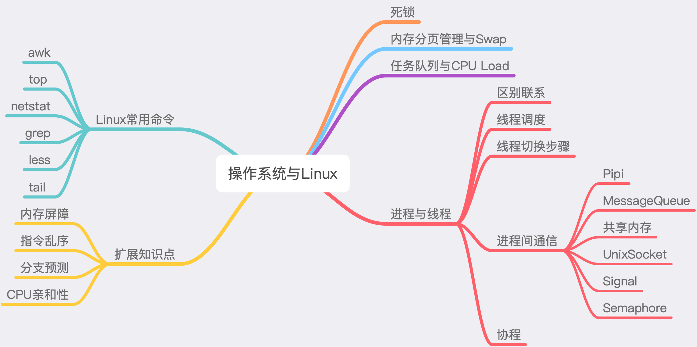

# 计算机操作系统与Linux

掌握操作系统与Linux相关知识，对服务问题的排查非常重要，实际找工作中，因为各个公司的侧重点都不一样，考察的知识也不一样，但是作为从事相关计算机工作的，计算机操作系统与Linux相关的知识点还是需要掌握的。根据工作常用的知识，本文整理了所需要重点了解的几大知识点。

## 一 知识点汇总

关于知识点，我就不唠唠，直接上图⬇️



## 二 操作系统

### 1.死锁

> 什么是死锁？

在两个或多个并发进程中，如果每个进程持有某种资源而又都等待别的进程释放它或它们现在保持着的资源，在未改变这种状态之前都不能向前推进，称这一组进程产生了死锁。通俗地讲，就是两个或多个进程被无限期地阻塞、相互等待的一种状态。

> 产生死锁的原因？

1.系统资源不足；

2.进程推进顺序非法。

产生死锁的必要条件：

- 互斥（mutualexclusion），一个资源每次只能被一个进程使用；
- 不可抢占（nopreemption），进程已获得的资源，在未使用完之前，不能强行剥夺；
- 占有并等待（hold andwait），一个进程因请求资源而阻塞时，对已获得的资源保持不放；
- 环形等待（circularwait），若干进程之间形成一种首尾相接的循环等待资源关系。

　　这四个条件是死锁的必要条件，只要系统发生死锁，这些条件必然成立，而只要上述条件之一不满足，就不会发生死锁。

> 怎样避免死锁？

在并发程序中，避免了逻辑中出现复数个线程互相持有对方线程所需要的独占锁的的情况，就可以避免死锁。

### 2.内存管理基础

高效快速的管理内存，在适当的时候回收和释放内存资源

####  内存分配

- 虚拟地址：用户编程时将代码（或数据）分成若干个段，每条代码或每个数据的地址由段名称 + 段内相对地址构成，这样的程序地址称为虚拟地址
- 逻辑地址：虚拟地址中，段内相对地址部分称为逻辑地址
- 物理地址：实际物理内存中所看到的存储地址称为物理地址
- 逻辑地址空间：在实际应用中，将虚拟地址和逻辑地址经常不加区分，通称为逻辑地址。逻辑地址的集合称为逻辑地址空间
- 线性地址空间：CPU地址总线可以访问的所有地址集合称为线性地址空间
- 物理地址空间：实际存在的可访问的物理内存地址集合称为物理地址空间
- MMU(Memery Management Unit内存管理单元)：实现将用户程序的虚拟地址（逻辑地址） → 物理地址映射的CPU中的硬件电路
- 基地址：在进行地址映射时，经常以段或页为单位并以其最小地址（即起始地址）为基值来进行计算
- 偏移量：在以段或页为单位进行地址映射时，相对于基地址的地址值

虚拟地址先经过分段机制映射到线性地址，然后线性地址通过分页机制映射到物理地址。

#### 虚拟内存

- 请求调页，也称按需调页，即对不在内存中的“页”，当进程执行时要用时才调入，否则有可能到程序结束时也不会调入

#### 页面置换算法

- FIFO算法

  先入先出，即淘汰最早调入的页面。

- OPT(MIN)算法

  选未来最远将使用的页淘汰，是一种最优的方案，可以证明缺页数最小。

  可惜，MIN需要知道将来发生的事，只能在理论中存在，实际不可应用。

- LRU(Least-Recently-Used)算法

  用过去的历史预测将来，选最近最长时间没有使用的页淘汰(也称最近最少使用)。

  LRU准确实现：计数器法，页码栈法。

  由于代价较高，通常不使用准确实现，而是采用近似实现，例如Clock算法。

### 3.进程与线程

进程是具有独立功能程序在某个数据集合上的一次执行过程。

线程是进程内的一个执行实体或执行单元。

#### 进程间通信的几种方式

##### 1.管道( pipe )

管道是一种半双工的通信方式，数据只能单向流动，而且只能在具有亲缘关系的进程间使用。进程的亲缘关系通常是指父子进程关系。

###### 举例

管道在Shell中的使用很常见。如简单的统计：`cat xxx | sort | uniq -c | sort -rg | less`。

##### 2.消息队列( message queue ) 

消息队列是由消息的链表，存放在内核中并由消息队列标识符标识。消息队列克服了信号传递信息少、管道只能承载无格式字节流以及缓冲区大小受限等缺点。

###### 举例

后端开发中，我们常用到的各种消息队列，就是这个道理。

##### 3.共享内存( shared memory ) 

共享内存就是映射一段能被其他进程所访问的内存，这段共享内存由一个进程创建，但多个进程都可以访问。共享内存是最快的 IPC 方式，它是针对其他进程间通信方式运行效率低而专门设计的。它往往与其他通信机制，如信号两，配合使用，来实现进程间的同步和通信。

##### 4.套接字( socket ) 

套解字也是一种进程间通信机制，与其他通信机制不同的是，它可用于不同机器间的进程通信。

###### 举例

开发中用到的各种Socket服务

##### 5.信号 ( sinal ) 

信号是一种比较复杂的通信方式，用于通知接收进程某个事件已经发生。

##### 6.信号量( semophore ) 

信号量是一个计数器，可以用来控制多个进程对共享资源的访问。它常作为一种锁机制，防止某进程正在访问共享资源时，其他进程也访问该资源。因此，主要作为进程间以及同一进程内不同线程之间的同步手段。

## 三 Linux常用命令

互联网企业中，一般服务都是部署到Linux系统上的，掌握常用的Linux命令是必不可少的，这样才能在日常工作中快速排查服务出现的问题。

### awk

一个强大的文本分析工具，用于在linux/unix下对文本和数据进行处理。数据可以来自标准输入、一个或多个文件，或其它命令的输出。支持用户自定义函数和动态正则表达式等先进功能，是linux/unix下的一个强大编程工具。在命令行中使用，但更多是作为脚本来使用。
使用方法：

```shell
  awk '{pattern + action}' {filenames}
  awk [-F|-f|-v] ‘BEGIN{} //{command1; command2} END{}’ file
```

### top

显示系统中各个进程的资源占用状况，类似于Windows的任务管理器

使用方法：

```shell
 top -d 1  #设置top的显示间隔(以秒计)
 top -n 3  #设置top退出前迭代的次数
 top -p 12345 -p 6789//每隔5秒显示pid是12345和pid是6789的两个进程的资源占用情况
 top -d 2 -c -p 123456 //每隔2秒显示pid是12345的进程的资源使用情况，并显式该进程启动的命令行参数
```

### netstat

用于显示与IP、TCP、UDP和ICMP协议相关的统计数据，一般用于检验本机各端口的网络连接情况。

使用方法：

```shell
netstat -a # 列出所有端口
netstat -apu # 显示UDP端口号的使用情况
netstat -i # 显示网卡列表
netstat -n # 显示所有已建立的有效连接
```

### grep

Linux系统一种强大的文本搜索工具，它能使用正则表达式搜索文本，并把匹配的行打印出来。学习以及工作中总难免需要使用到grep命令对某字符进行搜索。

```shell
grep text filename  # 在某个文件中搜索某文本
grep beijing -c testfile # 显示符合的行数
```

### less

less 与 more 类似，但使用 less 可以随意浏览文件，而 more 仅能向前移动，却不能向后移动，而且 less 在查看之前不会加载整个文件。

```shell
less [参数] 文件 
```

### tail

用于查看文件的内容，有一个常用的参数 **-f** 常用于查阅正在改变的日志文件。

```shell
tail +20 notes.log # 显示文件 notes.log 的内容，从第 20 行至文件末尾

tail -f notes.log # 要跟踪名为 notes.log 的文件的增长情况
```

## 四 总结

以上阐述了操作系统的常用知识点以及Linux在日常服务排查中所需要的常用命令，更多深入的知识还需要自己去探索。