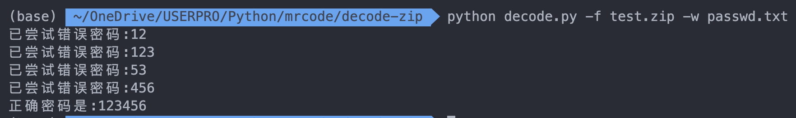

学会Python，就像拿了一把屠龙刀行走在江湖中。

本文带领大家用Python的zipfile模块实现Zip文件的密码暴力破解。在学习过程中会详细讲解 zipfile 模块和 argparse 模块的用法，并在最终破解出一个简单的加密Zip文件。

.jpg)

### 知识点：

- zipfile模块
- argparse模块

### 效果截图：



### 模块介绍

#### zipfile模块

ZIP 文件格式是一个常用的归档与压缩标准。 这个模块提供了创建、读取、写入、添加及列出 ZIP 文件的工具。 任何对此模块的进阶使用都将需要理解此格式。

加载压缩文件，创建ZipFile 对象
 `class zipfile.ZipFile(file[, mode[, compression[, allowZip64]]])`
 1.参数file表示文件的路径或类文件对象(file-like object);
 2.参数mode指示打开zip文件的模式，默认值为'r'，表示读已经存在的zip文件，也可以为'w'或'a'，w'表示新建一个zip文档或覆盖一个已经存在的zip文档，'a'表示将数据附加到一个现存的zip文档中;
 3.参数compression表示在写zip文档时使用的压缩方法，它的值可以是zipfile. ZIP_STORED 或zipfile. ZIP_DEFLATED。如果要操作的zip文件大小超过2G，应该将allowZip64设置为True。

- ZipFile.infolist()
  获取zip文档内所有文件的信息，返回一个zipfile.ZipInfo的列表
- ZipFile.namelist()
  获取zip文档内所有文件的名称列表
- ZipFile.extract(member[, path[, pwd]])
  将zip文档内的指定文件解压到当前目录。
- ZipFile.extractall([path[, members[, pwd]]])
  解压zip文档中的所有文件到当前目录。

#### argparse模块

此模块是 Python 标准库中推荐的命令行解析模块。

举个例子：`python decode.py -f test.zip -w passwd.txt`，这条命令中两个文件参数都通过关键字参数传入，这样实现了在一条命令中传入指定参数。

### 文件准备

在开始之前，我们准备两个文件，加密🔐压缩Zip文件和密码本㊙️，这里的密码本是我自己随便写的一些密码，如果大家在实际生活中需要，可以从网上下载复杂的密码本，很多的。

密码本格式如下：

```txt
12
123
53
456
123456
543
235345
```

压缩文件：

```sh
# Linux加密压缩命令
zip -r -P 123456 test.zip test
```

### 代码思路

argparse模块解析命令参数

首先导入了argparse这个模块，通过argparse.ArgumentParser方法来获得解析器对象。description是在我们输出命令行参数帮助信息时起到描述的作用。add_argument方法用来添加我们需要解析的参数。

如下添加-f参数，dest相当于存储命令行参数值的变量，提取这个变量的时候我们要用到，type表示我们输入的类型，这里是str。help是用来说明参数的，和description一样在我们输出命令行帮助信息时会显示出来。

```sh
parser = argparse.ArgumentParser(description='暴力破解Zip文件')
parser.add_argument('-f', dest='zFile', type=str, help='Zip文件路径')
parser.add_argument('-w', dest='pwdFile', type=str, help='密码本文件')
```

zipfile模块解压压缩文件

加载压缩文件，创建ZipFile 对象，然后遍历读取密码本中的密码，使用密码来尝试解压压缩文件，如果密码错误将会使用下一个密码继续尝试，知道最终尝试到正确密码。

```python
zipFile.extractall(path=savePath, pwd=password.encode('utf-8'))
```

### 完整代码

```python
import zipfile
import argparse
import os
from os.path import *


def tryZipPwd(zipFile, password, savePath):
    try:
        zipFile.extractall(path=savePath, pwd=password.encode('utf-8'))
        print('正确密码是:%s' % (password))
        return True
    except:
        print('已尝试错误密码:%s' % (password))
        return False


def main():
    parser = argparse.ArgumentParser(description='暴力破解Zip文件')
    parser.add_argument('-f', dest='zFile', type=str, help='Zip文件路径')
    parser.add_argument('-w', dest='pwdFile', type=str, help='密码本文件')
    zFilePath = None
    pwdFilePath = None
    try:
        options = parser.parse_args()
        zFilePath = options.zFile
        pwdFilePath = options.pwdFile
    except:
        print(parser.parse_args(['-h']))
        exit(0)
    if zFilePath == None or pwdFilePath == None:
        print(parser.parse_args(['-h']))
        exit(0)
    with zipfile.ZipFile(zFilePath) as zFile:
        with open(pwdFilePath) as f:
            for pwd in f.readlines():
                p, f = split(zFilePath)
                dirName = f.split('.')[0]
                dirPath = join(p, dirName)
                try:
                    os.mkdir(dirPath)
                except:
                    pass
                ok = tryZipPwd(zFile, pwd.strip('\n'), dirPath)
                if ok:
                    break


if __name__ == '__main__':
    main()
```

### 总结

通过以上内容，应该很容易的理解如何去暴力破解加密压缩文件。总的来说，思路也很简单，读取密码本密码不断的尝试加密压缩文件，直到匹配到正确密码。

