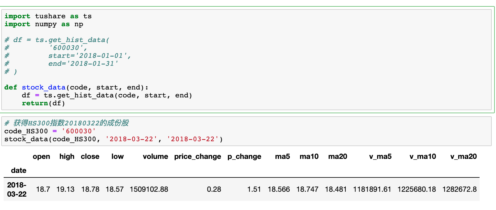
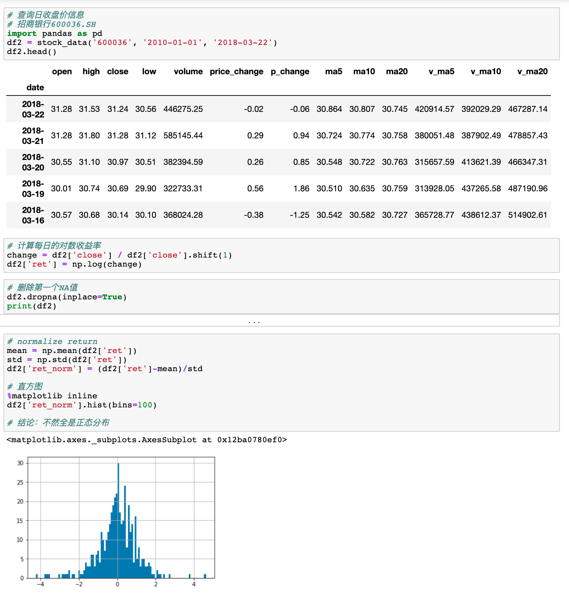
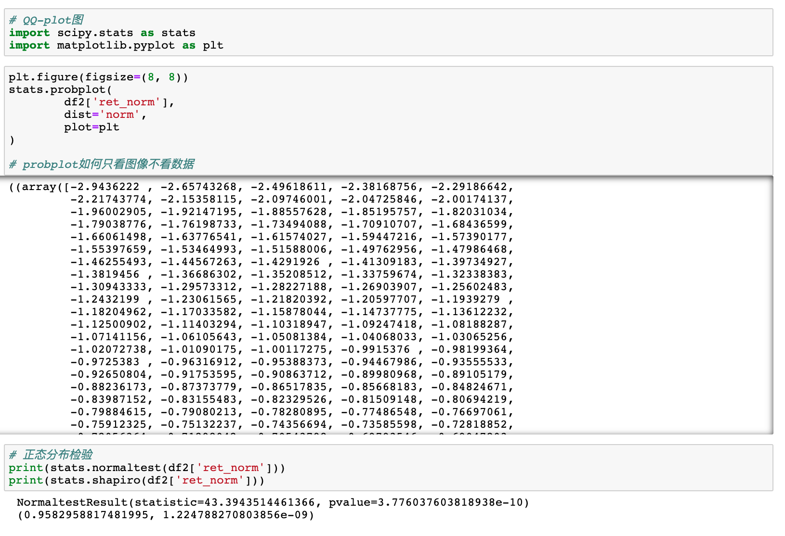
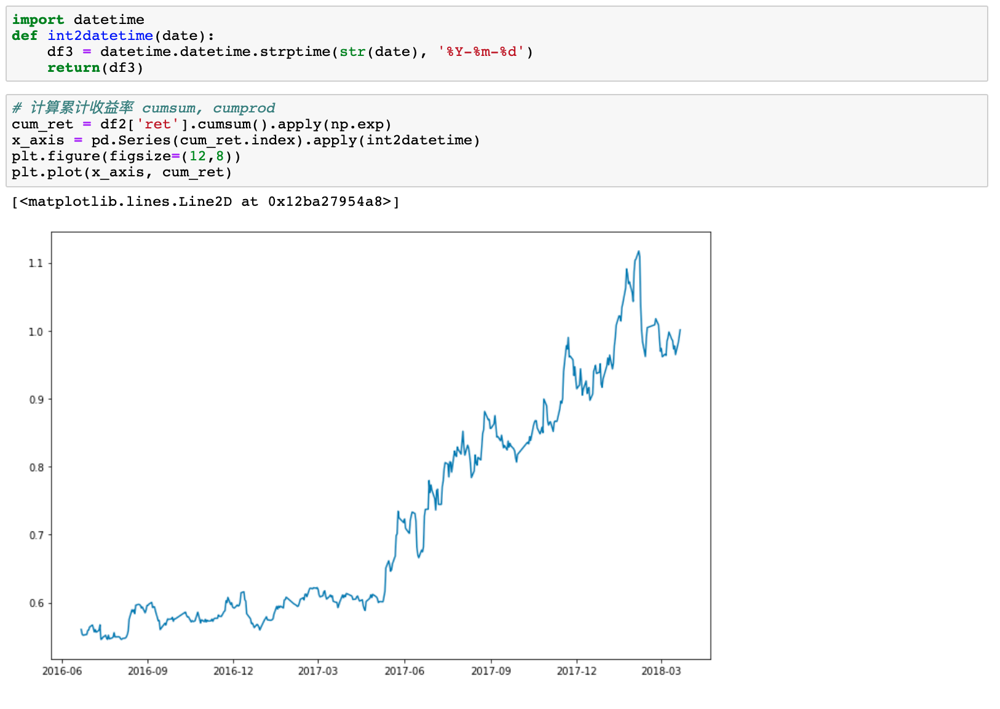
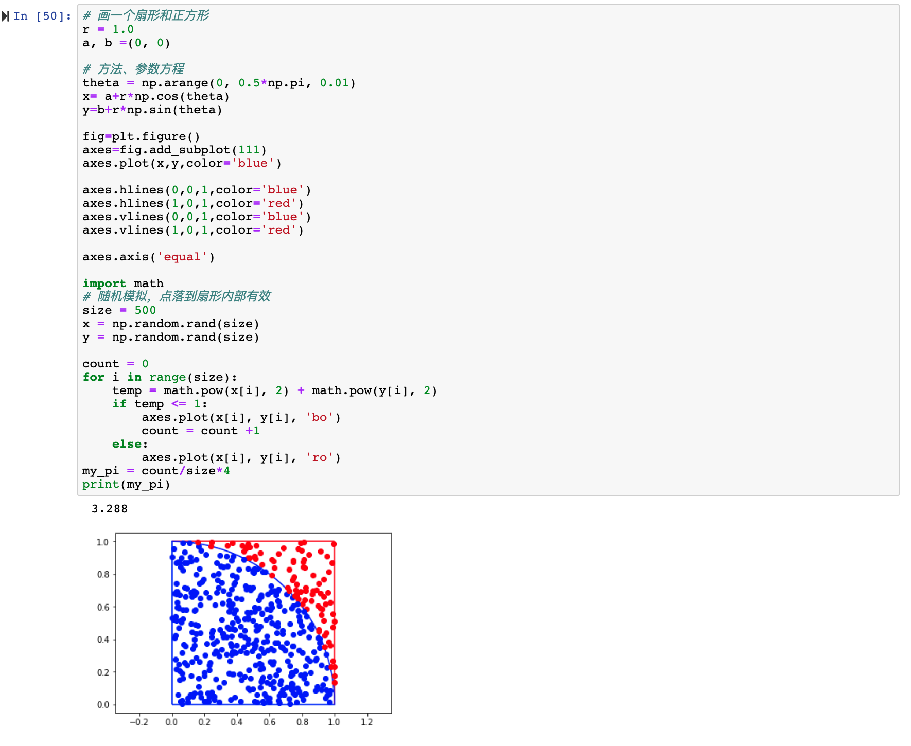

# 利用Python进行数据分析之金融数据的统计分析

## 前言

Python数据分析是金融领域必备的技能，当然现在好多专业领域都需要，我的一个生命科学专业的同学大学的时候就曾与我探讨过Python方面的知识，当时他们后面实验需要进行科学计算和数据分析。

本文主要讲解一下金融数据的统计分析。

## 本节重点

1. 分析HS300股票的市值和PE的统计规律
2. 个股日收益率的统计规律研究
3. 金融数据分析中的随机数

## 正文

Tushare是一个免费、开源的python财经数据接口包。拥有丰富的数据内容，如股票、基金、期货、数字货币等行情数据，公司财务、基金经理等基本面数据，后续开通债券、外汇、行业、大数据、区块链。Tushare返回的绝大部分的数据格式都是pandas DataFrame类型，非常便于用pandas/NumPy/Matplotlib进行数据分析和可视化。

### 1.分析HS300股票的市值和PE的统计规律

#### NumPy通用方法

- np.max / np.mean / np.min
- np.sum / np.std / np.median / np.Series.quantile(0,1) 分位数
- np.Series.skew() / np.Series.kurt()

NumPy的使用教程，可以看我之前的文章《轻松玩转NumPy》，也可以看官方教程。

#### 分布情况

- 直方图: Series.hist()

### 2.**个股日收益率的统计规律研究**

- 几个重要方法 DataFrame.set_index()
-  DataFrame.dropna()
-  Series.shift(1)
-  Series 加减乘除 Series
-  np.log(Series)

#### 正态分布的检验

结论：p值太小，不符合正态分布的特点

### 3.**计算累计收益率**

- Series.apply(func)

  > 对每个元素调用func，返回另一个Series

- Series.cumsum() 累加

  y1=x1y1=x1

  y2=x1+x2y2=x1+x2

  y3=x1+x2+x3y3=x1+x2+x3

  y4=x1+x2+x3+x4

### 4.**金融数据分析中的随机数**

- np.random.random()
- np.random.normal()
- np.random.randint()
- scipy.stats.normaltest()
- scipy.stats.kstest()

### 5.**利用模特卡罗模拟计算**

扇形面积 = 蓝点/（蓝点+红点）

扔的点越多，结果误差越小

随机模拟，点落到扇形内部有效

后面讲更多数据分析知识。

