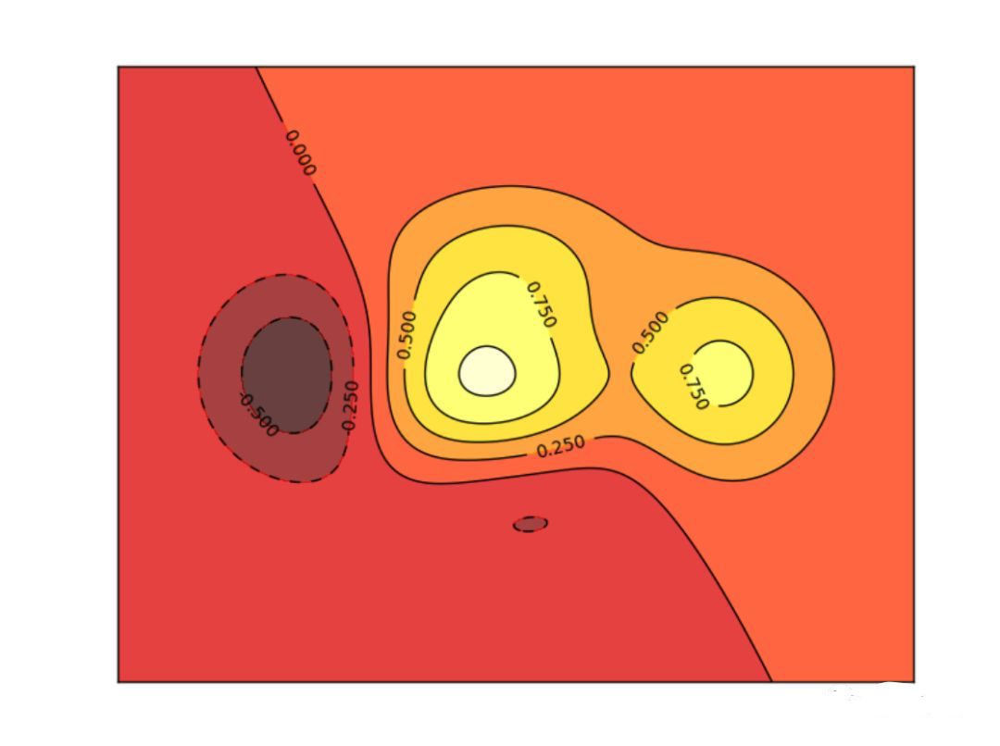
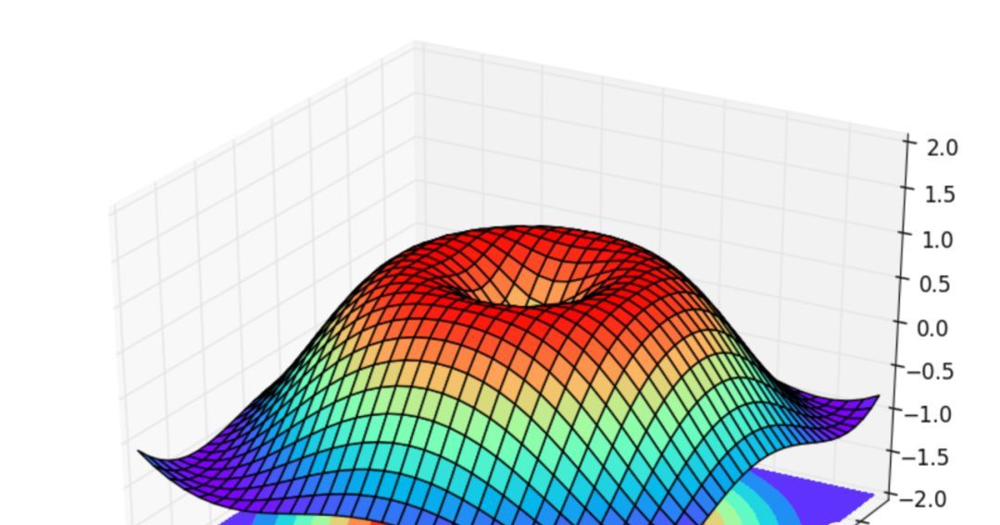
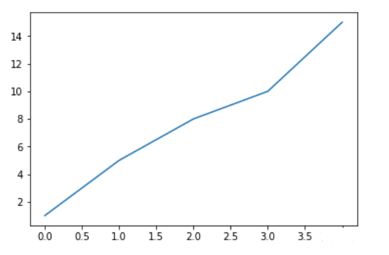
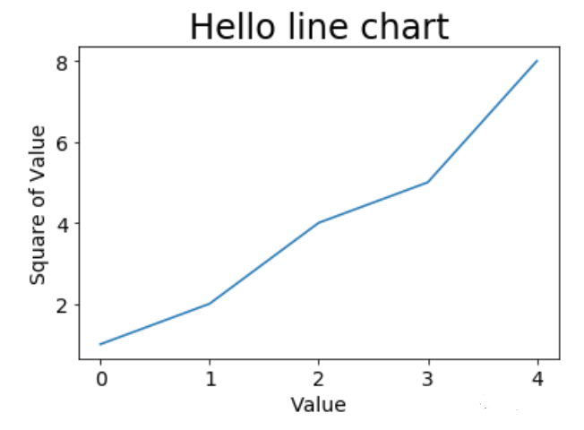
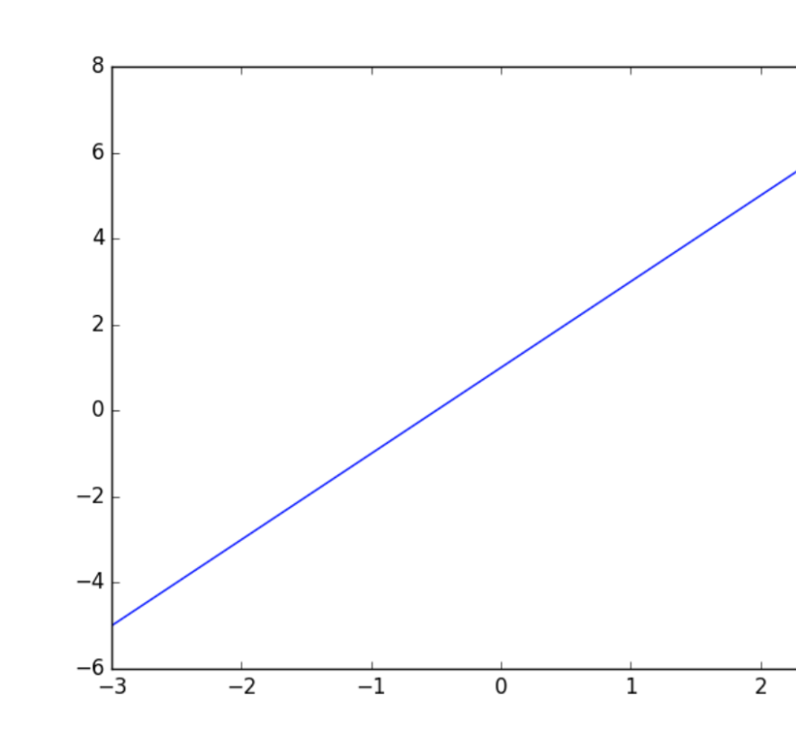
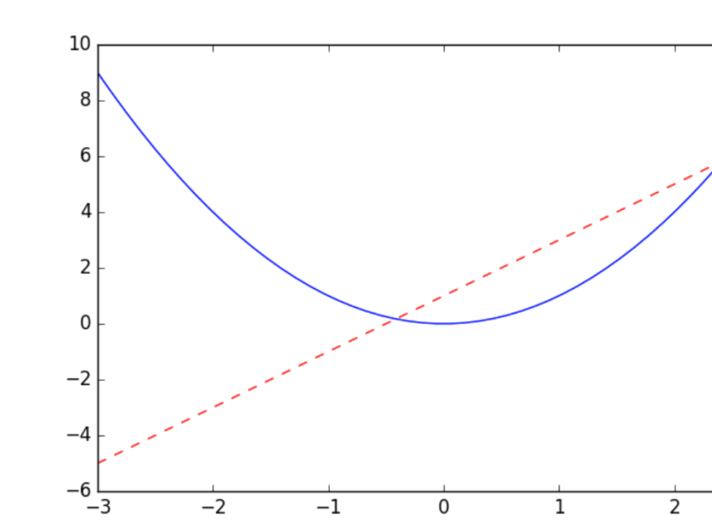
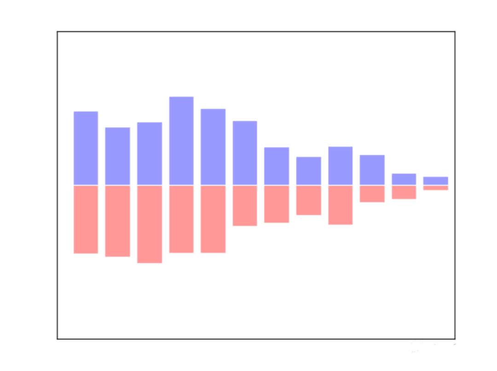
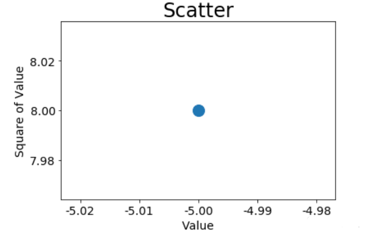
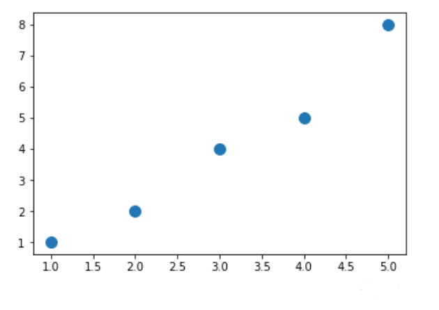

# 数据可视化，看这一篇就够了

## 介绍

Matplotlib 可能是 Python 2D-绘图领域使用最广泛的套件。它能让使用者很轻松地将数据图形化，并且提供多样化的输出格式。这里将会探索 matplotlib 的常见用法。

## 为什么选择Matplotlib？

如果某天你发现自己要学习 Matplotlib, 很可能是因为:

1. Matplotlib 是一个非常强大的 Python 画图工具;
2. 手中有很多数据, 可是不知道该怎么呈现这些数据.

所以就找到了 Matplotlib. 它能帮你画出美丽的:

- 线图;
- 散点图;
- 等高线图;
- 条形图;
- 柱状图;
- 3D 图形,
- 甚至是图形动画等等.

下面是一些例图:






## Matplotlib 安装

### MacOS

打开 Terminal 窗口, 输入以下内容

```
# python 3+ 请复制以下在 terminal 中执行
$ pip3 install matplotlib

# python 2+ 请复制以下在 terminal 中执行
$ pip install matplotlib
```

### Windows

- 确保你有安装 Visual Studio;
- 去这个网址: https://pypi.python.org/pypi/matplotlib/
- 找到一个适合你自己 python 版本的 wheel (.whl) 文件.

## 基础应用

使用`import`导入模块`matplotlib.pyplot`，并简写成`plt` 使用`import`导入模块`numpy`，并简写成`np`

```
import matplotlib.pyplot as plt
```

#### 绘制简单的折线图

定义数据

```
squares = [1, 5, 8, 10, 15]
```

使用`plt.figure`定义一个图像窗口. 使用`plt.plot`画(`x` ,`y`)曲线. 使用`plt.show`显示图像.

```
plt.plot(squares)
plt.show()
```




#### 修改标签文字和线条粗细

```
import matplotlib.pyplot as plt

squares = [1, 2, 4, 5, 8]
plt.plot(squares)
# 设置图标标题，并给坐标轴加上标签
plt.title("Hello line chart", fontsize=24)
plt.xlabel("Value", fontsize=14)
plt.ylabel("Square of Value", fontsize=14)
# 设置刻度标记的大小
plt.tick_params(axis='both',labelsize=14)
plt.show()
```




#### 简单的线条

matplotlib 的 figure 就是一个 单独的 figure 小窗口, 小窗口里面还可以有更多的小图片.

使用`import`导入模块`matplotlib.pyplot`，并简写成`plt` 使用`import`导入模块`numpy`，并简写成`np`

```
import matplotlib.pyplot as plt
import numpy as np
```

使用`np.linspace`定义x：范围是(-3,3);个数是50. 仿真一维数据组(`x` ,`y1`)表示曲线1. 仿真一维数据组(`x` ,`y2`)表示曲线2.

```
x = np.linspace(-3, 3, 50)
y1 = 2*x + 1
y2 = x**2
```

使用`plt.figure`定义一个图像窗口. 使用`plt.plot`画(`x` ,`y1`)曲线.

```
plt.figure()
plt.plot(x, y1)
plt.show()
```




使用`plt.figure`定义一个图像窗口：编号为3；大小为(8, 5). 使用`plt.plot`画(`x` ,`y2`)曲线. 使用`plt.plot`画(`x` ,`y1`)曲线，曲线的颜色属性(`color`)为红色;曲线的宽度(`linewidth`)为1.0；曲线的类型(`linestyle`)为虚线. 使用`plt.show`显示图像.




#### Bar 柱状图

##### 生成基本图形

向上向下分别生成12个数据，X为 0 到 11 的整数 ，Y是相应的均匀分布的随机数据。使用的函数是`plt.bar`，参数为X和Y：

```
import matplotlib.pyplot as plt
import numpy as np

n = 12
X = np.arange(n)
Y1 = (1 - X / float(n)) * np.random.uniform(0.5, 1.0, n)
Y2 = (1 - X / float(n)) * np.random.uniform(0.5, 1.0, n)

plt.bar(X, +Y1)
plt.bar(X, -Y2)

plt.xlim(-.5, n)
plt.xticks(())
plt.ylim(-1.25, 1.25)
plt.yticks(())
plt.bar(X, +Y1, facecolor='#9999ff', edgecolor='white')
plt.bar(X, -Y2, facecolor='#ff9999', edgecolor='white')
plt.show()
```

这样我们就生成了下图所示的柱状图基本框架：




#### Scatter 散点图

##### 绘制单个点

使用scatter()绘制散点图并设置其样式

```
import matplotlib.pyplot as plt
import matplotlib as mpl

# 解决中文乱码问题
# 用来正常显示负号
mpl.rcParams['axes.unicode_minus'] = False
plt.scatter(-5, 8, s=200)
# 设置图表标题并给坐标轴加上标签
plt.title(u"单点散点图", fontsize=24)
plt.xlabel("Value", fontsize=14)
plt.ylabel("Square of Value", fontsize=14)
# 设置刻度标记的大小
plt.tick_params(axis='both', which='major', labelsize=14)
plt.show()
```




##### 绘制一系列的点

```
import matplotlib.pyplot as plt
#
x_value = [1, 2, 3, 4, 5]
y_value = [1, 2, 4, 5, 8]
plt.scatter(x_value, y_value, s=100)
plt.show()
```




##### 绘制散点图

首先，先引入`matplotlib.pyplot`简写作`plt`,再引入模块`numpy`用来产生一些随机数据。生成1024个呈标准正态分布的二维数据组 (平均数是0，方差为1) 作为一个数据集，并图像化这个数据集。每一个点的颜色值用`T`来表示：

```
import matplotlib.pyplot as plt
import numpy as np

n = 1024# data size
X = np.random.normal(0, 1, n) # 每一个点的X值
Y = np.random.normal(0, 1, n) # 每一个点的Y值
T = np.arctan2(Y,X) # for color value
```

数据集生成完毕，现在来用`scatter`plot这个点集，鼠标点上去，可以看到这个函数的各个parameter的描述

输入`X`和`Y`作为location，`size=75`，颜色为`T`，`color map`用默认值，透明度`alpha` 为 50%。x轴显示范围定位(-1.5，1.5)，并用`xtick()`函数来隐藏x坐标轴，y轴同理：

```
plt.scatter(X, Y, s=75, c=T, alpha=.5)

plt.xlim(-1.5, 1.5)
plt.xticks(())  # ignore xticks
plt.ylim(-1.5, 1.5)
plt.yticks(())  # ignore yticks

plt.show()
```


**具体查看Matplotlib官方文档**

- 用户指南
- 常见问题及回答
- 截屏

公众号回复“**数据可视化**”，下载jupyter notebook的ipynb文件。