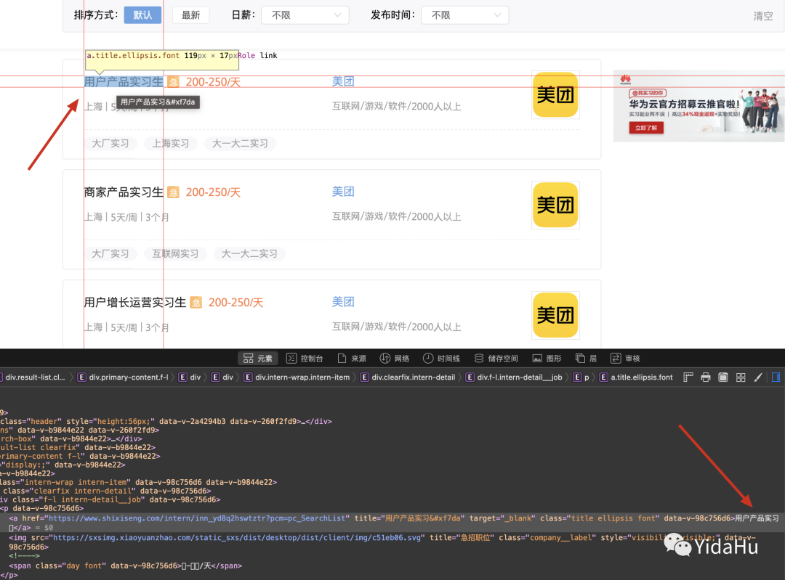
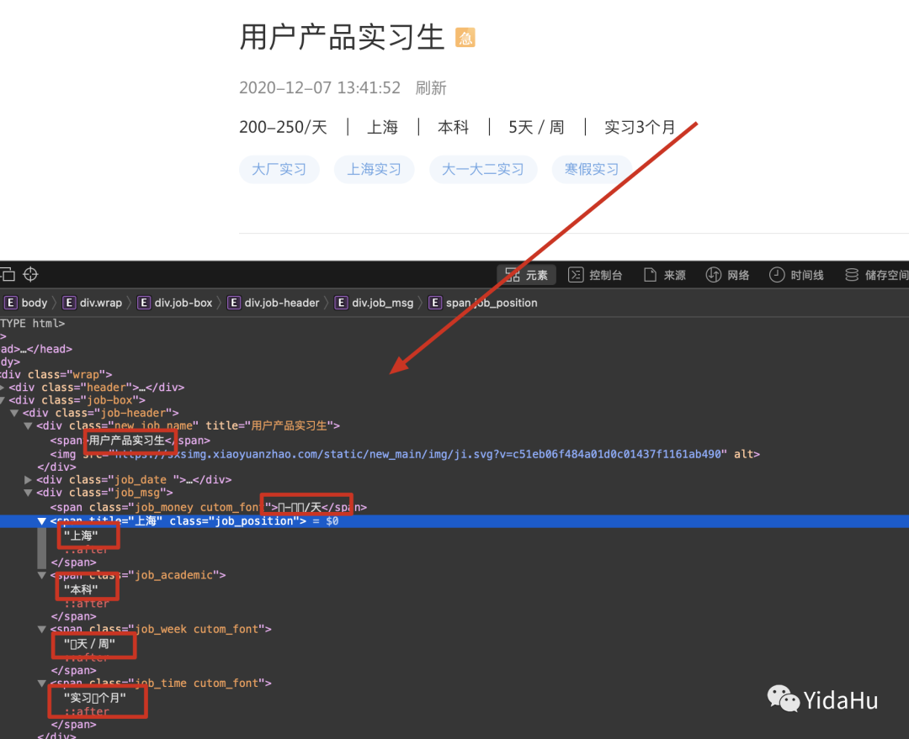
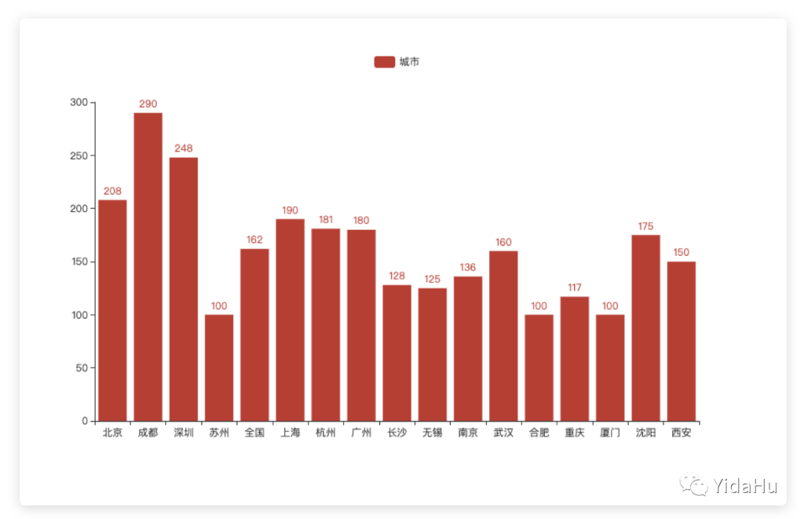

# Python网络爬虫：筛选招聘岗位

## 前言

本文将讲解利用Python网络爬虫海量招聘信息，一键筛选称心岗位。

如果需要源码和数据集的请私信📧。

## 知识点

\- requests

\- Beautiful Soup

\- pyecharts

### requests

Requests 是一个 Python 的 HTTP 客户端库。基于urllib编写的，Requests它会比urllib更加方便，可以节约我们大量的工作。

### Beautiful Soup

Beautiful Soup 提供一些简单的、python 式的函数用来处理导航、搜索、修改分析树等功能。它是一个工具箱，通过解析文档为用户提供需要抓取的数据，因为简单，所以不需要多少代码就可以写出一个完整的应用程序。Beautiful Soup 自动将输入文档转换为 Unicode 编码，输出文档转换为 utf-8 编码。你不需要考虑编码方式，除非文档没有指定一个编码方式，这时，Beautiful Soup 就不能自动识别编码方式了。然后，你仅仅需要说明一下原始编码方式就可以了。Beautiful Soup 已成为和 lxml、html6lib 一样出色的 python 解释器，为用户灵活地提供不同的解析策略或强劲的速度。

### pyecharts

Echarts 是一个由百度开源的数据可视化，凭借着良好的交互性，精巧的图表设计，得到了众多开发者的认可。而 Python 是一门富有表达力的语言，很适合用于数据处理。当数据分析遇上数据可视化时，pyecharts 诞生了。

## 爬虫步骤

通过对思路的分析，我们就得到了帮助解决问题的步骤：

1. 分析网页，找到数据所在网页中的结构；
2. 向网页发送请求，获取网页代码；
3. 解析网页，提取职位名称、公司名称和所在城市；
4. 破解字体反爬虫，提取薪资；
5. 统计不同城市的平均薪资与职位数量；
6. 绘制柱状图，得出结论。

### 定位数据

在这里，我们要获取的数据有：职位名称、公司名称、工作地址和工作薪资。

想要爬取数据，首先要去网页的 HTML 代码中找到所在的位置。

在 HTML 代码中我们会发现，职位名称、公司名称和工作地址所在的节点中，获取到了网页的源代码，接下来我们需要使用 BeautifulSoup 模块解析源代码，提取出职位对应的 URL 链接所在的全部节点。



### 常见反爬虫机制

在这里，给大家介绍最常遇到的两种反爬虫：

1. 基于 User-Agent 字段

User-Agent 是 HTTP 请求头中用来识别用户身份的一个字段。

每个正常用户使用浏览器正常访问网站时都会有标识自身属性的 User-Agent。而服务器如果发现 User-Agent 为空或不正常，则一般会拒绝返回数据，并返回错误码 403 表示禁止访问。

1. IP访问频率

如果输入正确的验证码，则放行，如果没有输入，则拉入禁止一段时间，如果超过禁爬时间，再次出发验证码，则拉入黑名单

设置**IP**访问频率，如果超过一定频率，弹出验证码

3.限制单个**ip/api token**的访问量

一定时间内限制请求的访问次数

### 提取数据

用鼠标定位的方法找到每个信息在 HTML 代码中的位置，可以发现我们想要的信息就位于图中所示的节点中。

我们可以使用 find() 函数，分别提取出职位名称、公司名称和所在城市对应的节点。



```
# 导入requests模块
import requests
# 从bs4中导入BeautifulSoup模块
from bs4 import BeautifulSoup
# 导入time模块
import time
# 将User-Agent以字典键对形式赋值给headers
headers = {"User-Agent": "Mozilla/5.0 (Macintosh; Intel Mac OS X 10_14_6) AppleWebKit/537.36 (KHTML, like Gecko) Chrome/85.0.4183.102 Safari/537.36"}
# 定义一个新函数getPositionInfo，包含参数detail_url
def getPositionInfo(detail_url):   
    # 将detail_url和headers参数，添加进requests.get()中，给赋值给res
    res = requests.get(detail_url,headers=headers)
    # 使用.text属性获取网页内容，赋值给html
    html = res.text
    # 用BeautifulSoup()传入变量html和解析器lxml，赋值给soup
    soup = BeautifulSoup(html, "lxml")
    # 使用find()函数获取class="new_job_name"的节点
    # 使用attrs属性提取出title的属性值,赋值给变量job
    job = soup.find(class_="new_job_name").attrs["title"]
    # 使用find()函数获取class="com-name"的节点
    # 使用.string属性提取出标签内容
    # 使用strip()移除空格，赋值给companyName
    companyName = soup.find(class_="com-name").string.strip()
    # 使用find()函数获取class="job_position"的节点
    # 使用.string属性提取出标签内容，赋值给position
    position = soup.find(class_="job_position").string
    # 使用find()函数获取class="job_money cutom_font"的节点
    # 使用.string属性提取出标签内容，赋值给salary
    salary = soup.find(class_="job_money cutom_font").string
    # 使用print格式化输出job,companyName,position,salary
    print(f"{job},{companyName},{position},{salary}")
# for循环遍历range()函数生成的1-6的数字
for i in range(1,6):
    # 利用格式化字符生成串网站链接 赋值给变量url
    url = f"https://www.shixiseng.com/interns?page={i}&type=intern&keyword=%E4%BA%A7%E5%93%81%E7%BB%8F%E7%90%86&area=&months=&days=&degree=&official=entry&enterprise=&salary=-0&publishTime=&sortType=&city=%E5%85%A8%E5%9B%BD&internExtend="
    # 将url和headers参数，添加进requests.get()中，将字典headers传递给headers参数，给赋值给res
    res = requests.get(url, headers=headers)
    # 使用.text属性获取网页内容，赋值给html
    html = res.text
    # 用BeautifulSoup()传入变量html和解析器lxml，赋值给soup
    soup = BeautifulSoup(html,"lxml")
    # 使用find_all()查询soup中class=title ellipsis font的节点，赋值给titles
    titles = soup.find_all(class_ = "title ellipsis font")
    # for循环遍历列表titles
    for item in titles:
        # 使用.attrs获取href对应的属性值，并赋值给detail_url
        detail_url = item.attrs["href"]
        # 调用getPositionInfo()函数，传入参数detail_url
        getPositionInfo(detail_url)
    # 使用time.sleep()停顿2秒
    time.sleep(2)
```

## 

### 字符编码转换

从上图可以看到，有好多数字都是小方块，我们可以先把小方格用其他的编码方式重新编码，比如说“UTF-8”编码。

我们根据编码后的二进制数据与网页薪资数字之间的对应关系，然后将它们进行替换。

接着将二进制数据，再转换成字符串，就可以破解字体反爬虫机制，获取到薪资数据啦～

想要将字符串转换成二进制数据，在这里我们可以使用 encode() 函数，实现“编码”。

在 encode() 函数中默认 UTF-8 编码，由于它是针对英语设计的，中英文字符转码后会有差异。

替换完成后，接下来就要将新的二进制数据转换成字符串，这个过程就叫做“解码”，我们可以使用 decode() 函数。

代码如下：

```
# 使用find()函数获取class="job_money cutom_font"的节点
# 使用.string属性提取出标签内容，赋值给salary
salary= soup.find(class_="job_money cutom_font").string

# encode()函数对变量salary编码，赋值给salary
salary = salary.encode()

# 使用replace()函数将二进制数据替换成UTF-8编码数字
salary = salary.replace(b"\xee\x8b\xbf", b"0")
salary = salary.replace(b"\xee\xa2\x9c", b"1")
salary = salary.replace(b"\xee\x90\xb7", b"2")

# 使用print输出salary
print(salary)
```

### 数据统计

想要绘制不同城市的平均薪资柱状图，我们先要知道柱状图的 x 轴和 y 轴的数据是什么。

这里柱状图的 x 轴是不同的城市名，y 轴是平均薪资。

柱将数据进行处理放在两个字典中，字典cityDict的键为不同城市，对应的值为平均薪资。字典 city_num_dict 的键为不同城市，对应的值为职位数量。

从 pyecharts.charts 中导入 Bar 模块，进行数据可视化绘制出两个柱状图。

代码如下：

```
# 从pyecharts.charts中导入Bar模块
from pyecharts.charts import Bar
# 使用with...as语句配合open()函数以r方式，打开路径为“/Users/职位数据.txt”的文件，赋值给f
with open("/Users/职位数据.txt", "r") as f:
    # 使用readlines()读取f中的所有行，赋值给dataList
    dataList = f.readlines()
# 新建一个字典cityDict
cityDict = {}
# for循环遍历列表dataList中的每个元素data
for data in dataList:
    # 如果"薪资面议"在元素中
    if "薪资面议" in data:
        # 就跳过
        continue
    # 使用split()以逗号分隔data，索引第3项元素，赋值给city
    city = data.split(",")[2]
    # 使用split()以逗号分隔data，索引第4项元素，赋值给salary
    salary = data.split(",")[3]
    # 使用split()以斜杠分隔salary，索引第1项元素，赋值给daily
    daily = salary.split("/")[0]
    # 使用split()以短横线分隔daily索引第1项，赋值给start
    start = daily.split("-")[0]
    # 使用split()以短横线分隔daily索引第2项，赋值给end
    end = daily.split("-")[1]
    # 将start和end转换成整型相加后除以2，并赋值给average
    average = (int(start)+int(end))/2
    # 如果city不在字典cityDict的键中
    if city not in cityDict.keys():
        # 将字典中键所对应的值设置为空列表
        cityDict[city] = []
    # 使用append()函数往字典键所对应的值中添加average
    cityDict[city].append(average)
# 新建一个字典city_num_dict
city_num_dict = {}
# for循环遍历cityDict.items()中的key,value
for key,value in cityDict.items():
    # 使用sum()函数将列表value求和
    # 使用len()函数计算列表value长度
    # 使用//运算符计算列表value的平均值，赋值给average_value
    average_value = sum(value)//len(value)
    # 将字典cityDict的键对应的值设置为average_value
    cityDict[key] = average_value
    # 将字典city_num_dict的键设置为不同城市
    # 将对应的值设置为len(value)
    city_num_dict[key] = len(value)
# 创建Bar对象，赋值给bar
bar = Bar()
# 使用list()将字典cityDict所有键转换成列表，传入add_xaxis()中
bar.add_xaxis(list(cityDict.keys()))
# 使用add_yaxis()函数，将数据统称设置为"城市"
# 将字典cityDict所有值转换成列表，作为参数添加进函数中
bar.add_yaxis("城市",list(cityDict.values()))
# 使用render()函数存储文件，设置文件名为salary.html
bar.render("salary.html")
# 创建Bar对象，赋值给bar_city
bar_city = Bar()
# 使用list()将字典city_num_dict所有键转换成列表，传入add_xaxis()中
bar_city.add_xaxis(list(city_num_dict.keys()))
# 使用add_yaxis()函数，将数据统称设置为"城市"
# 将字典city_num_dict所有值转换成列表，作为参数添加进函数中
bar_city.add_yaxis("城市",list(city_num_dict.values()))
# 使用render()函数存储文件，设置文件名为positions.html
bar_city.render("positions.html")
```

## 总结

本文讲解了分析网页，解析网页，字符串编码转换，读取数据，数据统计，绘制柱状图。

