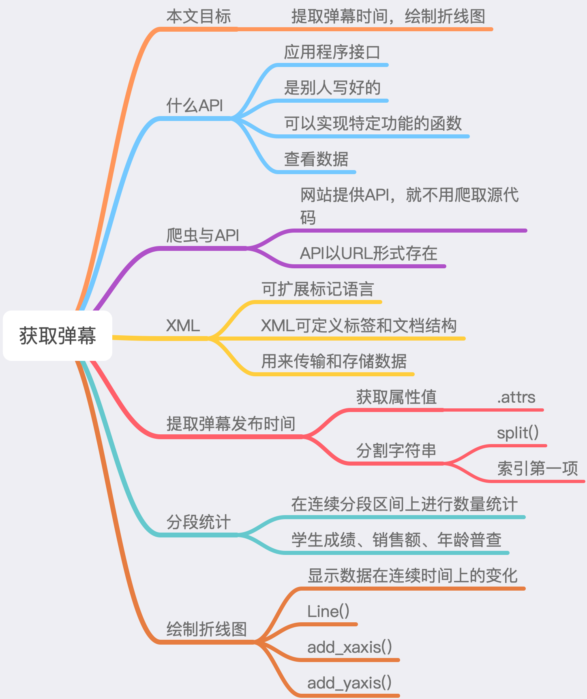
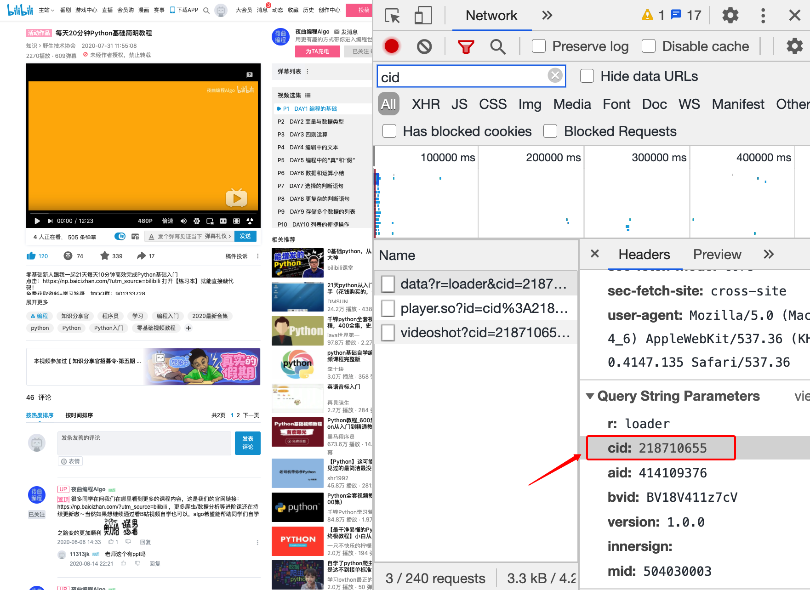
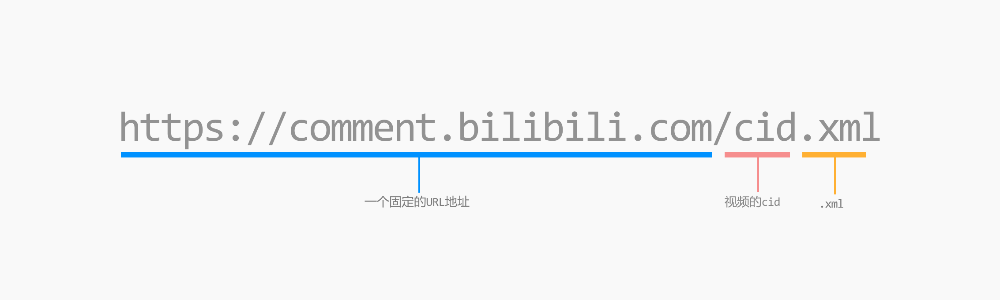
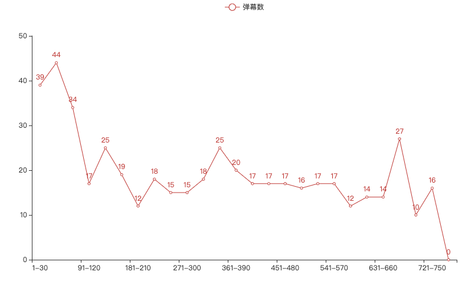

# 利用Python进行网络爬虫之获取B站弹幕


## 前言

本文通过利用Python进行网络爬虫，获取B站视频的弹幕，来分析粉丝的喜好，以此帮助up主们制作粉丝最喜欢的视频。

## 知识点

\- requests

\- Beautiful Soup

\- pyecharts



## requests库

requests最简单易用的HTTP库。

```shell
pip install requests
```

## BeautifulSoup库

BeautifulSoup是一个高效的网页解析库，可以从 HTML 或 XML 文件中提取数据。

```shell
pip install beautifulsoup4
```

##  Pyecharts库

Echarts 是一个由百度开源的数据可视化，凭借着良好的交互性，精巧的图表设计，得到了众多开发者的认可。而 Python 是一门富有表达力的语言，很适合用于数据处理。当数据分析遇上数据可视化时，pyecharts 诞生了。

```shell
pip install pyecharts
```

Pyecharts是开源数据可视化库。

## 爬虫步骤

通过对解题思路的分析，我们就得到了帮助解决问题的步骤：

1. 分析网页，找到弹幕所在网页位置；

2. 向网页发送请求，获取网页代码；

3. 解析网页，提取弹幕发布时间；

4. 将弹幕发布时间进行分段统计；

5. 绘制折线图。

## 定位弹幕

在B站中，许多基础的数据，如弹幕、评论、视频基本信息等，都有非常成熟和稳定的应用程序接口（API）可供使用。

也就是说，我们可以通过弹幕 API，获取一个视频的弹幕数据。

## 什么是API

API 是 Application Programming Interface （应用 编程 接口）三个单词的缩写。

通俗易懂的说，API 其实就是别人已经写好的可以实现特定功能的函数。

只需要调用它，传入规定的参数，这个函数就可以实现功能。

在B站中，只要视频中有弹幕，就会有一个 cid 参数。cid 用来表示某个视频对应的弹幕池。

前面我们提到，API 一般以 URL 形式存在的，B站的弹幕 API 的 URL 链接🔗看图示代码中。

看来，只要知道了 cid 参数值，就可以找到视频弹幕数据的位置了。



将获取的 cid 参数值放入以下 URL 链接中



## 解析数据

requests模块使用了 ISO-8859-1 编码，网页使用了 utf-8 编码，编码方式不一样，会出现中文乱码。

对 response.encoding 属性重新赋值，即可修改编码。

仔细观察 xml 代码，会发现所有的弹幕都在类似的节点中，只是属性 p 的值不一样，这些参数应该和弹幕的设置有关。

在这里，我们就需要提取出和弹幕有关所有节点，再从每个节点中提取出弹幕时间对应的参数。

```python
# 调用.encoding属性获取requests模块的编码方式
# 调用.apparent_encoding属性获取网页编码方式
# 将网页编码方式赋值给response.encoding
response.encoding = response.apparent_encoding

# 将服务器响应内容转换为字符串形式，赋值给xml
xml = response.text

# 使用BeautifulSoup()读取xml，添加lxml解析器，赋值给soup
soup = BeautifulSoup(xml, "lxml")

# 使用find_all()查询soup中d的节点，赋值给content_all
content_all = soup.find_all(name="d")
```

## 统计

将视频弹幕进行分段统计，新建一个字典，统计以 30 秒为分段区间的弹幕数。

从 pyecharts.charts 中导入 Line 模块，绘制折线图，设置 x 轴和 y 轴，将 html 文件名称为line.html。



```python
# 使用Line()创建Line对象，赋值给line
line = Line()

# 使用list()将字典subtitlesDict所有键转换成列表，传入add_xaxis()中
line.add_xaxis(list(subtitlesDict.keys()))

# 使用add_yaxis()函数，将数据统称设置为"弹幕数"
# 将字典subtitlesDict所有值转换成列表，作为参数添加进函数中
line.add_yaxis("弹幕数", list(subtitlesDict.values()))

# 使用render()函数存储文件，设置文件名为line.html
line.render("line.html")
```

## 总结

本文讲解了API接口、XML可扩展标记语言、修改编码方式、分段统计、折线图、生成折线图。

**如果需要本文案例源码**，请关注公众号【YidaHu】，后台回复【B站弹幕】，下载源代码。


