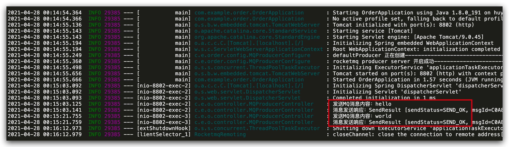
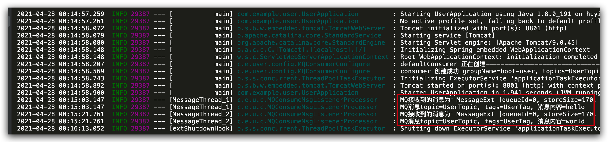

# SpringBoot 多项目实现 RocketMQ 生产消费

## Maven 配置

生产者和消费者都添加 rocketmq 配置
pom.xml 添加如下配置

```xml
<!-- rocketmq -->
<dependency>
    <groupId>org.apache.rocketmq</groupId>
    <artifactId>rocketmq-client</artifactId>
    <version>4.3.2</version>
</dependency>
<!-- lombok，根据需要添加 -->
<dependency>
    <groupId>org.projectlombok</groupId>
    <artifactId>lombok</artifactId>
    <version>1.18.4</version>
</dependency>
<!-- hutool，根据需要添加-->
<dependency>
    <groupId>cn.hutool</groupId>
    <artifactId>hutool-all</artifactId>
    <version>5.3.9</version>
</dependency>
```

## 生产者

创建 springboot 的项目，作为生产者服务

### properties 配置文件

application.properties

```properties
spring.application.name=boot-order
server.port=8802
spring.jackson.date-format=yyyy-MM-dd HH:mm:ss
spring.jackson.time-zone=GMT+8
# 是否开启自动配置
rocketmq.producer.isOnOff=on
# 发送同一类消息设置为同一个group，保证唯一默认不需要设置，rocketmq会使用ip@pid（pid代表jvm名字）作为唯一标识
rocketmq.producer.groupName=${spring.application.name}
# mq的nameserver地址
rocketmq.producer.namesrvAddr=192.168.1.71:9876
# 消息最大长度 默认 1024 * 4 (4M)
rocketmq.producer.maxMessageSize=4096
# 发送消息超时时间，默认 3000
rocketmq.producer.sendMsgTimeOut=3000
# 发送消息失败重试次数，默认2
rocketmq.producer.retryTimesWhenSendFailed=2
```

### 生产者配置

MQProducerConfigure.java

```java
@Getter
@Setter
@ToString
@Configuration
@ConfigurationProperties(prefix = "rocketmq.producer")
public class MQProducerConfigure {

    public static final Logger LOGGER = LoggerFactory.getLogger(MQProducerConfigure.class);

    private String groupName;
    private String namesrvAddr;
    // 消息最大值
    private Integer maxMessageSize;
    // 消息发送超时时间
    private Integer sendMsgTimeOut;
    // 失败重试次数
    private Integer retryTimesWhenSendFailed;

    /**
     * mq 生成者配置
     * @return
     * @throws MQClientException
     */
    @Bean
    @ConditionalOnProperty(prefix = "rocketmq.producer", value = "isOnOff", havingValue = "on")
    public DefaultMQProducer defaultProducer() throws MQClientException {
        LOGGER.info("defaultProducer 正在创建---------------------------------------");
        DefaultMQProducer producer = new DefaultMQProducer(groupName);
        producer.setNamesrvAddr(namesrvAddr);
        producer.setVipChannelEnabled(false);
        producer.setMaxMessageSize(maxMessageSize);
        producer.setSendMsgTimeout(sendMsgTimeOut);
        producer.setRetryTimesWhenSendAsyncFailed(retryTimesWhenSendFailed);
        producer.start();
        LOGGER.info("rocketmq producer server 开启成功----------------------------------");
        return producer;
    }
}
```

### Controller 测试生产消息

MQProducerController.java

```java
@RestController
@RequestMapping("/mqProducer")
public class MQProducerController {
    public static final Logger LOGGER = LoggerFactory.getLogger(MQProducerController.class);

    @Autowired
    DefaultMQProducer defaultMQProducer;

    /**
     * 发送简单的MQ消息
     *
     * @param msg
     * @return
     */
    @GetMapping("/send")
    public String send(String msg) throws InterruptedException, RemotingException, MQClientException, MQBrokerException {
        if (StringUtils.isEmpty(msg)) {
            return Dict.create().set("result", "success").toString();
        }
        LOGGER.info("发送MQ消息内容：" + msg);
        Message sendMsg = new Message("UserTopic", "UserTag", msg.getBytes());
        // 默认3秒超时
        SendResult sendResult = defaultMQProducer.send(sendMsg);
        LOGGER.info("消息发送响应：" + sendResult.toString());
        return Dict.create().set("result", sendResult).toString();
    }

}
```

## 消费者

创建 springboot 项目，作为消费者服务

### properties 配置文件

```properties
spring.application.name=boot-user
server.port=8801
spring.jackson.date-format=yyyy-MM-dd HH:mm:ss
spring.jackson.time-zone=GMT+8
# 是否开启自动配置
rocketmq.consumer.isOnOff=on
# 发送同一类消息设置为同一个group，保证唯一默认不需要设置，rocketmq会使用ip@pid（pid代表jvm名字）作为唯一标识
rocketmq.consumer.groupName=${spring.application.name}
# mq的nameserver地址
rocketmq.consumer.namesrvAddr=192.168.1.71:9876
# 消费者订阅的主题topic和tags（*标识订阅该主题下所有的tags），格式: topic~tag1||tag2||tags3;
rocketmq.consumer.topics=UserTopic~UserTag||MailTag;HelloTopic~HelloTag;YidaTopic~*
# 消费者线程数据量
rocketmq.consumer.consumeThreadMin=5
rocketmq.consumer.consumeThreadMax=32
# 设置一次消费信心的条数，默认1
rocketmq.consumer.consumeMessageBatchMaxSize=1
```

### 消费者配置

MQConsumerConfigure.java

```java
@Getter
@Setter
@ToString
@Configuration
@ConfigurationProperties(prefix = "rocketmq.consumer")
public class MQConsumerConfigure {

    public static final Logger LOGGER = LoggerFactory.getLogger(MQConsumerConfigure.class);

    private String groupName;
    private String namesrvAddr;
    private String topics;
    // 消费者线程数据量
    private Integer consumeThreadMin;
    private Integer consumeThreadMax;
    private Integer consumeMessageBatchMaxSize;

    @Autowired
    private MQConsumeMsgListenerProcessor consumeMsgListenerProcessor;

    /**
     * mq 消费者配置
     *
     * @return
     * @throws MQClientException
     */
    @Bean
    @ConditionalOnProperty(prefix = "rocketmq.consumer", value = "isOnOff", havingValue = "on")
    public DefaultMQPushConsumer defaultConsumer() throws MQClientException {
        LOGGER.info("defaultConsumer 正在创建---------------------------------------");
        DefaultMQPushConsumer consumer = new DefaultMQPushConsumer(groupName);
        consumer.setNamesrvAddr(namesrvAddr);
        consumer.setConsumeThreadMin(consumeThreadMin);
        consumer.setConsumeThreadMax(consumeThreadMax);
        consumer.setConsumeMessageBatchMaxSize(consumeMessageBatchMaxSize);
        // 设置监听
        consumer.registerMessageListener(consumeMsgListenerProcessor);

        /**
         * 设置consumer第一次启动是从队列头部开始还是队列尾部开始
         * 如果不是第一次启动，那么按照上次消费的位置继续消费
         */
        consumer.setConsumeFromWhere(ConsumeFromWhere.CONSUME_FROM_LAST_OFFSET);
        /**
         * 设置消费模型，集群还是广播，默认为集群
         */
//        consumer.setMessageModel(MessageModel.CLUSTERING);

        try {
            // 设置该消费者订阅的主题和tag，如果订阅该主题下的所有tag，则使用*,
            String[] topicArr = topics.split(";");
            for (String tag : topicArr) {
                String[] tagArr = tag.split("~");
                consumer.subscribe(tagArr[0], tagArr[1]);
            }
            consumer.start();
            LOGGER.info("consumer 创建成功 groupName={}, topics={}, namesrvAddr={}", groupName, topics, namesrvAddr);
        } catch (MQClientException e) {
            LOGGER.error("consumer 创建失败!");
        }
        return consumer;
    }
}
```

### 消息监听

MQConsumeMsgListenerProcessor.java

```java
@Component
public class MQConsumeMsgListenerProcessor implements MessageListenerConcurrently {

    public static final Logger LOGGER = LoggerFactory.getLogger(MQConsumeMsgListenerProcessor.class);


    /**
     * 默认msg里只有一条消息，可以通过设置consumeMessageBatchMaxSize参数来批量接收消息
     * 不要抛异常，如果没有return CONSUME_SUCCESS ，consumer会重新消费该消息，直到return CONSUME_SUCCESS
     *
     * @param msgList
     * @param consumeConcurrentlyContext
     * @return
     */
    @Override
    public ConsumeConcurrentlyStatus consumeMessage(List<MessageExt> msgList, ConsumeConcurrentlyContext consumeConcurrentlyContext) {
        if (CollectionUtils.isEmpty(msgList)) {
            LOGGER.info("MQ接收消息为空，直接返回成功");
            return ConsumeConcurrentlyStatus.CONSUME_SUCCESS;
        }
        MessageExt messageExt = msgList.get(0);
        LOGGER.info("MQ接收到的消息为：" + messageExt.toString());
        try {
            String topic = messageExt.getTopic();
            String tags = messageExt.getTags();
            String body = new String(messageExt.getBody(), "utf-8");

            LOGGER.info("MQ消息topic={}, tags={}, 消息内容={}", topic, tags, body);
        } catch (Exception e) {
            LOGGER.error("获取MQ消息内容异常{}", e);
        }
        // TODO 处理业务逻辑
        return ConsumeConcurrentlyStatus.CONSUME_SUCCESS;
    }
}
```

## 测试

发送消息

```sh
curl http://localhost:8802/mqProducer/send?msg=hello
```

生产者日志


消费者日志


