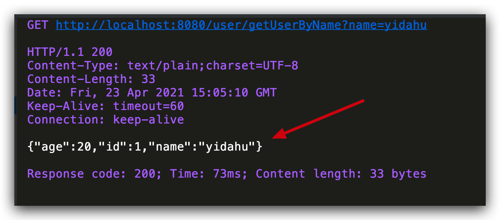

# SpringBoot 项目使用 JPA

## 相关依赖

在 pom.xml 中添加 maven 依赖

```xml
<dependencies>
		<dependency>
			<groupId>org.springframework.boot</groupId>
			<artifactId>spring-boot-starter-data-jpa</artifactId>
		</dependency>
		<dependency>
			<groupId>org.springframework.boot</groupId>
			<artifactId>spring-boot-starter-web</artifactId>
		</dependency>

		<dependency>
			<groupId>mysql</groupId>
			<artifactId>mysql-connector-java</artifactId>
			<scope>runtime</scope>
		</dependency>
		<dependency>
			<groupId>org.springframework.boot</groupId>
			<artifactId>spring-boot-starter-test</artifactId>
			<scope>test</scope>
		</dependency>
	</dependencies>
```

## MySQL 连接信息和 JPA 配置

`application.properties`

```properties
spring.jpa.hibernate.ddl-auto=update
spring.jpa.show-sql=true
spring.datasource.url=jdbc:mysql://${MYSQL_HOST:localhost}:3306/springboot_proj
spring.datasource.username=root
spring.datasource.password=123456
```

## 数据库表结构

```sql
DROP TABLE IF EXISTS `user`;
CREATE TABLE `user` (
  `id` bigint(20) NOT NULL AUTO_INCREMENT,
  `name` varchar(20) DEFAULT NULL,
  `age` int(11) DEFAULT NULL,
  PRIMARY KEY (`id`)
) ENGINE=InnoDB DEFAULT CHARSET=utf8;
```

## 创建实体类

```java
@Entity
@Data
public class User {

    @Id
    @GeneratedValue(strategy = GenerationType.IDENTITY)
    private Long id;

    private String name;

    private Integer age;

}
```

## 创建操作数据库的 Repository 接口

首先这个接口加了 @Repository 注解，代表它和数据库操作有关。另外，它继承了 JpaRepository<User, Long>接口

```java
@Repository
public interface UserRepository extends JpaRepository<User, Long> {
}
```

## JPA 自带方法实战

增删改查 1.保存用户到数据库

```java
User user = new User("yidahu", 20);
userRepository.save(user);
```

save()方法对应 sql 语句就是:insert into user (age, name) values (23,"snailclimb")

根据 id 查找用户

```java
Optional<User> userOptional = userRepository.findById(id);
```

findById()方法对应 sql 语句就是：select \* from user p where p.id = id

根据 id 删除用户

```java
userRepository.deleteById(id);
```

deleteById()方法对应 sql 语句就是：delete from user where id=id

更新用户

更新操作也要通过 save()方法来实现，比如：

```java
User user = new User("SnailClimb", 23);
User savedUser = userRepository.save(user);
 // 更新 user 对象的姓名
 savedUser.setName("UpdatedName");
 userRepository.save(savedUser);
```

在这里 save()方法相当于 sql 语句：update user set name="UpdatedName" where id=id

带条件的查询
下面这些方法是我们根据 JPA 提供的语法自定义的，你需要将下面这些方法写到 UserRepository 中。

假如我们想要根据 Name 来查找 User ，你可以这样：

```java
Optional<User> findByName(String name);
```

如果你想要找到年龄大于某个值的人，你可以这样：

```java
List<User> findByAgeGreaterThan(int age);
```

## 自定义 SQL 语句操作

根据 name 来查找 User：

```java
@Query("select u from User u where u.name = :name")
Optional<User> findByNameCustomeQuery(@Param("name") String name);
```

User 部分属性查询：

```java
@Query("select u.name from User u where u.id = :id")
String findUserNameById(@Param("id") Long id);
```

根据 id 更新 User name:

```java
@Query("select u.name from User u where u.id = :id")
String findUserNameById(@Param("id") Long id);
```

异步处理：

```java
@Async
Future<User> findByName(String name);
```

## 用 Controller 测试一下接口

```java
@RestController
@RequestMapping("user")
public class UserController {

    @Autowired
    private UserRepository userRepository;

    @GetMapping("/getUserByName")
    public String getUser(String name) {
        User user = userRepository.findByNameCustomeQuery(name).orElse(new User());
        return JSON.toJSONString(user);
    }

}
```

调用接口：



## 总结

本文主要介绍了 JPA 的基本用法：

- 使用 JPA 自带的方法进行增删改查以及条件查询。

- 自定义 SQL 语句进行查询或者更新数据库。

- 创建异步的方法。
