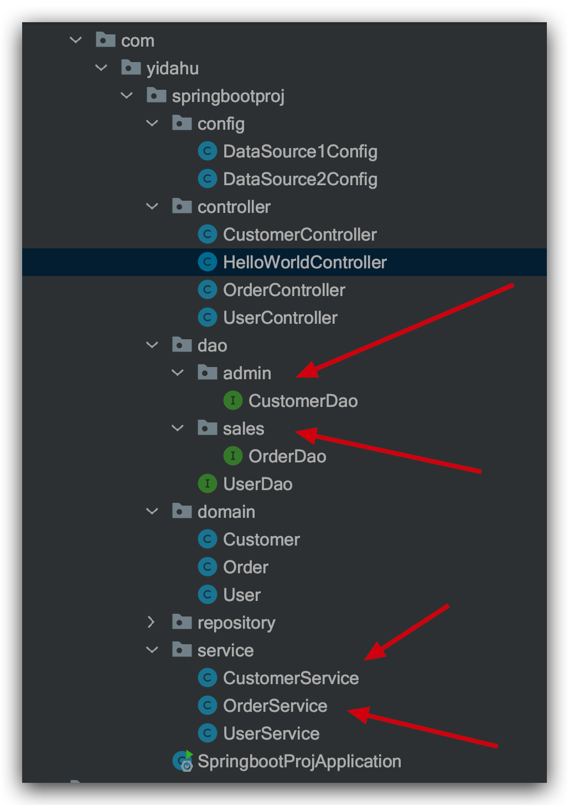

# SpringBoot 项目和 Mybatis 实现多数据源配置

## 数据库和表结构

### 数据库一：用户表


```sql
CREATE TABLE `customer` (
  `id` bigint(20) NOT NULL AUTO_INCREMENT COMMENT '主键',
  `name` varchar(20) DEFAULT NULL COMMENT '用户名',
  `age` int(11) DEFAULT NULL COMMENT '年龄',
  `integral` double(255,0) DEFAULT NULL COMMENT '积分',
  PRIMARY KEY (`id`)
) ENGINE=InnoDB AUTO_INCREMENT=3 DEFAULT CHARSET=utf8;
```

### 数据库二：订单表


```sql
DROP TABLE IF EXISTS `order_info`;
CREATE TABLE `order_info` (
  `id` bigint(20) NOT NULL COMMENT '主键',
  `u_id` bigint(20) DEFAULT NULL COMMENT '用户id',
  `goods` varchar(255) DEFAULT NULL COMMENT '商品',
  `pay_money` double(255,0) DEFAULT NULL COMMENT '支付金额',
  PRIMARY KEY (`id`)
) ENGINE=InnoDB DEFAULT CHARSET=utf8;
```

## maven 依赖

````xml
<dependencies>
        <dependency>
            <groupId>org.springframework.boot</groupId>
            <artifactId>spring-boot-starter-web</artifactId>
        </dependency>
        <dependency>
            <groupId>org.mybatis.spring.boot</groupId>
            <artifactId>mybatis-spring-boot-starter</artifactId>
            <version>1.3.2</version>
        </dependency>
        <dependency>
            <groupId>mysql</groupId>
            <artifactId>mysql-connector-java</artifactId>
            <scope>runtime</scope>
        </dependency>
        <dependency>
            <groupId>org.springframework.boot</groupId>
            <artifactId>spring-boot-starter-test</artifactId>
            <scope>test</scope>
        </dependency>
    </dependencies>
    ```

````

## 配置文件 application.properties

```properties
server.port=8080
spring.jpa.hibernate.ddl-auto=update
spring.jpa.show-sql=true
# 配置第一个数据源
spring.datasource.hikari.db1.jdbc-url=jdbc:mysql://127.0.0.1:3306/admin?useUnicode=true&characterEncoding=utf8&useSSL=true&serverTimezone=GMT%2B8
spring.datasource.hikari.db1.username=root
spring.datasource.hikari.db1.password=123456
spring.datasource.hikari.db1.driver-class-name=com.mysql.cj.jdbc.Driver
# 配置第二个数据源
spring.datasource.hikari.db2.jdbc-url=jdbc:mysql://127.0.0.1:3306/sales?useUnicode=true&characterEncoding=utf8&useSSL=true&serverTimezone=GMT%2B8
spring.datasource.hikari.db2.username=root
spring.datasource.hikari.db2.password=123456
spring.datasource.hikari.db2.driver-class-name=com.mysql.cj.jdbc.Driver
```

## 实体类

Customer.java

```java
@Data
public class Customer {

    private Long id;

    private String name;

    private int age;

    private double integral;
}
```

Order.java

```java
@Data
public class Order {

    private Long id;

    private Long uId;

    private String goods;

    private double payMoney;
}
```

## 数据源配置

DataSource1Config.java

```java
@Configuration
@MapperScan(basePackages = "com.yidahu.springbootproj.dao.admin", sqlSessionTemplateRef = "db1SqlSessionTemplate")
public class DataSource1Config {

    /**
     * 生成数据源.  @Primary 注解声明为默认数据源
     */
    @Bean(name = "db1DataSource")
    @ConfigurationProperties(prefix = "spring.datasource.hikari.db1")
    @Primary
    public DataSource testDataSource() {
        return DataSourceBuilder.create().build();
    }

    /**
     * 创建 SqlSessionFactory
     */
    @Bean(name = "db1SqlSessionFactory")
    @Primary
    public SqlSessionFactory testSqlSessionFactory(@Qualifier("db1DataSource") DataSource dataSource) throws Exception {
        SqlSessionFactoryBean bean = new SqlSessionFactoryBean();
        bean.setDataSource(dataSource);
        //  bean.setMapperLocations(new PathMatchingResourcePatternResolver().getResources("classpath:mybatis/mapper/db1/*.xml"));
        return bean.getObject();
    }

    /**
     * 配置事务管理
     */
    @Bean(name = "db1TransactionManager")
    @Primary
    public DataSourceTransactionManager testTransactionManager(@Qualifier("db1DataSource") DataSource dataSource) {
        return new DataSourceTransactionManager(dataSource);
    }

    @Bean(name = "db1SqlSessionTemplate")
    @Primary
    public SqlSessionTemplate testSqlSessionTemplate(@Qualifier("db1SqlSessionFactory") SqlSessionFactory sqlSessionFactory) throws Exception {
        return new SqlSessionTemplate(sqlSessionFactory);
    }

}
```

DataSource2Config.java

```java
@Configuration
@MapperScan(basePackages = "com.yidahu.springbootproj.dao.sales", sqlSessionTemplateRef = "db2SqlSessionTemplate")
public class DataSource2Config {

    @Bean(name = "db2DataSource")
    @ConfigurationProperties(prefix = "spring.datasource.hikari.db2")
    public DataSource testDataSource() {
        return DataSourceBuilder.create().build();
    }

    @Bean(name = "db2SqlSessionFactory")
    public SqlSessionFactory testSqlSessionFactory(@Qualifier("db2DataSource") DataSource dataSource) throws Exception {
        SqlSessionFactoryBean bean = new SqlSessionFactoryBean();
        bean.setDataSource(dataSource);
        //bean.setMapperLocations(new PathMatchingResourcePatternResolver().getResources("classpath:mybatis/mapper/db2/*.xml"));
        return bean.getObject();
    }

    @Bean(name = "db2TransactionManager")
    public DataSourceTransactionManager testTransactionManager(@Qualifier("db2DataSource") DataSource dataSource) {
        return new DataSourceTransactionManager(dataSource);
    }

    @Bean(name = "db2SqlSessionTemplate")
    public SqlSessionTemplate testSqlSessionTemplate(@Qualifier("db2SqlSessionFactory") SqlSessionFactory sqlSessionFactory) throws Exception {
        return new SqlSessionTemplate(sqlSessionFactory);
    }

}
```

## Dao 和 Service



### Dao

CustomerDao.java

```java
@Qualifier("db1SqlSessionTemplate")
public interface CustomerDao {

    /**
     * 通过名字查询用户信息
     */
    @Select("SELECT * FROM customer WHERE name = #{name}")
    Customer findUserByName(String name);

}
```

OrderDao.java

```java
@Qualifier("db2SqlSessionTemplate")
public interface OrderDao {

    /**
     * 通过id 查看工资详情
     */
    @Select("SELECT * FROM order_info WHERE id = #{id}")
    Order findOrderById(@Param("id") int id);
}
```

### Service

```java
@Service
public class CustomerService {

    @Autowired
    private CustomerDao customerDao;

    /**
     * 根据名字查找用户
     */
    public Customer selectUserByName(String name) {
        return customerDao.findUserByName(name);
    }
}
```

OrderService.java

```java
@Service
public class OrderService {

    @Autowired
    private OrderDao orderDao;

    /**
     * 根据名字查找用户
     */
    public Order selectOrderById(int id) {
        return orderDao.findOrderById(id);
    }
}
```

## Controller

CustomerController.java

```java
@RestController
@RequestMapping("/customer")
public class CustomerController {

    @Autowired
    private CustomerService customerService;

    @RequestMapping("/query")
    public Customer testQuery() {
        return customerService.selectUserByName("yidahu");
    }
}
```

OrderController.java

```java
@RestController
@RequestMapping("order")
public class OrderController {

    @Autowired
    private OrderService orderService;

    @RequestMapping("/query")
    public Order testQuery() {
        return orderService.selectOrderById(1);
    }
}
```

## 运行


