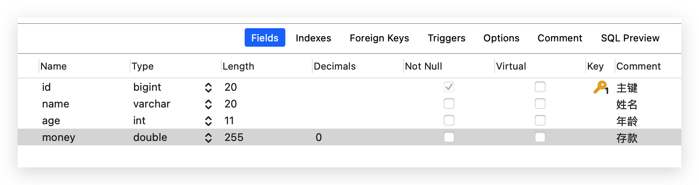
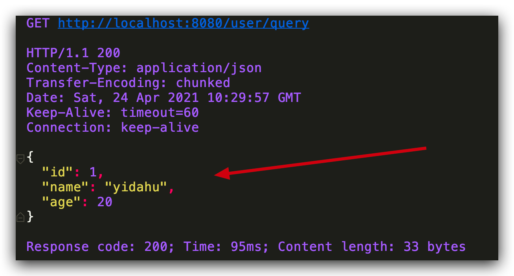

# SpringBoot 项目通过 Mybatis 实现 CRUD

## 创建项目

项目创建，请参考之前文章

## 创建数据库和用户表



```sql
DROP TABLE IF EXISTS `user`;
CREATE TABLE `user` (
  `id` bigint(20) NOT NULL AUTO_INCREMENT COMMENT '主键',
  `name` varchar(20) DEFAULT NULL COMMENT '用户名',
  `age` int(11) DEFAULT NULL COMMENT '年龄',
  `money` double(255,0) DEFAULT NULL COMMENT '存款',
  PRIMARY KEY (`id`)
) ENGINE=InnoDB AUTO_INCREMENT=3 DEFAULT CHARSET=utf8;
```

## maven 依赖

```xml
<dependencies>
    <dependency>
        <groupId>org.springframework.boot<groupId>
        <artifactId>spring-boot-starter-web<artifactId>
    </dependency>
    <dependency>
        <groupId>org.mybatis.spring.boot<groupId>
        <artifactId>mybatis-spring-boot-starter<artifactId>
        <version>1.3.2</version>
    </dependency>
    <dependency>
        <groupId>mysql</groupId>
        <artifactId>mysql-connector-java<artifactId>
        <scope>runtime</scope>
    </dependency>
    <dependency>
        <groupId>org.springframework.boot<groupId>
        <artifactId>spring-boot-starter-test<artifactId>
        <scope>test</scope>
    </dependency>
</dependencies>
```

## 配置文件

```properties
server.port=8080
spring.datasource.url=jdbc:mysql://${MYSQL_HOST:localhost}:3306/springboot_proj
spring.datasource.username=root
spring.datasource.password=123456
spring.datasource.driver-class-name=com.mysql.cj.jdbc.Driver
mybatis.mapper-locations=classpath:mapper/*.xml
```

## 实体类

```java
@Data
public class User {

    private Long id;

    private String name;

    private Integer age;

}
```

## 注解方式

### Dao

```java
@Mapper
public interface UserDao {

    /**
     * 通过名字查询用户信息
     */
    @Select("SELECT * FROM user WHERE name = #{name}")
    User findUserByName(@Param("name") String name);

    /**
     * 查询所有用户信息
     */
    @Select("SELECT * FROM user")
    List<User> findAllUser();

    /**
     * 插入用户信息
     */
    @Insert("INSERT INTO user(name, age,money) VALUES(#{name}, #{age}, #{money})")
    void insertUser(@Param("name") String name, @Param("age") Integer age, @Param("money") Double money);

    /**
     * 根据 id 更新用户信息
     */
    @Update("UPDATE  user SET name = #{name},age = #{age},money= #{money} WHERE id = #{id}")
    void updateUser(@Param("name") String name, @Param("age") Integer age, @Param("money") Double money,
                    @Param("id") int id);

    /**
     * 根据 id 删除用户信息
     */
    @Delete("DELETE from user WHERE id = #{id}")
    void deleteUser(@Param("id") int id);

}
```

### Service

```java
@Service
public class UserService {

    @Autowired
    private UserDao userDao;

    /**
     * 根据名字查找用户
     */
    public User selectUserByName(String name) {
        return userDao.findUserByName(name);
    }

    /**
     * 查找所有用户
     */
    public List<User> selectAllUser() {
        return userDao.findAllUser();
    }

    /**
     * 插入两个用户
     */
    public void insertService() {
        userDao.insertUser("SnailClimb", 22, 3000.0);
        userDao.insertUser("Daisy", 19, 3000.0);
    }

    /**
     * 根据id 删除用户
     */

    public void deleteService(int id) {
        userDao.deleteUser(id);
    }

    /**
     * 模拟事务。由于加上了 @Transactional注解，如果转账中途出了意外 SnailClimb 和 Daisy 的钱都不会改变。
     */
    @Transactional
    public void changemoney() {
        userDao.updateUser("SnailClimb", 22, 2000.0, 3);
        // 模拟转账过程中可能遇到的意外状况
        int temp = 1 / 0;
        userDao.updateUser("Daisy", 19, 4000.0, 4);
    }

}
```

### Controller

```java
@RestController
@RequestMapping("user")
public class UserController {

    @Autowired
    private UserRepository userRepository;

    @Autowired
    private UserService userService;

    @GetMapping("/getUserByName")
    public String getUser(String name) {
        User user = userRepository.findByNameCustomeQuery(name).orElse(new User());
        return JSON.toJSONString(user);
    }

    @RequestMapping("/query")
    public User testQuery() {
        return userService.selectUserByName("yidahu");
    }

    @RequestMapping("/insert")
    public List<User> testInsert() {
        userService.insertService();
        return userService.selectAllUser();
    }


    @RequestMapping("/changemoney")
    public List<User> testchangemoney() {
        userService.changemoney();
        return userService.selectAllUser();
    }

    @RequestMapping("/delete")
    public String testDelete() {
        userService.deleteService(3);
        return "OK";
    }

}
```

### 启动类

```java
@SpringBootApplication
// 此注解表示动态扫描DAO接口所在包，实际上不加下面这条语句也可以找到
@MapperScan("com.yidahu.springbootproj.dao")
public class SpringbootProjApplication {

    public static void main(String[] args) {
        SpringApplication.run(SpringbootProjApplication.class, args);
    }

}
```

### 运行



## xml 方式

### Dao 改动

方法上不需要添加注解

```java
/**
* 通过名字查询用户信息
*/
User findUserByNameFromMapper(String name);
```

### Mapper 的 xml 文件

```xml
<?xml version="1.0" encoding="UTF-8"?>
<!DOCTYPE mapper PUBLIC "-//mybatis.org//DTD Mapper 3.0//EN"
        "http://mybatis.org/dtd/mybatis-3-mapper.dtd">

<mapper namespace="com.yidahu.springbootproj.dao.UserDao">

    <select id="findUserByNameFromMapper" parameterType="String" resultType="com.yidahu.springbootproj.domain.User">
        SELECT * FROM user WHERE name = #{name}
    </select>
</mapper>
```

### 配置文件改动

配置文件添加下面代码

```properties
mybatis.mapper-locations=classpath:mapper/*.xml
```
