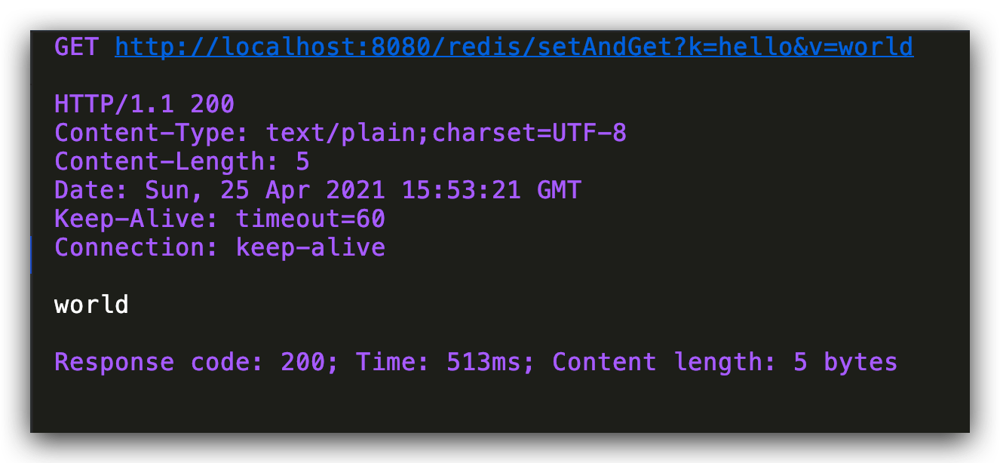

# SpringBoot 项目项目整合 Redis 封装工具类

## maven 依赖

```xml
<dependency>
    <groupId>org.springframework.boot</groupId>
    <artifactId>spring-boot-starter-data-redis</artifactId>
</dependency>
```

## application.properties 配置文件

```properties
# Redis数据库索引（默认为0）
spring.redis.database=0
# Redis服务器地址
spring.redis.host=127.0.0.1
# Redis服务器连接端口
spring.redis.port=6379
# Redis服务器连接密码（默认为空）
spring.redis.password=
# 连接池最大连接数（使用负值表示没有限制）
spring.redis.pool.max-active=200
# 连接池最大阻塞等待时间（使用负值表示没有限制）
spring.redis.pool.max-wait=-1
# 连接池中的最大空闲连接
spring.redis.pool.max-idle=10
# 连接池中的最小空闲连接
spring.redis.pool.min-idle=0
```

## Redis 配置类

RedisConfig.java

```java
@Configuration
public class RedisConfig {

    /**
     * redisTemplate注入到Spring容器
     *
     * @param factory
     * @return
     */
    @Bean
    public RedisTemplate<String, String> redisTemplate(RedisConnectionFactory factory) {
        RedisTemplate<String, String> redisTemplate = new RedisTemplate<>();
        RedisSerializer<String> redisSerializer = new StringRedisSerializer();
        redisTemplate.setConnectionFactory(factory);
        //key序列化
        redisTemplate.setKeySerializer(redisSerializer);
        //value序列化
        redisTemplate.setValueSerializer(redisSerializer);
        //value hashmap序列化
        redisTemplate.setHashKeySerializer(redisSerializer);
        //key hashmap序列化
        redisTemplate.setHashValueSerializer(redisSerializer);
        return redisTemplate;
    }

}
```

## Redis 工具类

RedisUtil.java

```java
@Component
public class RedisUtil {

    @Autowired
    private RedisTemplate redisTemplate;

    private static double size = Math.pow(2, 32);


    /**
     * 写入缓存
     *
     * @param key
     * @param offset 位 8Bit=1Byte
     * @return
     */
    public boolean setBit(String key, long offset, boolean isShow) {
        boolean result = false;
        try {
            ValueOperations<Serializable, Object> operations = redisTemplate.opsForValue();
            operations.setBit(key, offset, isShow);
            result = true;
        } catch (Exception e) {
            e.printStackTrace();
        }
        return result;
    }

    /**
     * 写入缓存
     *
     * @param key
     * @param offset
     * @return
     */
    public boolean getBit(String key, long offset) {
        boolean result = false;
        try {
            ValueOperations<Serializable, Object> operations = redisTemplate.opsForValue();
            result = operations.getBit(key, offset);
        } catch (Exception e) {
            e.printStackTrace();
        }
        return result;
    }


    /**
     * 写入缓存
     *
     * @param key
     * @param value
     * @return
     */
    public boolean set(final String key, Object value) {
        boolean result = false;
        try {
            ValueOperations<Serializable, Object> operations = redisTemplate.opsForValue();
            operations.set(key, value);
            result = true;
        } catch (Exception e) {
            e.printStackTrace();
        }
        return result;
    }

    /**
     * 写入缓存设置时效时间
     *
     * @param key
     * @param value
     * @return
     */
    public boolean set(final String key, Object value, Long expireTime) {
        boolean result = false;
        try {
            ValueOperations<Serializable, Object> operations = redisTemplate.opsForValue();
            operations.set(key, value);
            redisTemplate.expire(key, expireTime, TimeUnit.SECONDS);
            result = true;
        } catch (Exception e) {
            e.printStackTrace();
        }
        return result;
    }

    /**
     * 批量删除对应的value
     *
     * @param keys
     */
    public void remove(final String... keys) {
        for (String key : keys) {
            remove(key);
        }
    }


    /**
     * 删除对应的value
     *
     * @param key
     */
    public void remove(final String key) {
        if (exists(key)) {
            redisTemplate.delete(key);
        }
    }

    /**
     * 判断缓存中是否有对应的value
     *
     * @param key
     * @return
     */
    public boolean exists(final String key) {
        return redisTemplate.hasKey(key);
    }

    /**
     * 读取缓存
     *
     * @param key
     * @return
     */
    public Object get(final String key) {
        Object result = null;
        ValueOperations<Serializable, Object> operations = redisTemplate.opsForValue();
        result = operations.get(key);
        return result;
    }

    /**
     * 哈希 添加
     *
     * @param key
     * @param hashKey
     * @param value
     */
    public void hmSet(String key, Object hashKey, Object value) {
        HashOperations<String, Object, Object> hash = redisTemplate.opsForHash();
        hash.put(key, hashKey, value);
    }

    /**
     * 哈希获取数据
     *
     * @param key
     * @param hashKey
     * @return
     */
    public Object hmGet(String key, Object hashKey) {
        HashOperations<String, Object, Object> hash = redisTemplate.opsForHash();
        return hash.get(key, hashKey);
    }

    /**
     * 列表添加
     *
     * @param k
     * @param v
     */
    public void lPush(String k, Object v) {
        ListOperations<String, Object> list = redisTemplate.opsForList();
        list.rightPush(k, v);
    }

    /**
     * 列表获取
     *
     * @param k
     * @param l
     * @param l1
     * @return
     */
    public List<Object> lRange(String k, long l, long l1) {
        ListOperations<String, Object> list = redisTemplate.opsForList();
        return list.range(k, l, l1);
    }

    /**
     * 集合添加
     *
     * @param key
     * @param value
     */
    public void add(String key, Object value) {
        SetOperations<String, Object> set = redisTemplate.opsForSet();
        set.add(key, value);
    }

    /**
     * 集合获取
     *
     * @param key
     * @return
     */
    public Set<Object> setMembers(String key) {
        SetOperations<String, Object> set = redisTemplate.opsForSet();
        return set.members(key);
    }

    /**
     * 有序集合添加
     *
     * @param key
     * @param value
     * @param scoure
     */
    public void zAdd(String key, Object value, double scoure) {
        ZSetOperations<String, Object> zset = redisTemplate.opsForZSet();
        zset.add(key, value, scoure);
    }

    /**
     * 有序集合获取
     *
     * @param key
     * @param scoure
     * @param scoure1
     * @return
     */
    public Set<Object> rangeByScore(String key, double scoure, double scoure1) {
        ZSetOperations<String, Object> zset = redisTemplate.opsForZSet();
        redisTemplate.opsForValue();
        return zset.rangeByScore(key, scoure, scoure1);
    }


    //第一次加载的时候将数据加载到redis中
    public void saveDataToRedis(String name) {
        double index = Math.abs(name.hashCode() % size);
        long indexLong = new Double(index).longValue();
        boolean availableUsers = setBit("availableUsers", indexLong, true);
    }

    //第一次加载的时候将数据加载到redis中
    public boolean getDataToRedis(String name) {

        double index = Math.abs(name.hashCode() % size);
        long indexLong = new Double(index).longValue();
        return getBit("availableUsers", indexLong);
    }

    /**
     * 有序集合获取排名
     *
     * @param key   集合名称
     * @param value 值
     */
    public Long zRank(String key, Object value) {
        ZSetOperations<String, Object> zset = redisTemplate.opsForZSet();
        return zset.rank(key, value);
    }


    /**
     * 有序集合获取排名
     *
     * @param key
     */
    public Set<ZSetOperations.TypedTuple<Object>> zRankWithScore(String key, long start, long end) {
        ZSetOperations<String, Object> zset = redisTemplate.opsForZSet();
        Set<ZSetOperations.TypedTuple<Object>> ret = zset.rangeWithScores(key, start, end);
        return ret;
    }

    /**
     * 有序集合添加
     *
     * @param key
     * @param value
     */
    public Double zSetScore(String key, Object value) {
        ZSetOperations<String, Object> zset = redisTemplate.opsForZSet();
        return zset.score(key, value);
    }


    /**
     * 有序集合添加分数
     *
     * @param key
     * @param value
     * @param scoure
     */
    public void incrementScore(String key, Object value, double scoure) {
        ZSetOperations<String, Object> zset = redisTemplate.opsForZSet();
        zset.incrementScore(key, value, scoure);
    }


    /**
     * 有序集合获取排名
     *
     * @param key
     */
    public Set<ZSetOperations.TypedTuple<Object>> reverseZRankWithScore(String key, long start, long end) {
        ZSetOperations<String, Object> zset = redisTemplate.opsForZSet();
        Set<ZSetOperations.TypedTuple<Object>> ret = zset.reverseRangeByScoreWithScores(key, start, end);
        return ret;
    }

    /**
     * 有序集合获取排名
     *
     * @param key
     */
    public Set<ZSetOperations.TypedTuple<Object>> reverseZRankWithRank(String key, long start, long end) {
        ZSetOperations<String, Object> zset = redisTemplate.opsForZSet();
        Set<ZSetOperations.TypedTuple<Object>> ret = zset.reverseRangeWithScores(key, start, end);
        return ret;
    }

}
```

## Controller 测试类

RedisController.java

```java
@RestController
@RequestMapping("redis")
public class RedisController {

    @Autowired
    private RedisUtil redisUtil;

    @RequestMapping("/setAndGet")
    public String test(String k, String v) {
        redisUtil.set(k, v);
        return (String) redisUtil.get(k);
    }

}
```

## 运行



