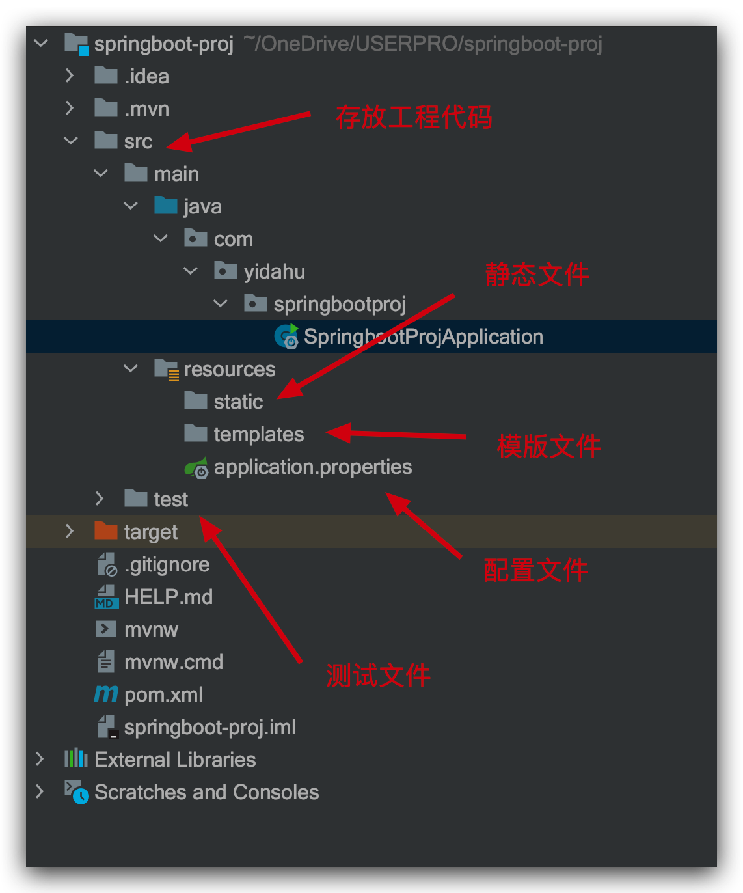
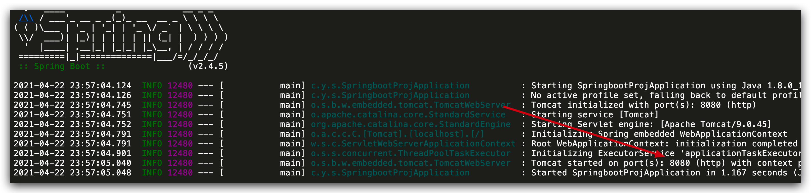

# 手把手搭建 SpringBoot 项目

## 新建 SpringBoot 项目

直接通过 IDEA 来生成一个 Spring Boot 的项目，具体方法和上面类似：File->New->Project->Spring Initializr


注意勾选上 Spring Web 这个模块，这是我们所必需的一个依赖。当所有选项都勾选完毕之后，点击下方的按钮 Generate 下载这个 Spring Boot 的项目。下载完成并解压之后，我们直接使用 IDEA


## 项目结构分析

创建好项目后，自动生成项目结构如下图所示



以 Application 为后缀名的 Java 类一般就是 Spring Boot 的启动类，比如本项目的启动项目就是 SpringbootProjApplication 。我们直接像运行普通 Java 程序一样运行它，由于 Spring Boot 本身就嵌入 servlet 容器的缘故，我们的 web 项目就运行成功了， 非常方便。

需要注意的一点是 Spring Boot 的启动类是需要最外层的，不然可能导致一些类无法被正确扫描到，导致一些奇怪的问题。 一般情况下 Spring Boot 项目结构类似下面这样

```
com
  +- yidahu
    +- springbootproj
      +- SpringbootProjApplication.java
      |
      +- domain
      |  +- User.java
      |
      +- repository
      |  +- UserRepository.java
      |
      +- service
      |  +- UserService.java
      |
      +- controller
      |  +- UserController.java
      |
      +- config
      |  +- swagerConfig.java
      |
```

1. Application.java 是项目的启动类
2. domain 目录主要用于实体（Entity）
3. repository 居于业务层和数据层之间，将两者隔离开来，在它的内部封装了数据查询和存储的逻辑
4. service 层主要是业务类代码
5. controller 负责页面访问控制
6. config 目录主要放一些配置类

## @SpringBootApplication 注解分析

`SpringbootProjApplication.java`

```java
@SpringBootApplication
public class SpringbootProjApplication {

    public static void main(String[] args) {
        SpringApplication.run(SpringbootProjApplication.class, args);
    }
}
```

`@SpringBootApplication` ，这个注解的相关代码如下：

```java
@Target({ElementType.TYPE})
@Retention(RetentionPolicy.RUNTIME)
@Documented
@Inherited
@SpringBootConfiguration
@EnableAutoConfiguration
@ComponentScan(
    excludeFilters = {@Filter(
    type = FilterType.CUSTOM,
    classes = {TypeExcludeFilter.class}
), @Filter(
    type = FilterType.CUSTOM,
    classes = {AutoConfigurationExcludeFilter.class}
)}
)
public @interface SpringBootApplication {
    @AliasFor(
        annotation = EnableAutoConfiguration.class
    )
    Class<?>[] exclude() default {};
    ....
}
```

`SpringBootConfiguration.java`

```java
@Target({ElementType.TYPE})
@Retention(RetentionPolicy.RUNTIME)
@Documented
@Configuration
public @interface SpringBootConfiguration {
    @AliasFor(
        annotation = Configuration.class
    )
    boolean proxyBeanMethods() default true;
}
```

可以看出大概可以把 @SpringBootApplication 看作是 @Configuration、@EnableAutoConfiguration、@ComponentScan 注解的集合。根据 SpringBoot 官网，这三个注解的作用分别是：

@EnableAutoConfiguration：启用 SpringBoot 的自动配置机制
@ComponentScan： 扫描被@Component (@Service,@Controller)注解的 bean，注解默认会扫描该类所在的包下所有的类。
@Configuration：允许在上下文中注册额外的 bean 或导入其他配置类。
所以说 @SpringBootApplication 就是几个重要的注解的组合，为什么要有它？当然是为了省事，避免了我们每次开发 Spring Boot 项目都要写一些必备的注解。这一点在我们平时开发中也经常用到，比如我们通常会提一个测试基类，这个基类包含了我们写测试所需要的一些基本的注解和一些依赖。

## 新建 Controller

上面说了这么多，我们现在正式开始写 Spring Boot 版的 “Hello World” 吧。

新建一个 controller 文件夹，并在这个文件夹下新建一个名字叫做 HelloWorldController 的类。

@RestController 是 Spring 4 之后新加的注解，如果在 Spring4 之前开发 RESTful Web 服务的话，你需要使用@Controller 并结合@ResponseBody 注解，也就是说@Controller +@ResponseBody= @RestController。对于这两个注解，我在基础篇单独抽了一篇文章来介绍。

`com.yidahu.springbootbase.controller`

```java
@RestController
@RequestMapping("springboot")
public class HelloWorldController {

    @GetMapping("/hello")
    public String getHello() {
        return "Hello SpringBoot !";
    }
}
```

默认情况下，Spring Boot 项目会使用 8080 作为项目的端口号。如果我们修改端口号的话，非常简单，直接修改
`application.properties` 配置文件即可。

`src/main/resources/application.properties`

```properties
server.port=8080
```

## 运行项目

运行 SpringbootProjApplication ，运行成功控制台会打印出一些消息，不要忽略这些消息，它里面会有一些比较有用的信息



通过 GET 方式访问`http://localhost:8080/springboot/hello`就可以获取到返回数据了


## 总结

通过本文我们学到了如何新建 Spring Boot 项目、SpringBoot 项目常见的项目结构分析、@SpringBootApplication 注解分析，最后实现了 Spring Boot 版的 "Hello SpringBoot !"。
